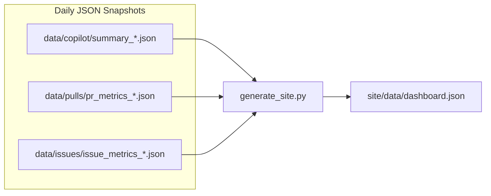

In **[Part 1]()**, we built Python scripts that collect Copilot usage, PR health, and issue lifecycle metrics from the GitHub API. Now we have daily JSON files piling up in a `data/` directory.

Raw data sitting in JSON files helps nobody. In this post, we'll turn that data into a static dashboard that:

- **Merges daily snapshots** into rolling historical trends
- **Renders interactive charts** with Chart.js (no backend required)
- **Deploys automatically** to GitHub Pages on every collection run
- **Works on any screen** with a responsive dark theme

The result is a single-page dashboard your team can bookmark and check anytime. No Grafana instance to manage, no database to maintain.

## The Data Pipeline

Before we can render charts, we need to process our accumulated daily JSON files into a single `dashboard.json` that the frontend consumes. Here's the flow:



### Merging Historical Data

The site generator reads every daily snapshot, deduplicates by date, and trims to the dashboard window (default: 90 days):

```python
# scripts/generate_site.py

def merge_copilot_history() -> dict:
    data_path = get_data_path("copilot")
    history = {"daily": {}, "seats_history": []}

    for filepath in sorted(glob.glob(os.path.join(data_path, "summary_*.json"))):
        summary = load_json(filepath)
        for day in summary.get("daily", []):
            date = day.get("date", "")
            if date:
                # Latest collection wins for each date
                history["daily"][date] = day

        if "seats" in summary:
            seats_entry = {
                "date": summary.get("collected_at", "")[:10],
                **summary["seats"],
            }
            existing_dates = [s["date"] for s in history["seats_history"]]
            if seats_entry["date"] not in existing_dates:
                history["seats_history"].append(seats_entry)

    # Trim to dashboard window
    cutoff = (datetime.now(timezone.utc) - timedelta(days=DASHBOARD_DAYS)).strftime("%Y-%m-%d")
    history["daily"] = {k: v for k, v in history["daily"].items() if k >= cutoff}

    return history
```

The same pattern applies for PR and issue data. Each gets merged into a rolling history, then everything is combined into a single JSON structure the dashboard reads.

### The Dashboard Data Structure

The generated `dashboard.json` has three top-level sections:

```json
{
  "summary": {
    "generated_at": "2026-03-10T05:00:00Z",
    "copilot": { "acceptance_rate": 28.5, "active_users": 142 },
    "seats": { "total": 200, "active": 142, "inactive": 38, "never_used": 20 },
    "prs": { "median_lifespan_hours": 18.3, "median_ttfr_hours": 4.2, "merge_rate_pct": 91.2 },
    "issues": { "open": 87, "stale": 12, "median_lifespan_hours": 72.1 }
  },
  "alerts": [ ... ],
  "charts": {
    "copilot": { "dates": [...], "acceptance_rate": [...], "active_users": [...] },
    "seats": { "dates": [...], "total": [...], "active": [...] },
    "prs": { "dates": [...], "median_lifespan": [...], "median_ttfr": [...] },
    "issues": { "dates": [...], "open_issues": [...], "stale_issues": [...] },
    "pr_throughput": { "weeks": [...], "merged": [...] },
    "issue_throughput": { "weeks": [...], "opened": [...], "closed": [...] }
  }
}
```

The `summary` object powers the top-level cards. The `charts` object provides time series arrays that map directly to Chart.js datasets. This keeps the JavaScript dead simple - just fetch, map, and render.

## The Static Dashboard

We're using plain HTML + CSS + JavaScript with Chart.js loaded from a CDN. Zero build tools. Zero npm packages. Zero bundlers. You can understand the entire frontend by reading three files.

### Summary Cards

The top of the dashboard shows at-a-glance numbers with color coding:

```javascript
// site/js/dashboard.js

function renderSummaryCards(summary) {
    // Acceptance rate - green if >= 25%, yellow if >= 15%, red otherwise
    if (summary.copilot) {
        const rate = summary.copilot.acceptance_rate;
        const el = document.getElementById('valAcceptanceRate');
        el.textContent = `${rate}%`;
        el.className = 'card-value ' + (rate >= 25 ? 'good' : rate >= 15 ? 'warning' : 'bad');
    }

    // Seat utilization
    if (summary.seats) {
        const el = document.getElementById('valActiveUsers');
        el.textContent = `${summary.seats.active}`;
        document.getElementById('detailActiveUsers').textContent =
            `of ${summary.seats.total} seats (${summary.seats.utilization_pct}% utilized)`;
    }

    // PR lifespan - show in hours or days depending on scale
    if (summary.prs) {
        const hours = summary.prs.median_lifespan_hours;
        const el = document.getElementById('valPRLifespan');
        el.textContent = hours < 24 ? `${hours.toFixed(1)}h` : `${(hours / 24).toFixed(1)}d`;
        el.className = 'card-value ' + (hours <= 24 ? 'good' : hours <= 48 ? 'warning' : 'bad');
    }
    // ... more cards
}
```

Six cards across the top: Acceptance Rate, Active Users, PR Lifespan, Time to Review, Merge Rate, and Open Issues. Each one turns green/yellow/red based on health thresholds. A quick glance tells you if something needs attention.

### Chart Rendering

Each chart section uses a reusable helper that standardizes the Chart.js config for our dark theme:

```javascript
function createLineChart(canvasId, labels, datasets, yAxisLabel = '') {
    const ctx = document.getElementById(canvasId);
    return new Chart(ctx, {
        type: 'line',
        data: { labels, datasets },
        options: {
            responsive: true,
            interaction: { intersect: false, mode: 'index' },
            plugins: {
                legend: {
                    display: datasets.length > 1,
                    position: 'top',
                    labels: { usePointStyle: true, boxWidth: 8 },
                },
            },
            scales: {
                x: { grid: { display: false }, ticks: { maxTicksLimit: 10 } },
                y: { title: { display: !!yAxisLabel, text: yAxisLabel }, beginAtZero: true },
            },
        },
    });
}
```

Then rendering a specific chart is just a matter of wiring data to the helper:

```javascript
// Acceptance Rate Trend
createLineChart('chartAcceptanceRate', copilot.dates, [
    {
        label: 'Acceptance Rate (%)',
        data: copilot.acceptance_rate,
        borderColor: '#3fb950',
        backgroundColor: 'rgba(63, 185, 80, 0.2)',
        fill: true,
        tension: 0.3,
    },
], '%');
```

### The Chart Layout

The dashboard has four major sections, each with a 2-column responsive grid:

**Copilot Usage**
- Acceptance Rate Trend (line)
- Active & Engaged Users (dual line)
- Suggestions & Acceptances (grouped bar)
- Chat Activity (line)

**Seat Utilization**
- Seat Allocation Over Time (multi-line: total, active, inactive, never used)
- Language Breakdown (doughnut - top 10 languages by suggestions)

**Pull Request Health**
- PR Lifespan Trend (dual line: median + P90)
- Time to First Review (line)
- Weekly PR Throughput (bar)
- Merge Rate Trend (line)

**Issue Health**
- Open & Stale Issues (dual line)
- Issue Lifespan Trend (line)
- Weekly Issue Throughput (grouped bar: opened vs. closed) - full width

### The CSS

We're using GitHub's dark theme colors for a clean look:

```css
:root {
    --bg-primary: #0d1117;
    --bg-secondary: #161b22;
    --border: #30363d;
    --text-primary: #e6edf3;
    --text-secondary: #8b949e;
    --accent-blue: #58a6ff;
    --accent-green: #3fb950;
    --accent-yellow: #d29922;
    --accent-red: #f85149;
}
```

The grid is responsive with `grid-template-columns: repeat(auto-fit, minmax(400px, 1fr))`, so it stacks to single column on mobile without any media query hacks. Cards use a 6-across grid that drops to 2 on tablets and 1 on phones.

## Deploying to GitHub Pages

The GitHub Actions workflow (from Part 1) handles deployment automatically:

```yaml
- name: Generate dashboard data
  run: python scripts/generate_site.py

- name: Commit data updates
  run: |
    git config user.name "github-actions[bot]"
    git config user.email "github-actions[bot]@users.noreply.github.com"
    git add data/ site/data/
    git diff --cached --quiet || git commit -m "chore: update metrics data $(date -u +%Y-%m-%d)"
    git push

- name: Deploy to GitHub Pages
  uses: actions/upload-pages-artifact@v3
  with:
    path: site/

- name: Deploy Pages
  uses: actions/deploy-pages@v4
```

After each nightly collection run, the workflow:

1. Generates fresh `dashboard.json` from all accumulated data
2. Commits the updated data files back to the repo (preserving history)
3. Deploys the `site/` directory to GitHub Pages

One prerequisite: go to **Settings > Pages** in your repo and set the source to **GitHub Actions**.

## Reading the Dashboard

Let's talk about what "good" looks like on each section:

**Copilot Usage:** You want a **stable or rising** acceptance rate and user count. A sudden drop in acceptance rate might mean a model change, or it might mean people are getting less useful suggestions (check the language breakdown for clues).

**Seat Utilization:** The "never used" and "inactive" lines should be as close to zero as possible. Anything else is waste. At $19/seat/month for Copilot Business, 20 unused seats = $380/month = $4,560/year walking out the door.

**PR Health:** Median lifespan trending **down** is great - code is shipping faster. But watch the P90 too. If the median is fine but the P90 is spiking, you have a few monster PRs dragging the tail. Time to first review is your review culture health check.

**Issue Health:** The throughput chart is the key one here. If the "opened" bars are consistently taller than "closed", your backlog is growing. The stale issue count climbing means things are falling through the cracks.

**The composite view:** The real insight comes from correlations. Is Copilot acceptance rate climbing while PR lifespan drops? That's the dream. Is acceptance rate climbing while issue quality (lifespan, backlog) gets worse? You might be shipping faster but shipping bugs.

## What's Next

We have data collection and a dashboard. But nobody's going to stare at charts every day. In **[Part 3: Alerting on What Matters]()**, we'll build an automated alert system that surfaces problems before they become crises, including detecting wasted seats, declining metrics, and review bottlenecks.

Full source code: [**jmassardo/copilot-metrics-dashboard**](https://github.com/jmassardo/copilot-metrics-dashboard)

## Closing

*Have questions about building developer productivity dashboards? Find me on [GitHub](https://github.com/jmassardo), [LinkedIn](https://www.linkedin.com/in/jenna-massardo/), or [Bluesky](https://bsky.app/profile/jmassardo.bsky.social).*
