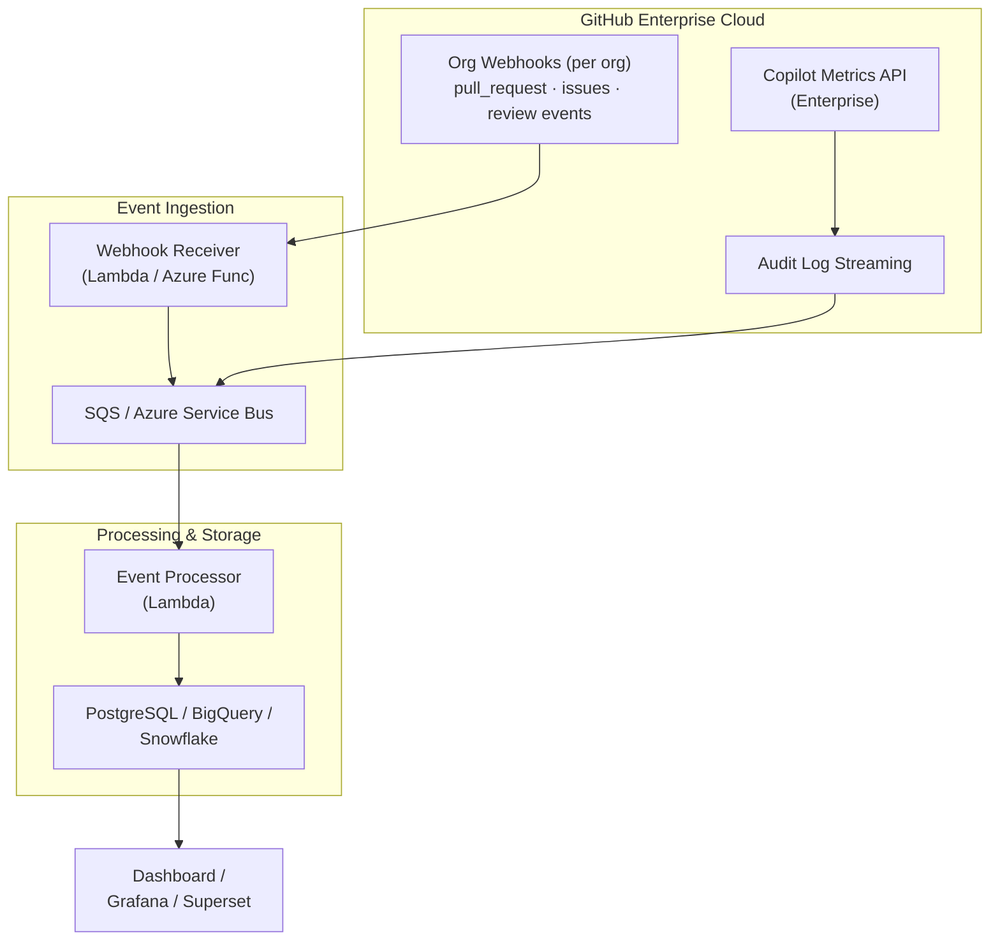

In Parts [1](/blog/2026/03/10/measuring-genai-effectiveness-data-collection/), [2](/blog/2026/03/10/measuring-genai-effectiveness-dashboard/), and [3](/blog/2026/03/10/measuring-genai-effectiveness-alerting/) we built a complete metrics collection, dashboard, and alerting system. It works great for a single org with a few dozen repos.

Now let's break it.

Imagine you're running this at a large enterprise. You have **100 organizations** on GitHub Enterprise Cloud, **100,000 repositories** across those orgs, and **15,000 Copilot seats**. Let's do some napkin math on what happens when you try to run our polling-based collectors at that scale.

## Why Polling Breaks

### The Math Problem

For PR metrics alone, each repo requires:
- 1 API call to list closed PRs
- 1 API call to list open PRs
- 1 API call per PR to fetch reviews

Assume a modest average of 10 PRs per repo per collection window:

```
100,000 repos x (2 + 10) API calls = 1,200,000 API calls
```

GitHub's REST API rate limit is **5,000 requests per hour** for authenticated users (or 15,000 for GitHub App installations). Even at the generous rate:

```
1,200,000 / 15,000 = 80 hours
```

Your "nightly" job would take **3.3 days** to complete. And that's just PRs. Add issues and you're looking at a week-long collection run that never actually finishes before the next one starts.

### The Data Volume Problem

Even if you somehow solved the rate limit issue, storing raw JSON for 100k repos means gigabytes of data per collection run. JSON files in a git repo stop being cute around 100MB.

### The Blast Radius Problem

One bad token rotation, one API outage, one repo with 10,000 open PRs - and your entire collection pipeline fails or hangs. At small scale, you retry. At enterprise scale, you need resilience built into the architecture.

## The Paradigm Shift: Pull to Push

The fix isn't "poll faster." It's **stop polling.**

Instead of asking GitHub "what happened?" every night, we need GitHub to **tell us** when things happen. This is the shift from pull-based to push-based (event-driven) architecture.

Here's the enterprise reference architecture:



Let's break this down layer by layer.

## Layer 1: Event Sources

### Enterprise Copilot Metrics API

Good news: Copilot metrics **already aggregate at the enterprise level**:

```
GET /enterprises/{enterprise}/copilot/metrics
```

This returns the same daily metrics as the org-level endpoint, but rolled up across all orgs. One API call instead of 100. This endpoint is your friend at scale.

For seat-level data, you'll still need to hit each org's billing endpoint, but seats change infrequently. A weekly cadence with staggered timing across orgs is fine:

```python
# Stagger org-level seat collection across the week
# Org 1-15 on Monday, Org 16-30 on Tuesday, etc.
import hashlib

def get_collection_day(org_name: str) -> int:
    """Deterministically assign an org to a day of the week (0=Mon, 6=Sun)."""
    return int(hashlib.md5(org_name.encode()).hexdigest(), 16) % 7
```

### Organization Webhooks

Instead of polling for PRs and issues, configure **org-level webhooks** that fire on every event you care about:

```
POST https://your-webhook-receiver.example.com/github/events
```

Configure each org webhook to send:
- `pull_request` events (opened, closed, merged, reopened)
- `pull_request_review` events (submitted)
- `issues` events (opened, closed, reopened)
- `issue_comment` events (created)

At the org level, one webhook covers every repo in that org. 100 org webhooks replaces 100,000 repo-level API polling loops.

**Setting up an org webhook:**

```bash
# Using the GitHub CLI
gh api orgs/{org}/hooks \
  --method POST \
  -f name=web \
  -f 'config[url]=https://your-receiver.example.com/github/events' \
  -f 'config[content_type]=json' \
  -f 'config[secret]=your-webhook-secret' \
  -f 'events[]=pull_request' \
  -f 'events[]=pull_request_review' \
  -f 'events[]=issues' \
  -f 'events[]=issue_comment' \
  -f active=true
```

### Audit Log Streaming

For enterprises that want even broader visibility, GHEC supports **audit log streaming** to:
- Amazon S3
- Azure Event Hubs
- Azure Blob Storage
- Datadog
- Google Cloud Storage
- Splunk

Audit log streaming captures events that webhooks miss (security events, admin actions, authentication events) and provides a compliance-grade event trail. It's overkill for just developer metrics, but if your security team already has this set up, you can tap into it.

## Layer 2: Event Ingestion

### The Webhook Receiver

You need something to receive and queue webhook payloads. Keep this layer thin - validate the signature, drop the event on a queue, return 200. Don't process inline.

**AWS Lambda example:**

```python
import json
import hmac
import hashlib
import boto3

sqs = boto3.client('sqs')
QUEUE_URL = "https://sqs.us-east-1.amazonaws.com/123456789/github-events"
WEBHOOK_SECRET = "your-secret"


def verify_signature(payload: bytes, signature: str) -> bool:
    expected = "sha256=" + hmac.new(
        WEBHOOK_SECRET.encode(), payload, hashlib.sha256
    ).hexdigest()
    return hmac.compare_digest(expected, signature)


def handler(event, context):
    body = event.get("body", "")
    signature = event["headers"].get("x-hub-signature-256", "")

    if not verify_signature(body.encode(), signature):
        return {"statusCode": 401, "body": "Invalid signature"}

    # Parse just enough to route the event
    payload = json.loads(body)
    event_type = event["headers"].get("x-github-event", "unknown")

    # Drop onto SQS for async processing
    sqs.send_message(
        QueueUrl=QUEUE_URL,
        MessageBody=json.dumps({
            "event_type": event_type,
            "action": payload.get("action", ""),
            "payload": payload,
            "received_at": context.get_remaining_time_in_millis(),
        }),
    )

    return {"statusCode": 200, "body": "OK"}
```

**Azure Functions equivalent:**

```python
import azure.functions as func
from azure.servicebus import ServiceBusClient

def main(req: func.HttpRequest) -> func.HttpResponse:
    # Verify signature (same HMAC logic)
    # ...

    event_type = req.headers.get("x-github-event", "unknown")
    payload = req.get_json()

    # Send to Service Bus queue
    with ServiceBusClient.from_connection_string(conn_str) as client:
        sender = client.get_queue_sender(queue_name="github-events")
        sender.send_messages(
            ServiceBusMessage(body=json.dumps({
                "event_type": event_type,
                "action": payload.get("action", ""),
                "payload": payload,
            }))
        )

    return func.HttpResponse("OK", status_code=200)
```

### Why a Queue?

Webhooks can burst. When a CI system merges 50 PRs in rapid succession, you'll get 50 webhook deliveries in seconds. A queue decouples ingestion from processing:

- **No dropped events** - The queue buffers bursts
- **Retry built in** - Failed processing gets retried automatically
- **Backpressure** - Processors consume at their own pace
- **Dead letter queue** - Poison messages go somewhere you can inspect them

## Layer 3: Event Processing

A queue consumer reads events and writes derived metrics to your database:

```python
# Simplified event processor

def process_pr_event(event: dict):
    action = event["action"]  # opened, closed, merged, reopened
    pr = event["payload"]["pull_request"]
    repo = event["payload"]["repository"]["full_name"]

    if action in ("closed",) and pr.get("merged_at"):
        # PR was merged - calculate lifespan
        created = datetime.fromisoformat(pr["created_at"])
        merged = datetime.fromisoformat(pr["merged_at"])
        lifespan_hours = (merged - created).total_seconds() / 3600

        db.execute("""
            INSERT INTO pr_metrics (repo, pr_number, created_at, merged_at,
                                    lifespan_hours, additions, deletions)
            VALUES (%s, %s, %s, %s, %s, %s, %s)
            ON CONFLICT (repo, pr_number) DO UPDATE SET
                merged_at = EXCLUDED.merged_at,
                lifespan_hours = EXCLUDED.lifespan_hours
        """, (repo, pr["number"], created, merged, lifespan_hours,
              pr["additions"], pr["deletions"]))


def process_review_event(event: dict):
    review = event["payload"]["review"]
    pr = event["payload"]["pull_request"]
    repo = event["payload"]["repository"]["full_name"]

    # Record the review timestamp for TTFR calculation
    db.execute("""
        INSERT INTO pr_reviews (repo, pr_number, reviewer, state, submitted_at)
        VALUES (%s, %s, %s, %s, %s)
        ON CONFLICT DO NOTHING
    """, (repo, pr["number"], review["user"]["login"],
          review["state"], review["submitted_at"]))
```

The processor is stateless. It reads an event, writes to the database, and moves on. If it crashes, the queue redelivers the message.

## Layer 4: Storage

At enterprise scale, you need a real database. Here are the practical options:

| Option | Best For | Cost Model |
|--------|----------|-----------|
| **PostgreSQL (RDS/Cloud SQL)** | Teams already running Postgres | Fixed instance cost |
| **BigQuery** | Heavy analytics, SQL-friendly teams | Per-query pricing |
| **Snowflake** | Enterprise data teams, joining with other data | Compute + storage |
| **ClickHouse** | Time-series heavy, self-hosted option | Free (self-hosted) |

A simple PostgreSQL schema covers everything:

```sql
CREATE TABLE pr_metrics (
    repo TEXT NOT NULL,
    pr_number INTEGER NOT NULL,
    author TEXT,
    created_at TIMESTAMPTZ NOT NULL,
    merged_at TIMESTAMPTZ,
    closed_at TIMESTAMPTZ,
    lifespan_hours NUMERIC,
    additions INTEGER,
    deletions INTEGER,
    first_review_at TIMESTAMPTZ,
    ttfr_hours NUMERIC,
    PRIMARY KEY (repo, pr_number)
);

CREATE TABLE issue_metrics (
    repo TEXT NOT NULL,
    issue_number INTEGER NOT NULL,
    author TEXT,
    created_at TIMESTAMPTZ NOT NULL,
    closed_at TIMESTAMPTZ,
    lifespan_hours NUMERIC,
    first_response_at TIMESTAMPTZ,
    ttfr_hours NUMERIC,
    is_stale BOOLEAN DEFAULT FALSE,
    PRIMARY KEY (repo, issue_number)
);

CREATE TABLE copilot_daily (
    date DATE NOT NULL,
    org TEXT NOT NULL,
    active_users INTEGER,
    engaged_users INTEGER,
    acceptance_rate NUMERIC,
    total_suggestions INTEGER,
    total_acceptances INTEGER,
    chat_turns INTEGER,
    PRIMARY KEY (date, org)
);

-- Materialized view for dashboard queries
CREATE MATERIALIZED VIEW weekly_pr_stats AS
SELECT
    date_trunc('week', merged_at) AS week,
    COUNT(*) AS merged_count,
    PERCENTILE_CONT(0.5) WITHIN GROUP (ORDER BY lifespan_hours) AS median_lifespan,
    PERCENTILE_CONT(0.9) WITHIN GROUP (ORDER BY lifespan_hours) AS p90_lifespan,
    PERCENTILE_CONT(0.5) WITHIN GROUP (ORDER BY ttfr_hours) AS median_ttfr
FROM pr_metrics
WHERE merged_at IS NOT NULL
GROUP BY 1;
```

Materialized views precompute the aggregations your dashboard needs, so queries stay fast even as the data grows.

## GraphQL: The Middle Ground

If you're not ready for the full webhook architecture but polling is too slow, the **GitHub GraphQL API** offers a middle ground. You can fetch exactly the fields you need in fewer requests:

```graphql
query RecentPRs($org: String!, $repo: String!) {
  repository(owner: $org, name: $repo) {
    pullRequests(last: 50, states: [MERGED, CLOSED], orderBy: {field: UPDATED_AT, direction: DESC}) {
      nodes {
        number
        title
        createdAt
        mergedAt
        closedAt
        additions
        deletions
        reviews(first: 1) {
          nodes {
            submittedAt
            state
          }
        }
      }
    }
  }
}
```

One GraphQL query here replaces what would be 50+ REST calls (list PRs + fetch reviews for each). The GraphQL API has its own rate limit (5,000 points/hour), but complex queries cost more points. It's better than REST at scale but still won't handle 100k repos.

**When to use each approach:**

| Scale | Approach |
|-------|----------|
| 1-5 orgs, < 100 repos | REST Polling (Parts 1-3) |
| 5-20 orgs, 100-1,000 repos | GraphQL Polling |
| 20+ orgs, 1,000+ repos | Webhooks + Event Queue |
| Enterprise (100+ orgs) | Webhooks + Queue + Database + Audit Log Streaming |

## Operational Considerations

### Webhook Reliability

GitHub guarantees webhook delivery with retries, but your receiver needs to be available. Things to get right:

- **Health checks** - Your receiver should have a `/health` endpoint for monitoring
- **Idempotency** - GitHub may redeliver events. Use `ON CONFLICT DO NOTHING` or `ON CONFLICT DO UPDATE` in your database writes
- **Dead letter queue** - Events that fail processing N times go to a DLQ for manual inspection
- **Monitoring** - Alert on DLQ depth, receiver errors, and event processing lag

### Multi-Org Management

Automating webhook setup across 100 orgs:

```python
import requests

ENTERPRISE_ORGS = get_all_enterprise_orgs()  # From enterprise admin API
WEBHOOK_CONFIG = {
    "url": "https://your-receiver.example.com/github/events",
    "content_type": "json",
    "secret": WEBHOOK_SECRET,
}

for org in ENTERPRISE_ORGS:
    resp = requests.post(
        f"https://api.github.com/orgs/{org}/hooks",
        headers=get_headers(),
        json={
            "name": "web",
            "config": WEBHOOK_CONFIG,
            "events": ["pull_request", "pull_request_review", "issues", "issue_comment"],
            "active": True,
        },
    )
    if resp.status_code == 201:
        print(f"  Created webhook for {org}")
    elif resp.status_code == 422:
        print(f"  Webhook already exists for {org}")
    else:
        print(f"  Error for {org}: {resp.status_code}")
```

### Cost at Scale

Let's estimate costs for a 15,000-developer enterprise:

| Component | Service | Estimated Monthly Cost |
|-----------|---------|----------------------|
| Webhook receiver | 2x Lambda / Azure Functions | $5-20 |
| Event queue | SQS / Service Bus | $10-50 |
| Event processor | Lambda / Azure Functions | $20-100 |
| Database | RDS Postgres (db.r6g.large) | $150-300 |
| Dashboard | Static site (S3 + CloudFront) | $1-5 |
| **Total** | | **$186-475/month** |

Compare that to the cost of even 100 unused Copilot seats ($1,900/month) and this system pays for itself by identifying waste alone.

## Summary: The Evolution Path

Here's the journey we've taken across all four posts:

| Post | What You Get | Best For |
|------|-------------|----------|
| [Part 1: Collection](/blog/2026/03/10/measuring-genai-effectiveness-data-collection/) | Python scripts polling GitHub APIs | Getting started, POC |
| [Part 2: Dashboard](/blog/2026/03/10/measuring-genai-effectiveness-dashboard/) | Static GitHub Pages dashboard | Small-medium orgs |
| [Part 3: Alerting](/blog/2026/03/10/measuring-genai-effectiveness-alerting/) | Automated threshold-based alerts | Proactive monitoring |
| Part 4: Scaling (this post) | Event-driven architecture | Enterprise scale |

You don't need to jump straight to the enterprise pattern. Start with Parts 1-3. Fork [the companion repo](https://github.com/jmassardo/copilot-metrics-dashboard), set up your secrets, and let the nightly cron run. When you outgrow it, you'll know - the collection workflow will start timing out or hitting rate limits, and this post gives you the blueprint for what comes next.

The bottom line: measuring GenAI effectiveness is not about Copilot metrics in isolation. It's about correlating AI adoption with actual developer outcomes. Whether you're running this for a 20-person team or a 15,000-person enterprise, the metrics that matter are the same. Only the plumbing changes.

## Closing

*Building developer metrics at enterprise scale? I'd love to hear about your architecture. Find me on [GitHub](https://github.com/jmassardo), [LinkedIn](https://www.linkedin.com/in/jenna-massardo/), or [Bluesky](https://bsky.app/profile/jmassardo.bsky.social).*
