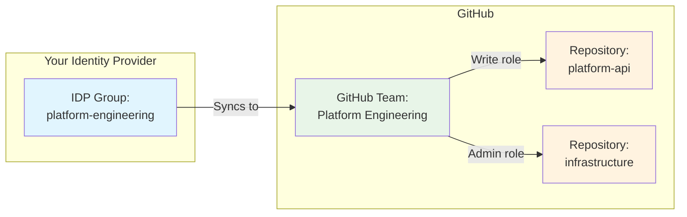

## Introduction

Let's be honest: securing GitHub Enterprise often feels like trying to nail jell-O to a wall while blindfolded. You know you need to lock things down, but you also can't turn your development environment into a bureaucratic nightmare where opening a PR requires three forms of ID and a blood sample.

I've had countless conversations with enterprise customers who want to "do security right" but don't know where to start. They've got compliance requirements breathing down their necks, auditors asking uncomfortable questions, and developers who will revolt if you make their workflow any more complicated than it already is.

This post is my attempt to codify the security practices that actually work in the real world – the ones I walk through with customers who are serious about protecting their intellectual property without sacrificing developer productivity. Think of this as your GitHub Enterprise security implementation guide, presentation deck, and sanity-preservation manual all rolled into one.

**Fair warning**: This is a living document. Security best practices evolve, new features get released, and threat landscapes shift. I'm hoping to crowdsource additional practices from the community, so if you've got battle-tested security configurations that aren't covered here, let's make this better together.

## The Foundation: Enterprise Managed Users (EMU)

If you're running GitHub Enterprise and you're not using EMU, we need to have a serious conversation. Enterprise Managed Users is like having a security guard who actually knows everyone's name instead of just waving people through the door.

### Why EMU Matters

Traditional GitHub setups let users bring their personal accounts into your enterprise, which is like letting employees use their home keys to access the office. Sure, it's convenient, but it's also a security nightmare waiting to happen.

EMU creates a clean separation:
- **Managed identities**: All user accounts are controlled by your organization
- **Centralized provisioning**: Users are created and managed through your identity provider
- **Clear boundaries**: No mixing of personal and enterprise GitHub activities
- **Audit trail**: Complete visibility into who has access to what


## Identity and Access Management: The "Principle of Least Privilege" Actually Applied

### Set Base Permissions to None

This is where we separate the security-conscious from the "everyone gets admin because it's easier" crowd. Setting base permissions to none means users start with zero access and earn their privileges through explicit grants.

**Default configuration should be**:
- Organization base permissions: `None`
- Repository default permissions: `None`
- External collaborator permissions: `None`

### IDP Group-Backed Teams

Manual team management is like manually managing DNS records – technically possible, but why would you torture yourself? Connect your GitHub teams directly to your identity provider groups.

**Benefits**:
- Automatic provisioning and deprovisioning
- Consistent access patterns across systems
- Reduced administrative overhead
- Better audit trail

**Implementation checklist**:
- [ ] Map GitHub teams to existing AD/LDAP groups
- [ ] Set up automated synchronization
- [ ] Define team naming conventions
- [ ] Create process for new team requests
- [ ] Establish regular access reviews


### Custom Organization and Repository Roles

GitHub's default roles are like off-the-rack suits – they'll work, but custom tailoring makes all the difference. Create roles that match your actual organizational structure and security requirements.

**Example custom org roles**:
- **Security Reviewer**: Can view security alerts and audit logs, but can't modify settings
- **Compliance Officer**: Read-only access to all repositories and org settings
- **Team Lead**: Can manage teams and repositories within specific boundaries

**Example custom repository roles**:
- **Code Reviewer**: Can review and merge PRs, but can't modify repository settings
- **Release Manager**: Can create releases and manage deployment keys
- **Security Champion**: Can manage security settings and view security advisories

## Repository Security: Building Walls That Actually Keep Bad Things Out

### Repository Rulesets: Your First Line of Defense

Rulesets are like having a bouncer who actually checks IDs at the door. They enforce your policies automatically so you don't have to rely on developers remembering to do the right thing.

**Essential ruleset configurations**:

```yaml
# Example branch protection ruleset
name: "Main Branch Protection"
target: "branch"
enforcement: "active"
conditions:
  ref_name:
    include: ["refs/heads/main", "refs/heads/master"]
rules:
  - type: "required_status_checks"
    parameters:
      strict_required_status_checks_policy: true
      required_status_checks:
        - "ci/build"
        - "security/scan"
        - "compliance/check"
  - type: "required_pull_request_reviews"
    parameters:
      required_approving_review_count: 2
      dismiss_stale_reviews: true
      require_code_owner_reviews: true
  - type: "restrict_pushes"
    parameters:
      restrict_pushes: true
```

**Additional ruleset best practices**:
- Require signed commits for sensitive repositories
- Block force pushes to protected branches
- Require up-to-date branches before merging
- Mandate status checks for automated security scanning

### Security Configurations: Defense in Depth

Security configurations let you set organization-wide defaults that actually stick. Think of them as your security policy enforcement mechanism.

**Key configurations to implement**:

1. **Dependency management**:
   - Enable Dependabot alerts and security updates
   - Configure vulnerability scanning for all repositories
   - Set up dependency review for pull requests

2. **Code scanning**:
   - Enable CodeQL analysis by default
   - Configure third-party security tools integration
   - Set up secret scanning across all repositories

3. **Supply chain security**:
   - Require signed commits for critical repositories
   - Enable dependency graph for all repositories
   - Configure SBOM generation for releases

```yaml
# Example security configuration
security_and_analysis:
  dependency_graph:
    status: "enabled"
  dependabot_alerts:
    status: "enabled"
  dependabot_security_updates:
    status: "enabled"
  secret_scanning:
    status: "enabled"
  secret_scanning_push_protection:
    status: "enabled"
  code_scanning_default_setup:
    status: "enabled"
    languages: ["javascript", "python", "java", "go"]
```

## Advanced Security Configurations

### Custom Properties: Metadata That Matters

Custom properties are like labels that actually do something useful. Use them to classify repositories, automate workflows, and enforce policies based on data sensitivity or compliance requirements.

**Practical custom property examples**:
- **Data Classification**: `public`, `internal`, `confidential`, `restricted`
- **Compliance Scope**: `sox`, `hipaa`, `pci-dss`, `gdpr`
- **Business Criticality**: `critical`, `high`, `medium`, `low`
- **Technology Stack**: `nodejs`, `python`, `java`, `golang`

```json
```json
{
  "team_name": "platform-engineering",
  "idp_group": "cn=platform-engineering,ou=teams,dc=company,dc=com",
  "sync_enabled": true,
  "privacy": "closed",
  "default_permission": "pull"
}
```

### The Access Control Flow: How It All Connects

Here's the core concept that many people struggle with - the simple flow from identity groups to repository access:



**That's it.** Three simple steps:

1. **People are assigned to IDP groups** (Active Directory, LDAP, etc.)
2. **IDP groups automatically map to GitHub teams** (via SCIM sync)
3. **GitHub teams are given specific roles on specific repositories**

When Sarah joins the platform engineering team:
- HR adds her to the `platform-engineering` AD group
- She automatically becomes a member of the GitHub `Platform Engineering` team  
- She immediately gets `Write` access to `platform-api` and `Admin` access to `infrastructure`
- No manual GitHub administration required

When she leaves or changes teams, the same process works in reverse.

### Custom Organization and Repository Roles
```

### Inner Source Management: Controlled Sharing

Inner source is like open source, but with the training wheels still on. You want to encourage collaboration and code reuse without accidentally sharing sensitive information with the wrong people.

**Inner source security checklist**:
- [ ] Establish clear criteria for internal repository promotion
- [ ] Create review process for marking repositories as "internal"
- [ ] Set up automated scanning for sensitive data before visibility changes
- [ ] Define guidelines for acceptable inner source contributions
- [ ] Implement monitoring for internal repository access patterns

**Process workflow**:
1. Developer requests to make repository internal
2. Automated security scan checks for secrets, sensitive data
3. Security team reviews repository content and access patterns
4. Business stakeholder approves based on business value
5. Repository visibility updated with appropriate custom properties

## Monitoring and Compliance

### Audit Log Management

If you're not monitoring your GitHub audit logs, you're basically flying blind through a thunderstorm. Set up comprehensive logging and alerting for security-relevant events.

**Critical events to monitor**:
- User provisioning and deprovisioning
- Permission changes (org, team, repository)
- Repository creation and deletion
- Security setting modifications
- Failed authentication attempts
- Unusual access patterns

**Implementation strategy**:
```json
{
  "audit_log_streaming": {
    "enabled": true,
    "destinations": [
      {
        "type": "splunk",
        "endpoint": "https://splunk.company.com/api/audit",
        "token": "your-splunk-token"
      },
      {
        "type": "datadog",
        "endpoint": "https://api.datadoghq.com/api/v1/audit",
        "api_key": "your-datadog-key"
      }
    ],
    "events": [
      "repo.create",
      "repo.delete",
      "org.update_member",
      "team.add_member",
      "team.remove_member"
    ]
  }
}
```

### Security Dashboards and Reporting

Create dashboards that actually tell you useful information instead of pretty graphs that nobody looks at.

**Key metrics to track**:
- Repository security posture scores
- Dependency vulnerability trends
- Code scanning alert resolution times
- Compliance policy violations
- User access pattern anomalies

## Implementation Roadmap

### Phase 1: Foundation (Weeks 1-4)
- [ ] Plan and execute EMU migration
- [ ] Configure base permissions to none
- [ ] Set up IDP group synchronization
- [ ] Create initial custom roles

### Phase 2: Repository Security (Weeks 5-8)
- [ ] Implement organization-wide security configurations
- [ ] Deploy repository rulesets for critical repositories
- [ ] Set up custom properties framework
- [ ] Configure audit log streaming

### Phase 3: Advanced Controls (Weeks 9-12)
- [ ] Define and implement inner source processes
- [ ] Create security monitoring dashboards
- [ ] Establish compliance reporting workflows
- [ ] Deploy advanced threat detection rules

### Phase 4: Optimization (Ongoing)
- [ ] Regular access reviews and cleanup
- [ ] Security configuration tuning
- [ ] Process refinement based on usage patterns
- [ ] Continuous improvement based on new threats

## Additional Security Considerations (Help Me Build This List!)

Here are some additional areas I typically discuss with customers, but I know there's more. **This is where I need your help** – what am I missing?

### Secret Management
- GitHub Advanced Security secret scanning
- Integration with enterprise secret management tools
- Custom secret scanning patterns for proprietary systems
- Automated secret remediation workflows

### Network Security
- IP allow lists for organization access
- VPN integration for sensitive repositories
- Network segmentation for GitHub Enterprise Server

### Backup and Disaster Recovery
- Repository backup strategies
- Metadata and configuration backup
- Disaster recovery testing procedures
- Cross-region replication considerations

### Third-Party Integrations
- Security review process for GitHub Apps
- OAuth application management
- Webhook security configurations
- API token lifecycle management

**What else should be on this list?** Drop me a line or open an issue if you've got battle-tested security practices that should be included here.

## Summary and Action Items

Securing GitHub Enterprise isn't about implementing every possible control – it's about implementing the right controls in the right order to achieve your security goals without destroying developer productivity.

### Your Security Implementation Checklist

**Immediate Actions (Do This Week)**:
- [ ] Audit your current GitHub Enterprise configuration
- [ ] Plan your EMU migration timeline
- [ ] Review and document your current permissions model
- [ ] Identify repositories that need immediate protection

**Short-term Goals (Next 30 Days)**:
- [ ] Implement EMU or finalize migration plan
- [ ] Set base permissions to none
- [ ] Configure IDP group synchronization
- [ ] Deploy repository rulesets for critical repositories
- [ ] Set up basic security configurations

**Long-term Strategy (Next 90 Days)**:
- [ ] Complete custom role implementation
- [ ] Establish inner source governance process
- [ ] Deploy comprehensive monitoring and alerting
- [ ] Create security reporting dashboards
- [ ] Conduct first quarterly access review

### The Reality Check

Here's the truth: security is a journey, not a destination. Your GitHub Enterprise security posture should evolve with your organization, your threat landscape, and the platform itself. The configurations I've outlined here are a starting point, not a finish line.

The most important thing is to start with the fundamentals (EMU, least privilege, rulesets) and build from there. Don't try to implement everything at once – you'll overwhelm your team and probably break something important in the process.

### Community Contribution

This post is my attempt to create a repeatable, practical guide for GitHub Enterprise security discussions. But I know I'm not covering everything, and security best practices evolve faster than my ability to update blog posts.

**I need your help to make this better**:
- What security configurations am I missing?
- What implementation gotchas should I warn people about?
- What automation strategies have worked well in your environment?
- What compliance requirements need additional coverage?

Let's make this the definitive guide to GitHub Enterprise security that actually helps people build more secure development environments. Because at the end of the day, security that doesn't get implemented isn't security at all.

*Now go forth and lock things down properly – your CISO (and your developers) will thank you.*

---

**Additional Resources:**
- [GitHub Enterprise Security Best Practices](https://docs.github.com/en/enterprise-cloud@latest/admin/overview/best-practices-for-enterprises)
- [Enterprise Managed Users Documentation](https://docs.github.com/en/enterprise-cloud@latest/admin/identity-and-access-management/using-enterprise-managed-users-for-iam/about-enterprise-managed-users)
- [Repository Rulesets Documentation](https://docs.github.com/en/repositories/configuring-branches-and-merges-in-your-repository/managing-rulesets/about-rulesets)
- [GitHub Advanced Security Features](https://docs.github.com/en/get-started/learning-about-github/about-github-advanced-security)
- [Audit Log Streaming Documentation](https://docs.github.com/en/enterprise-cloud@latest/admin/monitoring-activity-in-your-enterprise/reviewing-audit-logs-for-your-enterprise/streaming-the-audit-log-for-your-enterprise)
