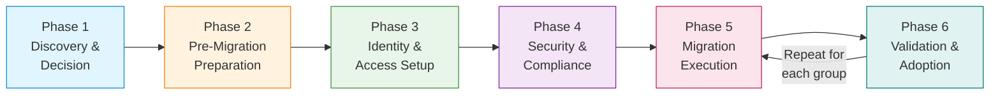
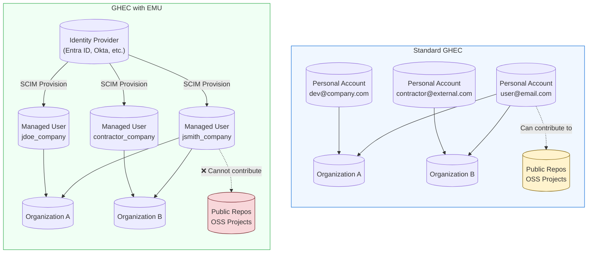
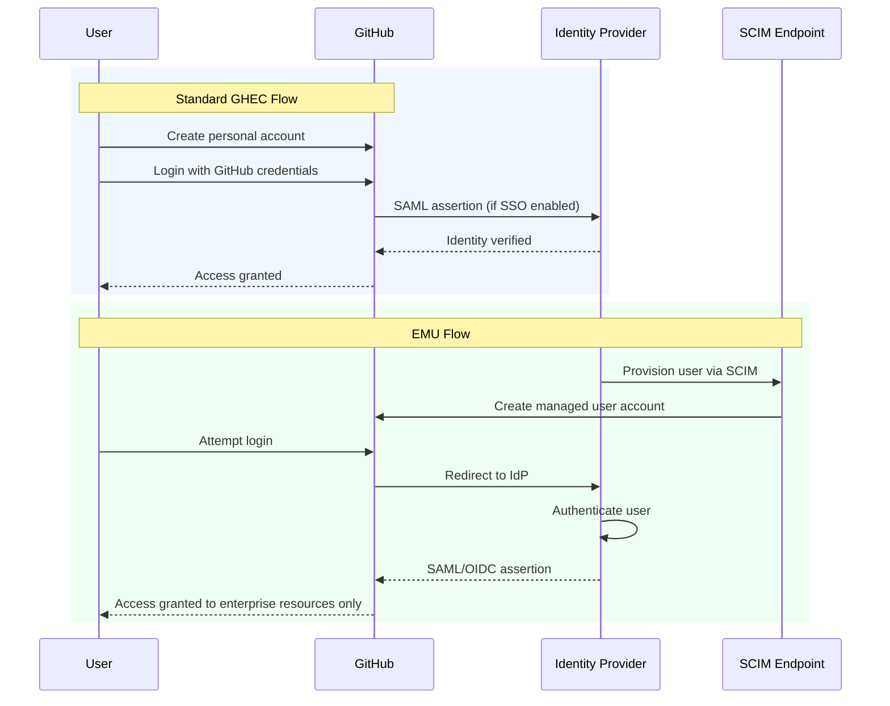
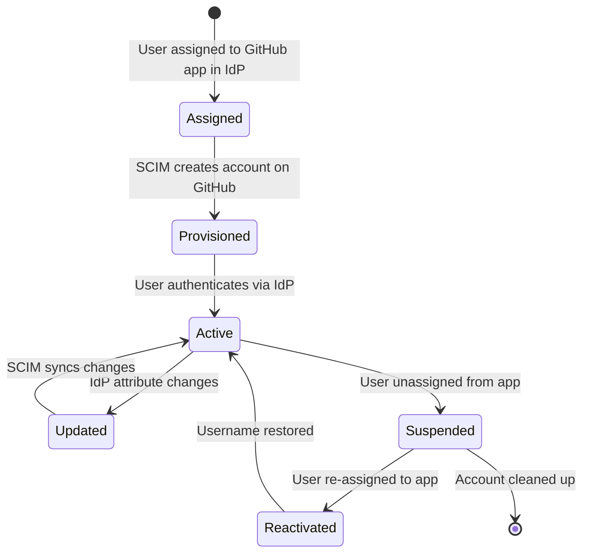
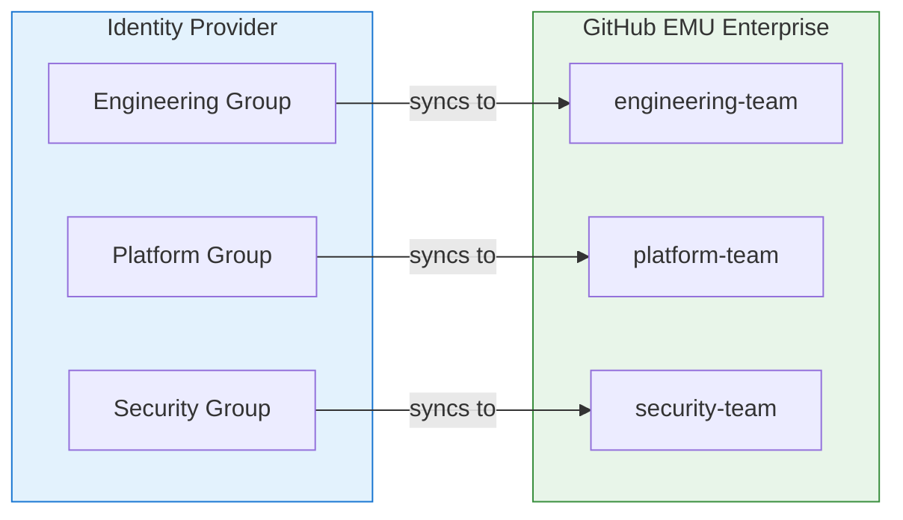
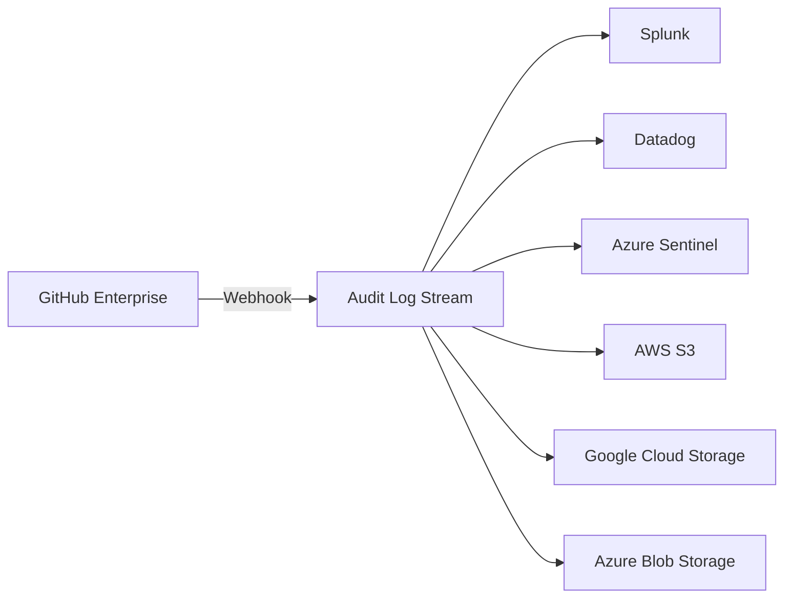
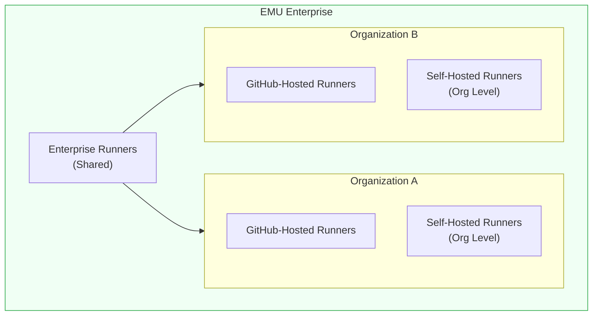
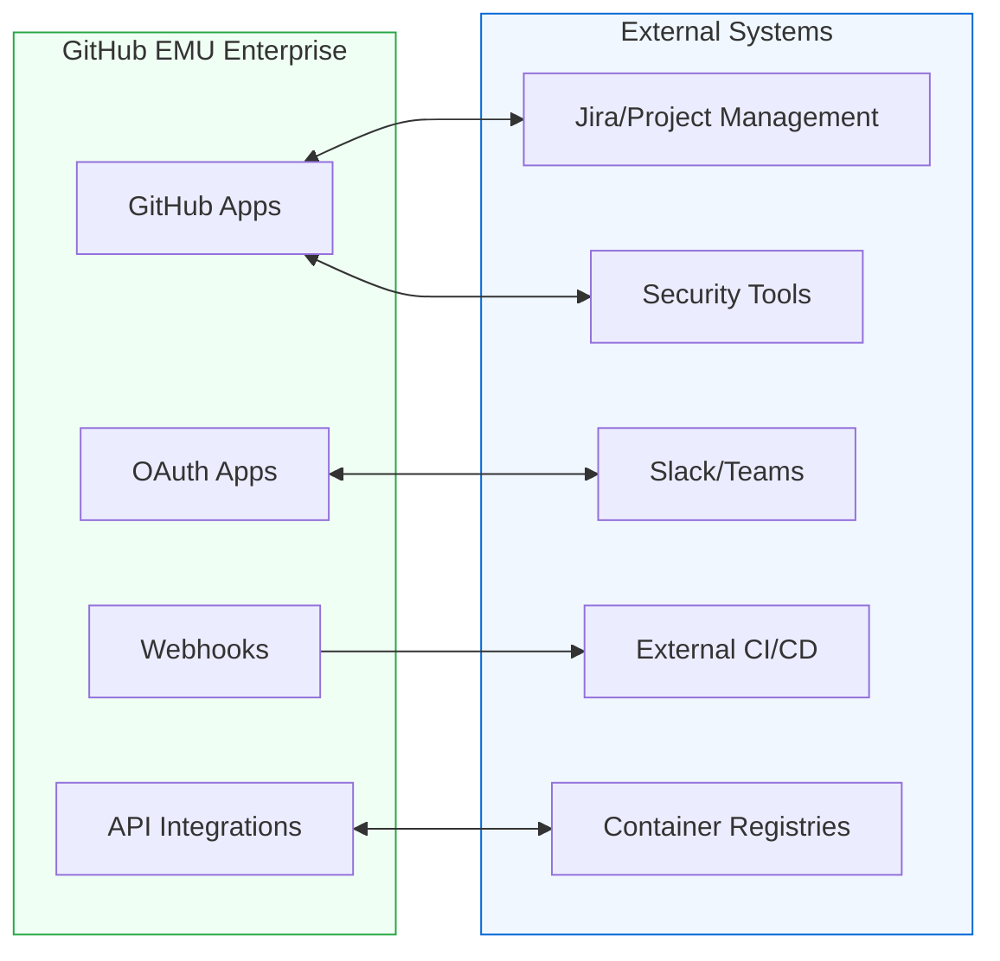
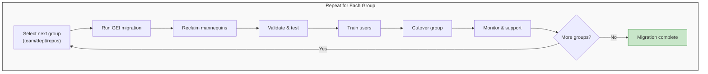
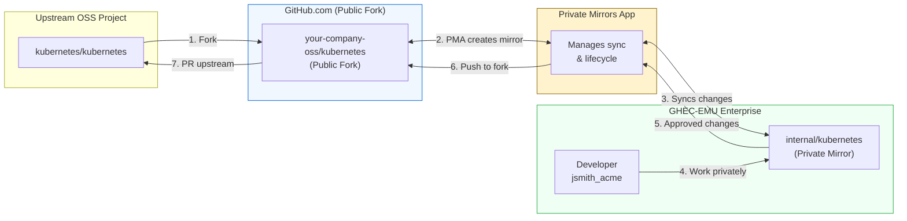

Migrating to GitHub Enterprise Cloud with Enterprise Managed Users (EMU) is one of those projects that sounds straightforward until you're knee-deep in identity provider configurations wondering why SCIM provisioning just deleted half your test users and renamed the other half. Trust me, I've been there.

This guide is designed to help you navigate the migration process with your sanity intact. Whether you're coming from standard GitHub Enterprise Cloud (GHEC), GitHub Enterprise Server (GHES), or another SCM platform entirely, we'll cover the requirements, considerations, gotchas, and hard-won lessons that will make your migration successful.

## Migration Phases Overview

A successful EMU migration is a marathon, not a sprint. We've broken this guide into six distinct phases to help you track progress and ensure nothing falls through the cracks:



| Phase | Focus | Key Activities | Timeline |
|-------|-------|----------------|----------|
| **Phase 1** | Discovery & Decision | Define goals, evaluate fit, get buy-in | 2-4 weeks |
| **Phase 2** | Pre-Migration Preparation | Inventory, cleanup, IdP readiness, user communication | 4-8 weeks |
| **Phase 3** | Identity & Access Setup | Configure SCIM, provision users, set up teams | 1-2 weeks |
| **Phase 4** | Security & Compliance | Audit logging, security hardening, CI/CD, integrations | 2-4 weeks |
| **Phase 5** | Migration Execution | Run GEI, migrate repos, reclaim mannequins | *Per group* |
| **Phase 6** | Validation & Adoption | Testing, user training, OSS strategy, go-live | *Per group* |

**Phases 1-4** are sequential and done once. **Phases 5-6 are iterative**. You'll repeat them for each team, department, or group of repositories you migrate. Don't try to move everyone at once. Let me say that again DO NOT TRY TO MIGRATE EVERYTHING AT ONCE. Whew... got that out of my system....

**Total estimated timeline: 12-26 weeks** depending on organization size and complexity.

> **NOTE:** These times can vary WILDLY depending on a multitude of factors. Some organizations have completed 1000 user migrations in 6-8 weeks, others have taken 18+ months. The key is that Phases 5 and 6 form a loop: you migrate a group, validate, get them productive, then move to the next group. Trying to do a "big bang" migration rarely ends well.

Now let's dive into each phase.

---

# Phase 1: Discovery & Decision

*Why are we doing this, and is EMU the right choice?*

Before you commit to an EMU migration, you need to ensure it's the right fit for your organization. This phase is about understanding EMU, defining your goals, and getting stakeholder alignment.

## Why Migrate to EMU? Defining Your Goals

Before diving into the technical details, let's be clear about what you're trying to achieve. A successful migration starts with well-defined goals that your stakeholders agree on.

### Common Migration Goals

**Security and Risk Reduction**
- Eliminate the risk of code leaking to public repositories
- Ensure immediate access revocation when employees leave
- Gain visibility into all developer activity through centralized audit logging
- Enforce corporate authentication policies consistently

**Compliance and Governance**
- Meet regulatory requirements for identity management (SOC 2, HIPAA, FedRAMP)
- Satisfy auditor requests for centralized access control evidence
- Implement data residency controls for geographic compliance
- Demonstrate segregation of duties through role-based access

**Operational Efficiency**
- Reduce manual account management overhead through SCIM automation
- Consolidate identity management into your existing IdP infrastructure
- Simplify access reviews and certifications with group-based permissions
- Decrease time-to-productivity for new hires through automated provisioning

**Cost Optimization**
- Better license management through automated deprovisioning
- Reduced support burden from self-service account issues
- Cleaner enterprise structure with centralized administration

### Defining Success Metrics

Document measurable outcomes for your migration. Here are a couple possible examples. These may or may not align with your reasons or goals and that's totally fine. The key is to document the "why" about the process.

| Goal | Metric | Target |
|------|--------|--------|
| Security | Time to revoke access on termination | < 1 hour (automated) |
| Compliance | Audit findings related to access management | Zero |
| Efficiency | Manual account management tasks per month | Reduced by 90% |
| Visibility | Percentage of activity captured in audit logs | 100% |

Having these goals documented helps justify the migration effort, align stakeholders, and measure success after completion.

## What Are Enterprise Managed Users?

Before we dive into the migration process, let's make sure we're on the same page about what EMU actually is and why you might want it.

Enterprise Managed Users is GitHub's solution for organizations that need centralized identity management. Unlike standard GHEC where users create and manage their own personal accounts, EMU gives your organization complete control over the user lifecycle:

- **Your IdP provisions user accounts** on GitHub, with access to your enterprise
- **Users authenticate through your identity provider** using SAML or OIDC
- **You control usernames, profile data, organization membership, and repository access** from your IdP
- **User accounts are automatically created, updated, and deactivated** based on IdP changes

Think of it as the difference between "bring your own device" and "company-issued laptops." Both can work, but they serve different security and compliance requirements.

For the full rundown, see GitHub's official documentation on [About Enterprise Managed Users](https://docs.github.com/en/enterprise-cloud@latest/admin/identity-and-access-management/understanding-iam-for-enterprises/about-enterprise-managed-users).

## When Should You Use EMU?

EMU isn't for everyone, and that's okay. Here's how to figure out if it's right for your organization.

### Reasons TO Use EMU

**1. Compliance and Regulatory Requirements**

If you're in a regulated industry (finance, healthcare, government, defense), EMU provides the control auditors love:
- Complete user lifecycle management from a single source of truth
- Automatic deprovisioning when employees leave (no more orphaned accounts)
- Full audit trail of all identity-related actions
- Enforced authentication through your corporate IdP

**2. Data Loss Prevention (DLP)**

EMU's restrictions are features, not bugs, for security-conscious organizations:
- Users cannot accidentally (or intentionally) push company code to public repositories
- No public gists where sensitive snippets might end up
- All work stays within your enterprise boundary
- Prevents "shadow IT" scenarios where developers use personal accounts for work

**3. True Single Sign-On Experience**

Unlike standard GHEC where SAML links external identities to personal accounts, EMU provides actual SSO:
- Users authenticate once through your IdP
- No separate GitHub passwords to manage
- Conditional Access Policies (with OIDC/Entra ID) for location, device compliance, and risk-based access
- Session management tied directly to your IdP

**4. Centralized Identity Governance**

If your organization already invests heavily in identity management:
- User attributes flow automatically from your IdP
- Group-based access management through IdP groups
- Consistent naming conventions across all systems
- One place to manage access reviews and certifications

**5. Contractor and Vendor Management**

EMU's guest collaborator role is perfect for external parties:
- Grant temporary access without creating permanent accounts
- Automatic removal when contractor engagements end
- Clear separation between full-time employees and external collaborators
- Audit trail for all external access

**6. Data Residency Requirements**

If you need to control where your data is stored, GitHub Enterprise Cloud with data residency (on GHE.com) **requires** EMU. This is essential for organizations with:
- EU data sovereignty requirements
- Government data handling mandates
- Industry-specific geographic restrictions

### Reasons NOT to Use EMU

**1. Heavy Open Source Participation**

If your company actively contributes to open source projects:
- Managed users cannot contribute to repositories outside your enterprise
- No public repository creation means no hosting your own OSS projects on GitHub
- Developers will need separate personal accounts for external contributions
- The cognitive overhead of switching accounts is real and annoying

**2. Developer Recruitment and Community Building**

Contribution graphs matter for some organizations:
- Managed user contributions don't appear on public profiles
- You can't showcase your team's open source work through their EMU accounts
- Developer advocacy and community engagement become more complex

**3. Small Teams or Startups**

The overhead may not be worth it if:
- You have fewer than 50-100 developers
- Your IdP infrastructure isn't mature
- You need flexibility over control
- Quick onboarding trumps governance

**4. Academic or Research Institutions**

Where collaboration is the primary goal:
- Researchers need to collaborate across institutional boundaries
- Open publication of code is often required
- Student accounts come and go frequently
- The "walled garden" model conflicts with academic openness

**5. Consulting or Agency Work**

If your developers work in client repositories:
- Managed users can only access repositories within your enterprise
- Client work often happens in the client's GitHub organization
- The restrictions create friction for client-facing work

### The Decision Framework

Ask yourself these questions:

| Question | If Yes | If No |
|----------|--------|-------|
| Do we have strict compliance requirements? | EMU | Either |
| Do developers need to contribute to external OSS? | Standard GHEC | EMU |
| Is our IdP our source of truth for all access? | EMU | Either |
| Do we need data residency controls? | EMU | Either |
| Do developers work in client repositories? | Standard GHEC | Either |
| Is preventing data exfiltration a top priority? | EMU | Either |

If you answered "EMU" to multiple questions, especially the compliance and data residency ones, EMU is probably your path. If external collaboration is critical to your business, think carefully before committing.

## Comparing GHEC and GHEC-EMU

One of the most common migration scenarios is moving from standard GHEC to GHEC-EMU. Before you start, it's critical to understand what you're gaining and what you're giving up.

### Architectural Differences



### Identity and Authentication Flow Comparison



### Feature Comparison Matrix

| Capability | Standard GHEC | GHEC-EMU |
|------------|--------------|----------|
| User account creation | User self-service | IdP provisioned only |
| Username format | User chosen | `handle_shortcode` format |
| Public repository creation | Yes | No |
| Public gists | Yes | No |
| Contribute to external repos | Yes | No |
| GitHub Pages (public) | Yes | Limited |
| GitHub Copilot Free/Pro | Yes | No (requires Business/Enterprise) |
| Conditional Access Policy | Limited | Full support (with OIDC) |
| User lifecycle management | Manual | Automated via SCIM |
| Identity provider | Optional | Required |

For the complete list of restrictions, see [Abilities and restrictions of managed user accounts](https://docs.github.com/en/enterprise-cloud@latest/admin/identity-and-access-management/understanding-iam-for-enterprises/abilities-and-restrictions-of-managed-user-accounts).

---

# Phase 2: Pre-Migration Preparation

*Cleaning up the old environment and getting ready to move.*

This phase is where you do the unglamorous but critical work: auditing what you have, cleaning up what you don't need, and ensuring your identity infrastructure is ready. Skipping this phase leads to painful surprises during migration.

## Pre-Migration Requirements Checklist

Before you even think about scheduling a migration window, you need to ensure your foundation is solid.

### 1. Identity Provider Readiness

EMU requires a compatible identity provider. GitHub has "paved-path" integrations with these partner IdPs:

| Identity Provider | SAML SSO | OIDC SSO | SCIM Provisioning |
|-------------------|----------|----------|-------------------|
| Microsoft Entra ID (Azure AD) | ✅ | ✅ | ✅ |
| Okta | ✅ | ❌ | ✅ |
| PingFederate | ✅ | ❌ | ✅ |

**Critical Note:** The combination of Okta and Entra ID for SSO and SCIM (in either order) is explicitly **not supported**. GitHub's SCIM API will return errors if this combination is configured.

If you're using a non-partner IdP, you can still configure EMU, but your system must:
- Adhere to GitHub's integration guidelines
- Provide authentication using SAML 2.0 specification
- Provide user lifecycle management using SCIM 2.0 specification
- Communicate with GitHub's REST API for SCIM

See [Configuring SCIM provisioning for Enterprise Managed Users](https://docs.github.com/en/enterprise-cloud@latest/admin/identity-and-access-management/provisioning-user-accounts-for-enterprise-managed-users/configuring-scim-provisioning-for-enterprise-managed-users) for detailed setup instructions.

### 2. Inventory Your Current State

Before migrating, you need a complete picture of what you're moving. Use the [`gh-repo-stats`](https://github.com/mona-actions/gh-repo-stats/) extension for GitHub CLI to generate a full inventory:

```bash
# Install the extension
gh extension install mona-actions/gh-repo-stats

# Generate inventory for your organization
gh repo-stats --org your-org-name --output inventory.csv
```

Your inventory should capture:
- Repository names and owners
- Last updated timestamps
- Pull request and issue counts
- Repository sizes (especially large files)
- Team structures and permissions
- Active integrations and webhooks
- GitHub Actions workflows

### 3. Assess Repository Sizes

Large repositories can significantly impact migration time and success. Use [`git-sizer`](https://github.com/github/git-sizer) to analyze each repository:

```bash
# Clone the repository
git clone --mirror https://github.com/org/repo.git

# Navigate to the cloned repo
cd repo.git

# Get the size of the largest file
git-sizer --no-progress -j | jq ".max_blob_size"

# Get total size of all files
git-sizer --no-progress -j | jq ".unique_blob_size"
```

If you have files over 100MB in your repository history, consider using [Git LFS](https://docs.github.com/en/repositories/working-with-files/managing-large-files/about-git-large-file-storage) or rewriting history before migration.

### 4. User Communication Plan

This is often overlooked, but arguably the most important step. Your users will experience:
- New usernames (their handle plus your enterprise shortcode)
- Loss of ability to contribute to public repositories
- Different authentication flow
- Potential loss of contribution history if not properly attributed

Start communicating early and often. Create documentation, hold training sessions, and set up a support channel for questions.

### 5. Pre-Migration Cleanup

**Don't migrate your mess; clean house first.** Every piece of technical debt, every abandoned repository, every stale PR you migrate is technical debt you're paying to move. Take this opportunity to start fresh.

#### Archive Unused Repositories

Identify and archive repositories that are no longer actively maintained:

```bash
# Find repositories with no activity in the last year
gh api graphql -f query='
query($org: String!, $cursor: String) {
  organization(login: $org) {
    repositories(first: 100, after: $cursor) {
      pageInfo { hasNextPage endCursor }
      nodes {
        name
        pushedAt
        isArchived
        defaultBranchRef {
          target {
            ... on Commit {
              committedDate
            }
          }
        }
      }
    }
  }
}' -f org=YOUR_ORG | jq '.data.organization.repositories.nodes[] | 
  select(.isArchived == false) | 
  select(.pushedAt < (now - 31536000 | todate)) | 
  .name'
```

Before archiving, consider:
- [ ] Has this repository been superseded by another project?
- [ ] Are there any active forks that should be migrated instead?
- [ ] Does it contain documentation that should be preserved elsewhere?
- [ ] Are there any secrets or credentials that need to be rotated first?

Archive repositories using:

```bash
# Archive a single repository
gh repo archive OWNER/REPO

# Bulk archive from a list
while read repo; do
  gh repo archive "$repo" --yes
  echo "Archived: $repo"
done < repos-to-archive.txt
```

> **Note:** Archived repositories can still be migrated if needed, but they signal to your team that the content is historical rather than active.

#### Close Stale Pull Requests

Open PRs that haven't been touched in months are rarely going to be merged. Close them before migration to avoid polluting your new environment:

```bash
# Find PRs older than 90 days with no recent activity
gh pr list --repo OWNER/REPO --state open --json number,title,updatedAt,author \
  --jq '.[] | select(.updatedAt < (now - 7776000 | todate))'

# Close stale PRs with a comment explaining why
gh pr close PR_NUMBER --repo OWNER/REPO \
  --comment "Closing as part of pre-migration cleanup. This PR has been inactive for >90 days. Please reopen against the new repository location if still needed."
```

For bulk operations, create a script:

```bash
#!/bin/bash
# close-stale-prs.sh - Close PRs older than specified days

REPO="$1"
DAYS="${2:-90}"
CUTOFF_DATE=$(date -d "$DAYS days ago" +%Y-%m-%d 2>/dev/null || date -v-${DAYS}d +%Y-%m-%d)

gh pr list --repo "$REPO" --state open --json number,title,updatedAt --jq '.[]' | \
while read -r pr; do
  PR_NUM=$(echo "$pr" | jq -r '.number')
  UPDATED=$(echo "$pr" | jq -r '.updatedAt' | cut -d'T' -f1)
  
  if [[ "$UPDATED" < "$CUTOFF_DATE" ]]; then
    echo "Closing PR #$PR_NUM: $(echo "$pr" | jq -r '.title')"
    gh pr close "$PR_NUM" --repo "$REPO" \
      --comment "🧹 Closing as part of pre-migration cleanup to EMU. This PR has been inactive since $UPDATED. If still relevant, please recreate after migration."
  fi
done
```

#### Clean Up Stale Issues

Similar to PRs, old issues that have gone cold should be triaged:

```bash
# Find issues with no activity in 6 months
gh issue list --repo OWNER/REPO --state open --json number,title,updatedAt,labels \
  --jq '.[] | select(.updatedAt < (now - 15552000 | todate))'

# Close with a descriptive label and comment
gh issue close ISSUE_NUMBER --repo OWNER/REPO \
  --comment "Closing as part of pre-migration housekeeping. If this issue is still relevant, please reopen or create a new issue in our new location."
```

Consider creating a "stale" or "pre-migration-triage" label to tag issues that need review before migration.

#### Prune Dead Branches

Every repository accumulates branches over time. Clean them up:

```bash
# List merged branches (safe to delete)
git branch -r --merged main | grep -v main | grep -v HEAD

# List branches with no commits in 6 months
for branch in $(git branch -r | grep -v HEAD); do
  last_commit=$(git log -1 --format="%ci" "$branch" 2>/dev/null | cut -d' ' -f1)
  if [[ "$last_commit" < "$(date -d '6 months ago' +%Y-%m-%d 2>/dev/null || date -v-6m +%Y-%m-%d)" ]]; then
    echo "$branch - last commit: $last_commit"
  fi
done

# Delete remote branches (be careful!)
git push origin --delete branch-name
```

GitHub also provides branch protection rules that can help prevent branch sprawl post-migration. See [Managing a branch protection rule](https://docs.github.com/en/repositories/configuring-branches-and-merges-in-your-repository/managing-protected-branches/managing-a-branch-protection-rule).

#### Audit and Remove Unused Integrations

Review OAuth apps, GitHub Apps, and webhooks before migration:

```bash
# List all webhooks in an organization
gh api orgs/YOUR_ORG/hooks --jq '.[] | {id, name, active, config: .config.url}'

# List installed GitHub Apps
gh api orgs/YOUR_ORG/installations --jq '.installations[] | {id, app_slug, permissions}'
```

For each integration, ask:
- [ ] Is this integration still actively used?
- [ ] Does the integration support EMU? (Check with the vendor)
- [ ] Are there EMU-compatible alternatives?
- [ ] Who owns this integration and can validate its necessity?

Remove integrations that are no longer needed - they won't migrate cleanly anyway, and orphaned webhooks are a security risk.

#### Clean Up Teams and Access

Review your team structure and membership:

```bash
# List all teams and their member counts
gh api orgs/YOUR_ORG/teams --jq '.[] | {name, slug, members_count: .members_count}'

# List team members
gh api orgs/YOUR_ORG/teams/TEAM_SLUG/members --jq '.[].login'
```

Questions to address:
- [ ] Are there teams with no members or no repository access?
- [ ] Are there duplicate teams that should be consolidated?
- [ ] Do team names follow your naming conventions?
- [ ] Are nested teams structured appropriately for your IdP groups?

Remember: In EMU, team membership is managed via your IdP. This is a great opportunity to align your GitHub team structure with your IdP groups.

#### Remove Secrets and Sensitive Data

This is critical. Before migration:

1. **Rotate all secrets** - Any token, API key, or credential in your code should be rotated to prevent the possiblity of comprimise from a leaked secret.
2. **Check for committed secrets** - Use [GitHub Secret Scanning](https://docs.github.com/en/code-security/secret-scanning/introduction/about-secret-scanning) or tools like [truffleHog](https://github.com/trufflesecurity/trufflehog) or [gitleaks](https://github.com/gitleaks/gitleaks)
3. **Review Actions secrets** - Document all repository and organization secrets that will need to be recreated

```bash
# Check for exposed secrets using gitleaks
gitleaks detect --source . --verbose

# List organization secrets (names only, not values)
gh api orgs/YOUR_ORG/actions/secrets --jq '.secrets[].name'

# List repository secrets
gh api repos/OWNER/REPO/actions/secrets --jq '.secrets[].name'
```

> **⚠️ Important:** Secrets don't migrate automatically. You'll need to recreate them in your new EMU environment. Use this as an opportunity to implement proper secrets management with tools like [HashiCorp Vault](https://www.vaultproject.io/) or [Azure Key Vault](https://azure.microsoft.com/en-us/products/key-vault).

#### Create a Cleanup Checklist

Track your progress with a checklist:

| Category | Task | Owner | Status |
|----------|------|-------|--------|
| Repositories | Identify repos with no activity >1 year | | ☐ |
| Repositories | Archive or delete unused repositories | | ☐ |
| Repositories | Document repos that should NOT migrate | | ☐ |
| Pull Requests | Close PRs inactive >90 days | | ☐ |
| Pull Requests | Merge or close PRs that are ready | | ☐ |
| Issues | Triage issues inactive >6 months | | ☐ |
| Issues | Close issues that are no longer relevant | | ☐ |
| Branches | Delete merged branches | | ☐ |
| Branches | Delete stale feature branches | | ☐ |
| Integrations | Audit all OAuth and GitHub Apps | | ☐ |
| Integrations | Remove unused webhooks | | ☐ |
| Integrations | Verify EMU compatibility for remaining integrations | | ☐ |
| Teams | Review and consolidate team structure | | ☐ |
| Teams | Map teams to IdP groups | | ☐ |
| Security | Scan for committed secrets | | ☐ |
| Security | Rotate all credentials | | ☐ |
| Security | Document secrets for recreation | | ☐ |

The goal is simple: **migrate only what you need, and migrate it clean.** Your future self will thank you.

---

# Phase 3: Identity & Access Setup

*Setting up the new environment before migration.*

Before you can migrate repositories, you need users to assign permissions to. This phase covers configuring your IdP integration, provisioning users via SCIM, and setting up team structures. Get this right first - it makes everything else smoother.

## Identity and User Lifecycle Management

This is where EMU really shines, but also where things can go sideways if not configured properly.

### Username Normalization

GitHub automatically creates usernames by normalizing an identifier from your IdP. The format is:

```
{normalized_handle}_{enterprise_shortcode}
```

For example, if your enterprise shortcode is `acme` and the IdP provides `John.Smith@company.com`, the username might become `john-smith_acme`.

Be aware that:
- Special characters are removed or replaced
- Conflicts may occur if normalized names collide
- Changing a user's email in the IdP will unlink contribution history
- Avoid using any type of randomly generated number or ID as part of the username. It might seem like an easy way to deal with name collisions but if something in the user record updates, SCIM will reprocess the user object and any expressions. TLDR, if you use `rand()` your usernames will change and your users will have a bad time...

See [Username considerations for external authentication](https://docs.github.com/en/enterprise-cloud@latest/admin/identity-and-access-management/managing-iam-for-your-enterprise/username-considerations-for-external-authentication) for normalization rules.

### SCIM Provisioning Lifecycle

With SCIM properly configured, the user lifecycle is fully automated:



### Team and Permission Synchronization

In EMU, team membership is managed through your IdP using group synchronization. This is a fundamental shift from standard GHEC where team membership is managed directly in GitHub.

#### How Team Sync Works



When you connect an IdP group to a GitHub team:
- Users in the IdP group are automatically added to the GitHub team
- Users removed from the IdP group are automatically removed from the GitHub team
- Changes propagate within minutes (typically)
- Manual team membership changes in GitHub are overwritten by the next sync

#### Setting Up Team Sync

**Step 1: Create the GitHub team**

```bash
# Create a new team in your organization
gh api orgs/YOUR_ORG/teams \
  -X POST \
  -f name="platform-team" \
  -f description="Platform engineering team" \
  -f privacy="closed"
```

**Step 2: Connect the IdP group**

In the GitHub UI:
1. Navigate to your organization → Teams → Select team
2. Click "Settings" → "Identity Provider Groups"
3. Search for and select the IdP group to connect
4. Save changes

Or via API:

```bash
# Connect an IdP group to a team
# You'll need the group's IdP identifier
gh api orgs/YOUR_ORG/teams/TEAM_SLUG/team-sync/group-mappings \
  -X PATCH \
  -f "groups[][group_id]=YOUR_IDP_GROUP_ID" \
  -f "groups[][group_name]=Your IdP Group Name" \
  -f "groups[][group_description]=Group description"
```

#### Team Structure Planning

Before migration, map out how your IdP groups will connect to GitHub teams:

| IdP Group | GitHub Team | Repository Access | Permission Level |
|-----------|-------------|-------------------|------------------|
| `eng-backend` | `backend-developers` | `api-services/*` | Write |
| `eng-frontend` | `frontend-developers` | `web-app/*` | Write |
| `eng-platform` | `platform-team` | `infrastructure/*` | Admin |
| `eng-leads` | `tech-leads` | All repos | Maintain |
| `security-team` | `security-reviewers` | All repos | Read + Security alerts |

**Key considerations:**

1. **One-to-one or one-to-many?** Each GitHub team can only be connected to ONE IdP group. But one IdP group can be connected to multiple GitHub teams if needed.

2. **Nested teams**: GitHub supports nested teams, but the IdP group connection only applies to the team it's directly connected to. Child teams don't inherit the group connection.

3. **Naming conventions**: Establish clear naming conventions that work in both systems. Consider prefixes like `gh-` in your IdP to identify GitHub-related groups.

4. **Permission inheritance**: Teams grant repository permissions. Plan your team hierarchy to match your access control needs.

#### Common Pitfalls

**❌ Problem: Manually adding users to synced teams**

Users added manually to a team with IdP sync enabled will be removed on the next sync cycle. All membership must flow through the IdP group.

**❌ Problem: Orphaned teams after migration**

If you migrate teams but don't connect them to IdP groups, they'll have no members (since EMU users can only be in teams via IdP sync).

**❌ Problem: Too many small groups**

Creating a 1:1 mapping between every repository and an IdP group leads to group sprawl in your IdP. Use team hierarchies and broader access patterns where appropriate.

**✅ Solution: Plan your group strategy**

```
IdP Group Strategy:
├── Broad access groups (most users)
│   ├── all-developers (read to most repos)
│   └── all-engineers (write to team repos)
├── Team-specific groups
│   ├── team-api
│   ├── team-web
│   └── team-mobile
└── Privileged access groups
    ├── repo-admins
    └── security-team
```

#### Verifying Team Sync

After setup, verify sync is working:

```bash
# List team members (should match IdP group)
gh api orgs/YOUR_ORG/teams/TEAM_SLUG/members --jq '.[].login'

# Check team sync status
gh api orgs/YOUR_ORG/teams/TEAM_SLUG/team-sync/group-mappings
```

See [Managing team memberships with identity provider groups](https://docs.github.com/en/enterprise-cloud@latest/admin/identity-and-access-management/using-enterprise-managed-users-for-iam/managing-team-memberships-with-identity-provider-groups) for complete documentation.

---

# Phase 4: Security & Compliance

*Locking down the new environment before migration begins.*

Before you start moving repositories and onboarding users, you need the security guardrails in place. This phase covers audit logging, enterprise policies, CI/CD configuration, and integrations. Get these right so that when code lands in the new environment, it's already protected.

## Audit Logging and Compliance

EMU provides detailed audit logging that's essential for compliance and security monitoring.

### Compliance Framework Alignment

EMU's controls map well to common compliance frameworks. Here's how EMU features support specific requirements:

| Framework | Relevant Controls | How EMU Helps |
|-----------|-------------------|---------------|
| **SOC 2** | Access Control (CC6.1), User Authentication (CC6.6) | Centralized IdP authentication, automated deprovisioning, audit trails |
| **HIPAA** | Access Controls (164.312(a)), Audit Controls (164.312(b)) | Role-based access via IdP groups, detailed audit logging |
| **FedRAMP** | IA-2 (Identification), AC-2 (Account Management) | SSO enforcement, automated account lifecycle, session management |
| **PCI-DSS** | Requirement 7 (Restrict Access), Requirement 8 (Identify Users) | Unique user IDs, MFA via IdP, access logging |
| **GDPR** | Article 32 (Security of Processing) | Data residency options, access controls, right to erasure via IdP |
| **ISO 27001** | A.9 (Access Control) | Identity management, user provisioning, access reviews |

> NOTE: This doesn't mean that you are automatically compliant. These are areas where EMU **helps** get you to a compliant state.

**Key compliance benefits:**
- **Single source of truth**: All access decisions flow from your IdP, simplifying audit evidence collection
- **Automated offboarding**: Deprovisioned users lose access immediately, no manual cleanup required
- **Immutable audit trail**: GitHub's audit log provides tamper-evident records of all actions
- **Segregation of duties**: Role-based access through IdP groups ensures proper separation

### What's Captured

The audit log captures:
- User authentication events
- Repository access and modifications
- Organization and team changes
- SAML SSO and SCIM identity information
- Source IP addresses (when enabled)
- Token-based access identification

Events are retained for 180 days, with Git events retained for 7 days.

### Streaming Audit Logs

For long-term retention and SIEM integration, configure audit log streaming:



See [Streaming the audit log for your enterprise](https://docs.github.com/en/enterprise-cloud@latest/admin/monitoring-activity-in-your-enterprise/reviewing-audit-logs-for-your-enterprise/streaming-the-audit-log-for-your-enterprise) for configuration details.

### Audit Log API

For programmatic access, use the Audit Log API:

```bash
# Get recent audit events
gh api \
  -H "Accept: application/vnd.github+json" \
  /enterprises/{enterprise}/audit-log
```

> NOTE: It's recommended to stream the audit log somewhere else for data processing versus calling the API as the API has certain rate limits that might not be able to keep up in a busy environment.

See [Using the audit log API for your enterprise](https://docs.github.com/en/enterprise-cloud@latest/admin/monitoring-activity-in-your-enterprise/reviewing-audit-logs-for-your-enterprise/using-the-audit-log-api-for-your-enterprise).

## Security Hardening Best Practices

Once you've migrated, implementing proper security controls is essential.

### Enterprise Policies

Set enterprise-wide policies to enforce security standards:

- **Repository visibility**: Restrict to private and internal only
- **Repository creation**: Control who can create repositories
- **Forking**: Limit forking to within the enterprise
- **Actions permissions**: Restrict to verified or enterprise-approved actions
- **Code security**: Enable secret scanning and code scanning by default

See [Enforcing policies for your enterprise](https://docs.github.com/en/enterprise-cloud@latest/admin/enforcing-policies/enforcing-policies-for-your-enterprise).

### Conditional Access Policies (OIDC)

If you use OIDC with Entra ID, you can enforce certian Conditional Access Policies. OIDC cannot enforce device health/compliance conditions. 

See [About support for your IdP's Conditional Access Policy](https://docs.github.com/en/enterprise-cloud@latest/admin/identity-and-access-management/using-enterprise-managed-users-for-iam/about-support-for-your-idps-conditional-access-policy).

### Secret Scanning and Push Protection

If you have GitHub Advanced Security, enable Secrets Scanning and Push Protection the enterprise level:

```
Enterprise Settings → Code security and analysis → Enable for all repositories
```

This catches secrets before they're committed and alerts on any that slip through.

### IP Allow Lists

Restrict access to your enterprise from known IP ranges:

```
Enterprise Settings → Authentication security → IP allow list
```

> NOTE: One caveat here, make sure you talk to your edge networking folks to understand your Internet egress. It's tempting to try to restrict access to a very small number of IPs to make the Allow List management easier, however, this has the possible negative effect of triggering GitHub's DDOS protections and rate limits. 

## CI/CD Implications and GitHub Actions

Your CI/CD pipelines will need attention during the migration. GitHub Actions works with EMU, but there are important differences and considerations.

### GitHub Actions Changes

**What stays the same:**
- Workflow syntax and YAML structure
- GitHub-hosted runner availability (for organization-owned repos)
- Most marketplace actions work normally
- Reusable workflows within the enterprise

**What changes:**
- **Personal repository runners**: Managed users cannot use GitHub-hosted runners for personal repositories (they can only own private repos anyway)
- **Cross-enterprise workflows**: Cannot reference actions or workflows from outside your enterprise unless they are in public repos.
- **GITHUB_TOKEN scope**: Token permissions are scoped to enterprise resources only

### Runner Strategy

For EMU enterprises, plan your runner infrastructure carefully:



**Self-hosted runner considerations:**
- Register runners at the enterprise level for shared infrastructure
- Use runner groups to control which organizations can use which runners. This has the added benefit of separating the usage from the actual infrastructure. Developers set workflows to run on a runner group and don't worry about it. Ops teams can change out hardware under the hood without the Devs needing to update their workflows.
- Implement auto scaling options like [Actions Runner Controller](https://docs.github.com/en/actions/reference/runners/self-hosted-runners)
- Ensure runners can authenticate to your IdP if workflows need corporate resources

### Secrets and Variables Management

Secrets management changes slightly with EMU:

1. **Organization secrets**: Work the same, scoped to org repositories
2. **Repository secrets**: Work the same
3. **Environment secrets**: Work the same, with environment protection rules
4. **Personal access tokens (PATs)**: Managed users can create PATs, but they're scoped to enterprise resources only

**Best practices:**
```yaml
# Use OIDC for cloud provider authentication instead of long-lived secrets
jobs:
  deploy:
    permissions:
      id-token: write
      contents: read
    steps:
      - uses: aws-actions/configure-aws-credentials@v4
        with:
          role-to-assume: arn:aws:iam::123456789:role/github-actions
          aws-region: us-east-1
```

See [About security hardening with OpenID Connect](https://docs.github.com/en/actions/deployment/security-hardening-your-deployments/about-security-hardening-with-openid-connect).

### Actions Permissions and Policies

Configure enterprise-wide Actions policies:

```
Enterprise Settings → Policies → Actions
```

Recommended settings for secure EMU environments:
- **Allow select actions**: Restrict to GitHub-authored, verified marketplace, and specific trusted actions
- **Require approval for fork PRs**: Prevent malicious workflow execution from forks
- **Default workflow permissions**: Set to read-only, require explicit write permissions
- **Allow GitHub Actions to create PRs**: Disable unless specifically needed

### Migrating Existing Workflows

When migrating workflows from standard GHEC:

1. **Audit action sources**: Ensure all referenced actions are available in your EMU enterprise
2. **Update authentication**: Replace personal PATs with GitHub App tokens or OIDC
3. **Review external calls**: Workflows calling external APIs may need updated credentials
4. **Test thoroughly**: Run workflows in the new environment before switching production

```bash
# Find all actions used in your workflows
find . -name "*.yml" -path ".github/workflows/*" -exec grep -h "uses:" {} \; | \
  sort | uniq -c | sort -rn
```

## Planning for Integrations

Integrations are often the most complex part of an EMU migration. You'll need to audit, test, and potentially reconfigure every integration.

### Types of Integrations to Consider



### GitHub Apps vs OAuth Apps

**GitHub Apps** (preferred for EMU):
- Can be installed at organization or repository level
- Use short-lived tokens with specific permissions
- Work well with managed user restrictions
- Can be restricted to specific repositories

**OAuth Apps** (use with caution):
- Authenticate as users, which limits functionality for managed users
- May have issues with EMU's visibility restrictions
- Consider migrating to GitHub Apps where possible

### Integration Audit Checklist

Before migration, document each integration:

| Integration | Type | Current Auth | EMU Compatible | Migration Steps |
|-------------|------|--------------|----------------|------------------|
| Jira | GitHub App | App Installation | ✅ Yes | Reinstall in new enterprise |
| Jenkins | Webhook + PAT | Personal Token | ⚠️ Update | Use GitHub App token |
| Slack | OAuth App | User OAuth | ⚠️ Test | Verify with managed user |
| SonarQube | GitHub App | App Installation | ✅ Yes | Reinstall, update config |
| Custom Tool | API | Service Account | ❌ Rework | Create machine user or GitHub App |

### Common Integration Patterns

**Pattern 1: GitHub App Installation**
```yaml
# Preferred approach - install app at org level
# App authenticates with installation token
# Works well with EMU
```

**Pattern 2: Machine User (for legacy integrations)**
If you have integrations that require a "user" account:
- Provision a dedicated managed user via your IdP
- Assign minimal required permissions
- Use this account's PAT for the integration
- Monitor usage via audit logs

**Pattern 3: Webhook to External System**
```bash
# Webhooks work the same in EMU
# Re-register webhooks after migration
# Update webhook secrets
curl -X POST \
  -H "Authorization: token $GITHUB_TOKEN" \
  -H "Accept: application/vnd.github+json" \
  https://api.github.com/orgs/ORG/hooks \
  -d '{"name":"web","config":{"url":"https://example.com/webhook"}}'
```

### Third-Party Tool Compatibility

Contact vendors to verify EMU compatibility for:
- **IDE plugins**: VS Code, JetBrains, etc.
- **Security scanning**: Snyk, Checkmarx, Veracode
- **Project management**: Jira, Azure Boards, Linear
- **Communication**: Slack, Microsoft Teams
- **Monitoring**: Datadog, New Relic

Most modern tools support GitHub Apps and work fine with EMU. Issues typically arise with older tools that rely on user-level OAuth.

## Artifact Management and GitHub Packages

GitHub Packages works with EMU, but there are important considerations for your artifact management strategy.

### Supported Package Types

GitHub Packages in EMU supports:
- **Container Registry** (ghcr.io): Docker and OCI images
- **npm**: JavaScript packages
- **Maven**: Java packages
- **NuGet**: .NET packages
- **RubyGems**: Ruby packages

### Authentication Changes

Managed users authenticate to GitHub Packages the same way, but with enterprise-scoped tokens:

```bash
# Docker login with PAT
echo $GITHUB_TOKEN | docker login ghcr.io -u USERNAME_shortcode --password-stdin

# npm configuration
npm login --registry=https://npm.pkg.github.com --scope=@your-org

# Maven settings.xml
<server>
  <id>github</id>
  <username>USERNAME_shortcode</username>
  <password>${GITHUB_TOKEN}</password>
</server>
```

### Package Visibility and Access

In EMU enterprises:
- **No public packages**: All packages are private or internal (visible within enterprise)
- **Organization-scoped**: Packages belong to organizations, not personal accounts
- **Permission inheritance**: Package access follows repository permissions

### Migration Considerations

When migrating existing packages:

1. **Inventory existing packages**: List all packages across registries
2. **Plan namespace changes**: Package URLs will change with new org structure
3. **Update CI/CD pipelines**: Modify publish/pull configurations
4. **Communicate to consumers**: Internal teams need new registry URLs
5. **Consider caching**: Set up artifact caching for build performance

```yaml
# Example: Updated workflow for EMU package publishing
name: Publish Package
on:
  release:
    types: [published]

jobs:
  publish:
    runs-on: ubuntu-latest
    permissions:
      contents: read
      packages: write
    steps:
      - uses: actions/checkout@v4
      - name: Login to GitHub Container Registry
        uses: docker/login-action@v3
        with:
          registry: ghcr.io
          username: ${{ github.actor }}
          password: ${{ secrets.GITHUB_TOKEN }}
      - name: Build and push
        uses: docker/build-push-action@v5
        with:
          push: true
          tags: ghcr.io/${{ github.repository }}:${{ github.ref_name }}
```

### External Registry Integration

If you use external registries (Artifactory, Nexus, ECR, ACR), they'll continue to work:
- Configure authentication in GitHub Actions secrets
- Use OIDC where possible for cloud provider registries
- Update any references to GitHub Packages URLs

## Code Security and GitHub Advanced Security

EMU enterprises can take full advantage of GitHub Advanced Security (GHAS) features. Here's how to maximize your security posture.

### GitHub Advanced Security Features

**Code Scanning**
- Runs CodeQL analysis on your codebase
- Identifies security vulnerabilities and coding errors
- Integrates with PR workflow for shift-left security
- Supports custom queries for organization-specific patterns

```yaml
# Enable code scanning in your workflow
name: "CodeQL"
on:
  push:
    branches: [main]
  pull_request:
    branches: [main]
  schedule:
    - cron: '0 6 * * 1'  # Weekly scan

jobs:
  analyze:
    runs-on: ubuntu-latest
    permissions:
      security-events: write
      contents: read
    steps:
      - uses: actions/checkout@v4
      - uses: github/codeql-action/init@v3
        with:
          languages: javascript, python
      - uses: github/codeql-action/analyze@v3
```

**Secret Scanning**
- Detects secrets accidentally committed to repositories
- Supports 200+ secret patterns from partners
- Custom patterns for organization-specific secrets
- Push protection blocks secrets before they're committed

**Dependabot**
- Automated dependency updates
- Security vulnerability alerts
- Version updates to keep dependencies current
- Works within EMU's enterprise boundary

```yaml
# .github/dependabot.yml
version: 2
updates:
  - package-ecosystem: "npm"
    directory: "/"
    schedule:
      interval: "weekly"
    open-pull-requests-limit: 10
  - package-ecosystem: "docker"
    directory: "/"
    schedule:
      interval: "weekly"
```

### Enterprise Security Configuration

Configure security features at scale:

```
Enterprise Settings → Code security and analysis
```

**Recommended settings:**
- ✅ Enable Dependabot alerts for all repositories
- ✅ Enable Dependabot security updates for all repositories
- ✅ Enable secret scanning for all repositories
- ✅ Enable push protection for all repositories
- ✅ Enable code scanning default setup for all repositories

### Security Overview Dashboard

EMU enterprises get access to the Security Overview dashboard:
- Enterprise-wide view of security alerts
- Risk assessment across all organizations
- Coverage metrics for security features
- Alert trends over time

See [About the security overview](https://docs.github.com/en/code-security/security-overview/about-the-security-overview).

### Private Vulnerability Reporting

Enable private vulnerability reporting to allow security researchers to report issues confidentially:

```
Repository Settings → Security → Private vulnerability reporting
```

This creates a secure channel for vulnerability disclosure without public exposure.

### Security Policies

Create a `SECURITY.md` file in your `.github` repository to establish organization-wide security policies:

```markdown
# Security Policy

## Reporting a Vulnerability

Please report security vulnerabilities through our private vulnerability reporting feature
or by emailing security@company.com.

## Supported Versions

| Version | Supported          |
| ------- | ------------------ |
| 2.x     | :white_check_mark: |
| 1.x     | :x:                |
```

---

# Phase 5: Migration Execution

*Moving repositories, group by group.*

With security policies in place and users provisioned, it's time to start migrating. This phase is iterative - you'll repeat it for each team or group of repositories. Start with a pilot group, learn from the experience, then expand.

## The Migration Loop



## GitHub Migration Tools

GitHub provides several tools for migration depending on your source platform.

### GitHub Enterprise Importer (GEI)

[GitHub Enterprise Importer](https://docs.github.com/en/migrations/using-github-enterprise-importer/understanding-github-enterprise-importer/about-github-enterprise-importer) is the primary tool for high-fidelity migrations. It supports:

- **Azure DevOps Cloud** to GHEC
- **Bitbucket Server/Data Center 5.14+** to GHEC
- **GitHub.com** to GHEC
- **GitHub Enterprise Server 3.4.1+** to GHEC

Key features:
- Repository-by-repository or organization-by-organization migration
- Preserves Git history and GitHub metadata (issues, PRs, etc.)
- Supports dry-run migrations for testing
- Clear error logging that doesn't block on non-critical issues
- Users retain ownership of their history

Install and use GEI via the GitHub CLI:

```bash
# Install the GEI extension
gh extension install github/gh-gei

# For GHEC to GHEC migration
gh gei migrate-repo \
  --github-source-org SOURCE_ORG \
  --source-repo REPO_NAME \
  --github-target-org TARGET_ORG \
  --target-repo REPO_NAME

# For organization migration
gh gei migrate-org \
  --github-source-org SOURCE_ORG \
  --github-target-org TARGET_ORG \
  --github-target-enterprise TARGET_ENTERPRISE
```

### Handling Mannequins

When you migrate with GEI, user activity gets linked to placeholder identities called "mannequins." After migration, you'll need to reclaim these mannequins and attribute them to real managed user accounts.

See [Reclaiming mannequins for GitHub Enterprise Importer](https://docs.github.com/en/migrations/using-github-enterprise-importer/completing-your-migration-with-github-enterprise-importer/reclaiming-mannequins-for-github-enterprise-importer) for the process.

### Dry Runs and Rollback Planning

**Always do a dry run first.** GEI supports dry-run migrations that validate everything without actually moving data:

```bash
# Dry run a repository migration
gh gei migrate-repo \
  --github-source-org SOURCE_ORG \
  --source-repo REPO_NAME \
  --github-target-org TARGET_ORG \
  --target-repo REPO_NAME \
  --dry-run
```

**Rollback considerations:**

EMU migrations don't have a simple "undo" button. Plan accordingly:

1. **Keep the source active**: Don't decommission your source environment until the migrated group is fully validated and productive. Run both in parallel during the transition.

2. **Set a cutover date, not a point of no return**: Users can work in the old environment until you're confident the new one is ready. Communication is key.

3. **Repository rollback**: If a specific repo migration fails, you can re-run GEI. The source repo is never modified during migration.

4. **User rollback**: If SCIM causes issues, you can adjust IdP group assignments. Removing a user from the GitHub app assignment suspends (not deletes) their account.

5. **Document your baseline**: Before starting each group's migration, document the current state so you know what "working" looks like.

**The real safety net is iteration**: By migrating group by group, a problem only affects one team, not your entire organization.

---

# Phase 6: Validation & Adoption

*Testing, training, and bringing each group live.*

For each group you migrate, you need to validate the migration was successful, train the users, and support them through the transition. This phase runs in tandem with Phase 5 - migrate a group, validate, repeat.

## GHEC to GHEC-EMU Migration: Tips and Tricks

If you're specifically migrating from standard GHEC to EMU, here are some hard-won lessons:

### 1. You Need a New Enterprise Account

**This is critical:** You cannot convert an existing GHEC enterprise to EMU. You must create a new EMU enterprise and migrate to it. Contact [GitHub Sales](https://enterprise.github.com/contact) to initiate this process.

### 2. Plan for the "Two Account" Problem

Your developers who contribute to open source will need to maintain two accounts:
- Their managed user account for work
- A personal account for external contributions

Create clear guidelines for when to use each account. Consider using different browsers or browser profiles to avoid confusion.

### 3. Handle GitHub Apps and Integrations

Many GitHub Apps won't work the same way with managed user accounts:
- Apps installed on personal accounts won't transfer
- Some marketplace apps may not support EMU
- Internal apps may need reconfiguration

Audit your integrations before migration and contact vendors for EMU compatibility.

### 4. Preserve Contribution History

To maintain contribution graphs and history:
1. Ensure email addresses in your IdP match the emails used for Git commits
2. Use the mannequin reclaim process to attribute migrated history
3. Consider having users verify their email addresses match their IdP identity

### 5. Test with a Pilot Group

Never do a big-bang migration:
1. Start with a small, technical team that can provide feedback
2. Migrate a few repositories to test the full workflow
3. Iterate on your process before expanding
4. Document issues and solutions as you go

### 6. Timing Considerations

- **Avoid end of quarter/year**: Your finance team will thank you
- **Plan for timezone coverage**: Have support available across regions
- **Buffer time**: Add 50% to your estimates for unexpected issues
- **Communication windows**: Account for company-wide announcements

## Handling Open Source Contributions with EMU

Let's address the elephant in the room: EMU users cannot contribute to repositories outside your enterprise. No public repos, no PRs to external projects, no starring your favorite libraries. For organizations with active open source participation, this requires a deliberate strategy.

### The Reality of EMU's Restrictions

Managed user accounts have these hard limitations:
- **Cannot** create public repositories
- **Cannot** create gists (public or private outside enterprise)
- **Cannot** fork repositories from outside the enterprise
- **Cannot** push to, comment on, or interact with external repositories
- **Cannot** star, watch, or follow anything outside the enterprise
- **Are invisible** to users outside your enterprise

This isn't a bug or something that can be configured away. It's fundamental to EMU's security model.

### Strategy 1: The Dual Account Approach

The most common solution is maintaining two separate accounts:

```
Work Account (EMU):           Personal Account:
jsmith_acme                   jsmith
├── Company repos             ├── Personal projects  
├── Internal tools            ├── OSS contributions
└── Proprietary code          └── Community engagement
```

**Implementation Tips:**

1. **Use different browsers or profiles**
   - Chrome Profile 1: Work (EMU account)
   - Chrome Profile 2: Personal (GitHub.com account)
   - This prevents accidental commits to the wrong account

2. **Configure Git identity per directory**
   ```bash
   # ~/.gitconfig
   [user]
       name = Your Name
       email = personal@email.com
   
   [includeIf "gitdir:~/work/"]
       path = ~/.gitconfig-work
   
   # ~/.gitconfig-work
   [user]
       email = your.name@company.com
   ```

3. **Use SSH key separation**
   ```bash
   # ~/.ssh/config
   Host github.com
       HostName github.com
       User git
       IdentityFile ~/.ssh/id_personal
   
   Host github-work
       HostName github.com
       User git
       IdentityFile ~/.ssh/id_work
   ```

4. **Document the process** for your team so everyone follows the same pattern

### Strategy 2: Private Mirrors App (Recommended for OSS Contributions)

The [Private Mirrors App (PMA)](https://github.com/github-community-projects/private-mirrors) is a GitHub App designed to solve the EMU open source contribution problem. It's a community project with EMU support built in that provides a clean workflow for contributing to upstream projects while keeping your work private until it's ready.

**How it works:**



**Key benefits of PMA:**
- **No commit rewriting**: Keeps commit history, author attributions, and commit signing intact
- **No external datastore**: Your code stays on GitHub, not a third-party server
- **Native GitHub integration**: Works with existing GitHub workflows and permissions
- **EMU compatible**: Explicitly supports Enterprise Managed Users
- **Approval workflows**: Ensure code passes internal review before going public
- **Reduces risk**: Work stays private until explicitly approved for upstream contribution

**Setting up PMA:**

1. Self-host the app (Docker or any Next.js hosting provider)
2. Configure environment variables for your public and private organizations:
   ```bash
   PUBLIC_ORG=your-company-oss      # Where public forks live
   PRIVATE_ORG=your-emu-org         # Your EMU enterprise org
   ALLOWED_HANDLES=user1,user2      # Who can create mirrors
   ```
3. Install the GitHub App on both organizations
4. Developers can then create private mirrors of any upstream project

For detailed setup instructions, see the [PMA documentation](https://github.com/github-community-projects/private-mirrors/blob/main/docs/developing.md) and watch the [demo video](https://www.youtube.com/watch?v=pVhB0epW5ro).

**Real-world example**: Capital One presented their experience using PMA at GitHub Universe 2024 in their talk [Contributing with Confidence](https://www.youtube.com/watch?v=boWJs4lASfY), demonstrating how they enabled secure open source contributions at enterprise scale.

### Strategy 3: Manual Innersource Model

If PMA doesn't fit your needs, you can implement a similar workflow manually:

1. **Fork externally with a service account** or designated personal account
2. **Mirror the fork** into your EMU enterprise as an internal repository
3. **Make changes internally** through normal PR workflows
4. **Push upstream** from the external fork using the personal/service account

This approach requires more manual coordination but avoids additional tooling.

### Strategy 4: Dedicated OSS Team or Account

For companies with significant open source presence:

1. **Create a separate, non-EMU organization** specifically for open source work
2. **Staff it with developers** who have personal accounts (not managed users)
3. **Establish clear governance** for what code can move between EMU and OSS orgs
4. **Use automation** to sync approved changes between environments

This approach works well for companies that:
- Maintain their own open source projects
- Have dedicated developer relations or OSS program offices
- Need public visibility for their contributions

### Communicating the Change to Developers

When rolling out EMU to a team used to contributing to OSS, be upfront:

1. **Acknowledge the friction** - Don't pretend it's not a change
2. **Explain the why** - Help them understand the security benefits
3. **Provide the playbook** - Document exactly how to handle dual accounts
4. **Offer support** - Set up office hours for questions during transition
5. **Gather feedback** - Some workflows may need adjustment

Sample communication:

> "Our move to Enterprise Managed Users means your work GitHub account will be separate from your personal contributions. This protects our code and meets our compliance requirements. Here's our guide to managing both accounts effectively..."

### What About Contribution Graphs?

A common concern: "My contribution graph shows my work!"

With EMU:
- Work contributions appear on your managed user profile
- That profile is only visible within your enterprise
- External contributions go on your personal account
- Your public profile won't show work contributions

For developers who care about their public presence, this means maintaining activity on their personal account for OSS work. For hiring purposes, many companies now understand this separation and don't penalize candidates whose "green squares" are lower due to enterprise restrictions.

## Go-Live Validation Checklist

After migration, verify everything is working:

- [ ] All users can authenticate via IdP
- [ ] SCIM provisioning creates/updates/deactivates users correctly
- [ ] Team sync is working with IdP groups
- [ ] Repository permissions are correct
- [ ] GitHub Actions workflows are functioning
- [ ] Integrations and webhooks are operational
- [ ] Audit log streaming is configured
- [ ] Security policies are enforced
- [ ] Documentation is updated
- [ ] Support channels are established

## Decommissioning the Old Environment

Once all groups have migrated and validated, you can start decommissioning the source:

1. **Set a sunset date**: Give a clear deadline for when the old environment will be read-only, then deleted
2. **Archive, don't delete immediately**: Archive source repos for 30-90 days before permanent deletion
3. **Revoke integrations**: Remove OAuth apps, webhooks, and GitHub Apps from the source
4. **Update DNS/bookmarks**: Redirect any internal links to the new enterprise
5. **Notify stragglers**: Some users will miss every communication. Send final notices.
6. **Document lessons learned**: Capture what worked, what didn't, and what you'd do differently

---

# Resources and Further Reading

### Official GitHub Documentation
- [Choosing an enterprise type for GitHub Enterprise Cloud](https://docs.github.com/en/enterprise-cloud@latest/admin/identity-and-access-management/understanding-iam-for-enterprises/choosing-an-enterprise-type-for-github-enterprise-cloud)
- [Getting started with Enterprise Managed Users](https://docs.github.com/en/enterprise-cloud@latest/admin/identity-and-access-management/understanding-iam-for-enterprises/getting-started-with-enterprise-managed-users)
- [Planning your migration to GitHub](https://docs.github.com/en/migrations/overview/planning-your-migration-to-github)
- [About GitHub Enterprise Importer](https://docs.github.com/en/migrations/using-github-enterprise-importer/understanding-github-enterprise-importer/about-github-enterprise-importer)
- [Enterprise administrator guides](https://docs.github.com/en/enterprise-cloud@latest/admin/guides)

### Migration Tools
- [GitHub Enterprise Importer CLI](https://github.com/github/gh-gei)
- [gh-repo-stats](https://github.com/mona-actions/gh-repo-stats/) - Repository inventory tool
- [git-sizer](https://github.com/github/git-sizer) - Repository size analysis
- [Private Mirrors App](https://github.com/github-community-projects/private-mirrors) - Enable OSS contributions from EMU enterprises

### Identity Provider Documentation
- [Entra ID: Configure GitHub EMU for automatic provisioning](https://learn.microsoft.com/entra/identity/saas-apps/github-enterprise-managed-user-provisioning-tutorial)
- [Okta: GitHub EMU integration](https://help.okta.com/en-us/content/topics/apps/apps-github-emu.htm)

### Support Resources
- [GitHub Support Portal](https://support.github.com/)
- [GitHub Community Discussions](https://github.com/orgs/community/discussions)
- [GitHub Expert Services](https://github.com/services/)

## TL;DR - Key Takeaways

1. **EMU is a different beast** - It's not just "GHEC with better identity management." Understand the restrictions before committing.

2. **You need a new enterprise** - Existing GHEC enterprises cannot be converted. Plan for a migration, not an upgrade.

3. **IdP is the source of truth** - Your identity provider controls everything. Make sure it's properly configured before starting.

4. **Test thoroughly** - Do dry runs, pilot with small groups, and document everything.

5. **Communicate early and often** - User experience will change significantly. Prepare your teams.

6. **Plan for the long tail** - The migration itself is just the beginning. Budget time for cleanup, optimization, and support.

7. **Get help if needed** - GitHub Expert Services exists for a reason. Complex migrations benefit from experienced guidance.

---

Have questions about your EMU migration? Found something I missed? Reach out or leave a comment below. I'm always happy to help fellow engineers navigate enterprise GitHub.
