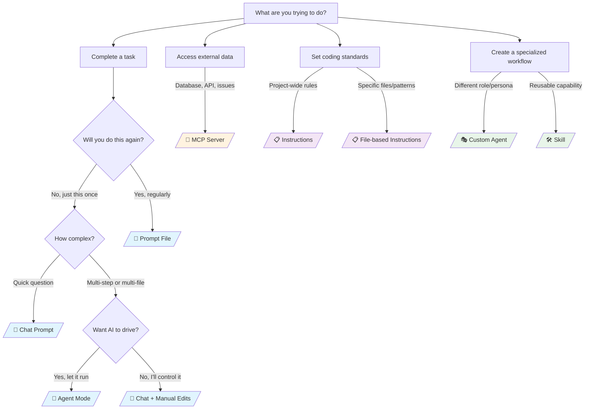

If you've tried to use an AI coding assistant lately, you've probably noticed they've gotten... complicated. What started as "fancy autocomplete" has evolved into a whole ecosystem of features: prompts, agents, instructions, skills, MCP servers, custom modes, and more.

I spend a lot of time helping engineers get the most out of these tools, and the number one question I hear is: "When do I use *this* thing versus *that* thing?" Fair question. The terminology varies between tools, the features overlap in confusing ways, and the documentation assumes you already know what you're doing.

Let's fix that.

## The Core Concepts

Before we dive into specific tools, let's establish a common vocabulary. These concepts exist across most AI coding assistants, even if they go by different names.

### Prompts

**What it is:** The text you send to the AI. That's it. Every interaction starts with a prompt.

**When to use it:** Always. You can't avoid prompts. But the question is whether you're typing everything from scratch every time, or leveraging other features to make your prompts more consistent and effective.

**Pro tip:** Good prompts are specific. "Fix this code" is weak. "This function throws a null reference exception when the user array is empty. Add a guard clause and return an empty result instead" is strong.

### Instructions (Custom Instructions / System Prompts)

**What it is:** Persistent rules that automatically apply to your AI interactions. Think of them as "always-on" context that you don't have to repeat every time.

| Use It For | Avoid Using It For |
|------------|--------------------|
| Coding standards ("always use async/await, never callbacks") | One-off tasks (use a prompt instead) |
| Project context ("this is a Rails 7 app using PostgreSQL") | Complex, multi-step workflows (use an agent or prompt file) |
| Style preferences ("prefer explicit types over inference in TypeScript") | Highly specific context for one file or feature (use file-based instructions) |
| Security requirements ("never log sensitive data, always sanitize inputs") | |

**Common pitfall:** Stuffing too much into your instructions. I see this all the time. Someone adds 50 rules to their instructions file, then wonders why the AI isn't following that one specific thing on line 47. Instructions work best when they're high-level guardrails, not a detailed recipe book. The AI has limited attention, just like humans.

**How tools differ:**

| Tool | How Instructions Work | Scope Options |
|------|----------------------|---------------|
| **GitHub Copilot** | Markdown files in your repo (`.github/copilot-instructions.md` for always-on, `*.instructions.md` for pattern-matched) | Global, workspace, or file-pattern based |
| **Cursor** | Rules files (`.cursor/rules`) with global and project-level options | Global settings or project-specific |
| **Claude (web)** | Project instructions defined per project workspace | Per-project only |
| **ChatGPT** | Custom instructions in settings, or baked into Custom GPTs | Account-wide or per-GPT |
| **Windsurf** | Rules in `.windsurfrules` or global settings | Global or workspace |
| **Amazon Q** | Limited; primarily through prompts | Minimal persistent customization |

Copilot's file-based approach means your instructions live in version control with your code. Team members get the same instructions automatically. Claude and ChatGPT store instructions in the cloud, which is convenient for individuals but harder to share.

### Prompt Files / Reusable Prompts

**What it is:** Pre-written prompts saved as files that you can invoke on demand. Instead of typing "review this PR for security issues, check for SQL injection, XSS, CSRF, authentication bypasses, and rate limiting..." every time, you save it once and invoke it with a shortcut.

| Use It For | Avoid Using It For |
|------------|--------------------|
| Repetitive tasks with consistent requirements | Simple, quick questions |
| Team workflows that need standardization | Novel tasks you haven't done before |
| Complex prompts you don't want to remember or retype | Prompts that need significant customization each time |

**How tools differ:**

| Tool | Reusable Prompt Feature | How to Invoke |
|------|------------------------|---------------|
| **GitHub Copilot** | Prompt files (`.github/prompts/*.prompt.md`) | Type `/` to see available prompts |
| **Cursor** | Notepads (saved prompts in composer) | Reference from notepad panel |
| **Claude (web)** | Not directly supported; copy/paste from project knowledge | Manual |
| **ChatGPT** | Custom GPTs with predefined behavior | Select the GPT before chatting |
| **Windsurf** | Workflows (triggered prompt sequences) | Via command palette or triggers |

If you want to share prompt templates with your team via git, Copilot's approach wins. If you want to share with non-developers or the public, Custom GPTs are more accessible.

### Agents / Agent Mode

**What it is:** AI that can take actions autonomously, not just generate text. An agent can read files, write files, run terminal commands, search codebases, and iterate until a task is done.

| Use It For | Avoid Using It For |
|------------|--------------------|
| Multi-step tasks ("add a new API endpoint with tests and documentation") | Quick questions about syntax or concepts |
| Tasks requiring codebase exploration ("find all usages of this deprecated function and update them") | Single-file edits you could do faster manually |
| Generating boilerplate across multiple files | Sensitive operations where you need to review each step (production deployments, database migrations) |
| Complex refactoring | |

**Common pitfall:** Agents can be... enthusiastic. They'll keep going until they think they're done, which isn't always when *you* think they're done. Review agent changes carefully, especially for larger tasks.

**How tools differ:**

| Tool | Agent Capabilities | Terminal Access | File Creation | Review Model |
|------|-------------------|-----------------|---------------|--------------|
| **GitHub Copilot** | Full agent mode with tool use | Yes | Yes | Inline diff review |
| **Cursor** | Composer with agentic features | Yes | Yes | Checkpoint-based review |
| **Claude Code** | CLI/IDE agent with autonomy controls | Yes | Yes | Approval prompts |
| **Windsurf** | Cascade (multi-file agent) | Yes | Yes | Step-by-step or auto |
| **Amazon Q** | Feature development agent | Limited | Yes | Inline review |
| **ChatGPT** | Canvas for iterative editing | No (code interpreter only) | In sandbox only | Conversational |

IDE-integrated agents (Copilot, Cursor, Windsurf) can actually run your code, execute tests, and modify your real filesystem. ChatGPT's agent capabilities are sandboxed. For real development work, you want an IDE-integrated agent.

### Skills

**What it is:** Specialized capabilities bundled as reusable packages. Skills can include instructions, scripts, examples, and other resources focused on a specific task or domain.

| Use It For |
|------------|
| Domain-specific workflows (testing, deployment, database operations) |
| Sharing capabilities across projects or teams |
| When you need more than just instructions, you need examples and scripts too |

**Note:** This is a newer concept and not universally available across all tools yet, but it's where the industry is heading.

### MCP (Model Context Protocol) Servers

**What it is:** External services that extend what your AI can do. MCP servers give the AI access to databases, APIs, issue trackers, and other tools beyond just code and terminal.

| Use It For | Avoid Using It For |
|------------|--------------------|
| Querying production databases from your IDE | Simple coding tasks that don't need external data |
| Pulling context from Jira, Linear, or GitHub Issues | When you're not sure what data the MCP server exposes (review it first) |
| Interacting with external APIs | Sensitive operations without proper access controls |
| Custom integrations specific to your organization | |

**How tools differ:**

| Tool | MCP Support | Built-in Integrations |
|------|-------------|----------------------|
| **GitHub Copilot** | Yes, configure in VS Code settings | GitHub (issues, PRs, Actions) |
| **Cursor** | Yes | Docs indexing, various MCPs |
| **Claude** | Yes (desktop app, Claude Code) | File system, various community MCPs |
| **ChatGPT** | No native MCP; uses plugins/actions | Various first-party integrations |
| **Windsurf** | Yes | Limited built-in |
| **Amazon Q** | No | AWS services (native integration) |

Copilot, Cursor, and Claude are betting on MCP as an open standard. ChatGPT uses its own plugin/action system. If you're all-in on AWS, Amazon Q's native integration might be simpler than configuring MCP servers.

### Custom Agents / Personas

**What it is:** Purpose-built AI "characters" with their own instructions, tools, and focus areas. Instead of one general-purpose assistant, you can create specialists: a database admin agent, a security reviewer agent, a front-end specialist.

| Use It For |
|------------|
| Complex projects with distinct domains |
| When you want to constrain what the AI focuses on |
| Team environments where different people need different capabilities |
| Reducing context usage by scoping agents to specific tasks |

### Context / Workspace Understanding

**What it is:** What the AI knows about your code. This includes open files, workspace structure, symbols, git history, and more.

**Why it matters:** AI without context is just guessing. AI with good context can make informed suggestions that actually fit your codebase.

**Pro tip:** If the AI isn't giving relevant answers, it probably doesn't have enough context. Reference specific files, include error messages, share the relevant code. Don't make it guess.

**How tools differ:**

| Tool | Codebase Indexing | Context Sources |
|------|-------------------|------------------|
| **GitHub Copilot** | Workspace indexing, symbol understanding | Open files, workspace, git |
| **Cursor** | Deep codebase indexing (explicit) | Full repo, docs, web |
| **Claude** | Project knowledge uploads | Uploaded files, project instructions |
| **ChatGPT** | Memory across conversations | Conversation history, uploaded files |
| **Windsurf** | Codebase indexing | Open files, indexed repo |
| **Amazon Q** | Workspace understanding | Open files, AWS resources |

Cursor explicitly indexes your entire codebase and lets you reference it. Copilot relies more on what's open or explicitly referenced. Claude requires you to upload files to project knowledge. For large codebases where you want the AI to "just know" about distant files, explicit indexing matters.

## Quick Reference: Where to Find Each Feature

| Feature | Copilot | Cursor | Claude | ChatGPT | Windsurf | Amazon Q |
|---------|---------|--------|--------|---------|----------|----------|
| Custom instructions | `.github/copilot-instructions.md` | `.cursor/rules` | Project settings | Account settings | `.windsurfrules` | N/A |
| Reusable prompts | `.github/prompts/` | Notepads | N/A | Custom GPTs | Workflows | N/A |
| Agent mode | Chat panel (Agent) | Composer | Claude Code | Canvas | Cascade | Chat |
| MCP servers | VS Code settings | Settings | Desktop app | N/A | Settings | N/A |
| Model switching | Model picker | Model dropdown | Limited | Limited | Model picker | Limited |

## Decision Framework: When to Use What

Not sure which feature to reach for? Start here:

Or if flowcharts aren't your thing, here's the quick reference table:

| Situation | Use This |
|-----------|----------|
| Quick syntax question | Chat prompt |
| Project-wide coding standards | Instructions |
| Repeated complex task | Prompt file |
| Multi-file feature implementation | Agent mode |
| External data needed | MCP server |
| Domain-specific workflow | Custom agent or skill |
| One-time complex problem | Detailed prompt with context |

## Common Mistakes and How to Avoid Them

### "I put it in the instructions but it didn't work"

Instructions are guidelines, not guarantees. If something is critical:
1. Keep instructions focused and prioritized
2. Repeat important requirements in your prompt
3. Check if your instruction conflicts with other context
4. Use file-specific instructions for targeted rules

### "The agent changed too much"

Agents optimize for completing the task. To stay in control:
1. Be specific about scope ("only modify this file")
2. Review changes before accepting
3. Use smaller, incremental tasks
4. Commit frequently so you can roll back

### "It doesn't know about my project"

Context is king:
1. Make sure relevant files are open or referenced
2. Include error messages and stack traces
3. Reference specific function or class names
4. Use tools with good codebase indexing

### "Which tool should I pick?"

Consider:
1. What editor do you already use?
2. Does your team have standardization requirements?
3. What's your budget?
4. Do you need enterprise features?
5. Are you heavily invested in a specific cloud platform?

There's no universally "best" tool. The best tool is the one that fits your workflow and that you'll actually use consistently.

## TL;DR

- **Prompts** are your basic input. Make them specific.
- **Instructions** are always-on guardrails. Keep them focused.
- **Prompt files** save complex prompts for reuse.
- **Agents** take autonomous action across files. Review their work.
- **MCP** connects external tools. Know what data you're exposing.
- **Skills** package capabilities for reuse and sharing.

Every major tool has its own implementation of these concepts. Pick the one that fits your editor, team, and workflow. Then invest time in learning it properly. These tools reward deliberate practice.

The AI assistant landscape is evolving fast. What I've described here will probably have new wrinkles in six months. But the core concepts will persist: context, instructions, prompts, and actions. Master those, and you'll adapt to whatever comes next.

---

*Have questions about AI coding assistants or want to share your setup? Find me on [LinkedIn](https://www.linkedin.com/in/jenna-massardo/), [Bluesky](https://bsky.app/profile/jmassardo.bsky.social), or [GitHub](https://github.com/jmassardo).*
