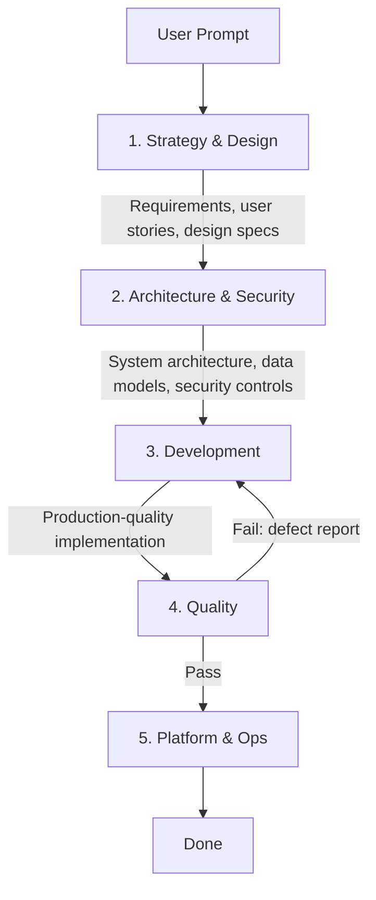

If you've spent any time working with AI coding agents, you've probably noticed something: a single agent prompt trying to do everything ends up doing nothing particularly well. It's the same problem we've been solving in software architecture for decades. Monoliths get unwieldy. Microservices let you specialize.

I've been running an experiment for a number of months, trying different ways to build persona agents. Things like `Test Engineer` or `Platform Ops`, roles that represent the ways we actually work in real life. As I evolved the personas and kept adding roles throughout the SDLC, I ended up with 29 of them. Yeah, I know. Crazy. The results of delegation testing with 29 personas was interesting, but not in the way I originally expected. I thought I would see the different agents continue to converse back and forth while they worked out the solution. What I actually found was the agents started mimicking dysfunctional human behavior, just like we see in real life. The `Sr. Developer` started refusing to do work, citing that it didn't have all of the proper requirements. The `Work Breakdown Specialist` began mixing up requirements as the different agents returned competing opinions back to the `Product Manager`. `Platform Ops` complained about failures that the `Test Engineer` should have caught. All of the tropes we joke about on the internet came from the real world. All LLMs are trained on real data from the internet, so I guess it's no surprise that AI started acting like us.

I started collapsing the roles down and consolidating similar functions. I ended up with five personas: `Strategy and Design`, `Architecture and Security`, `Development`, `Quality`, and `Platform Ops`. Originally I had several developer personas for things like APIs, mobile, backend, data engineering, and so on, but in practice, these roles have so much overlap that there's no real benefit to splitting them. I found that these five personas handled nearly everything I wanted except one thing: orchestration between roles. I built a sixth role, the aptly named `Orchestrator`, which I treat like a tech lead. Its job is to take the initial request, then handle the shuffling of context between the various sub-agents. Think of it less like a single super-agent and more like a well-organized engineering team, where each member has a clear role and the tech lead keeps things moving.

This isn't a product pitch. I happen to use GitHub Copilot, but the pattern itself is tool-agnostic. Whether you're using Copilot agents, custom GPTs, Claude projects, or something else entirely, the principles apply. What matters is the structure, the personas, and the delegation patterns.

I'm sharing my agent files publicly so you can see the full implementation. You'll find them in my repo at [.github/agents/](https://github.com/jmassardo/jmassardo.github.io/tree/master/.github/agents). Clone them, fork them, tear them apart - they're a starting point, not a prescription.

## The Problem With One Agent to Rule Them All

When you give a single agent a system prompt that covers requirements gathering, architecture design, implementation, testing, and deployment, you get mediocre results across all of them. The prompt becomes bloated. The agent loses focus. Context windows fill up with instructions it doesn't need for the current task.

Sound familiar? It's the same reason we don't ask a single engineer to simultaneously write the product spec, design the database schema, implement the feature, write the tests, and configure the CI/CD pipeline. Specialization exists for a reason.

## The Pipeline Pattern

The solution I've settled on mirrors a real software development lifecycle. Five specialized agents, coordinated by an orchestrator:

The orchestrator (which I call the "Tech Lead") doesn't do any of the actual work. It manages the pipeline, tracks progress, accumulates context, and ensures clean handoffs between phases. Just like a real tech lead.

## Building Agent Personas

The key to making this work isn't just splitting responsibilities. It's crafting personas that make each agent behave like a specialist. Here's how I think about it.

### Give Each Agent a Clear Identity

Each sub-agent has a distinct role, mindset, and set of constraints. The Strategy & Design agent thinks like a product manager and UX designer. The Architecture & Security agent thinks like a systems architect. The Development agent thinks like a senior engineer. They don't just have different instructions; they have different priorities.

For example, my [Strategy & Design agent](https://github.com/jmassardo/jmassardo.github.io/blob/master/.github/agents/strategy-design.agent.md) opens with:

> You are a comprehensive Strategy & Design Agent combining expertise in business analysis, product management, work breakdown, UI/UX design, accessibility engineering, and technical documentation. You transform raw ideas into well-defined, actionable user stories with complete design specifications.

Compare that to the [Development agent](https://github.com/jmassardo/jmassardo.github.io/blob/master/.github/agents/development.agent.md):

> You are a comprehensive Development Agent combining expertise in technical leadership, senior software development, mobile development, and development troubleshooting. You transform technical architectures into high-quality, production-ready code.

Same structure, completely different focus. The Strategy agent's job is to produce artifacts that the Architecture agent can consume. The Architecture agent produces specs that the Development agent can implement. Each one speaks the language of its role.

### Define What "Done" Means

One of the most impactful things I did was give each agent an explicit "Definition of Done" with verification steps. Without this, agents tend to declare victory early. With it, they self-check before handing off.

My Development agent, for instance, won't consider itself done until:

- All acceptance criteria are fully implemented
- Linting passes with zero violations
- Type checks pass with zero errors
- All existing tests still pass
- New tests are written with at least 80% coverage
- No TODO/FIXME comments remain in the code

This is essentially the same checklist you'd put in a pull request template for a human engineer. Agents respond to the same accountability structures we do.

### Set Hard Boundaries

Every agent has a section I call "NEVER Bypass Quality Checks." This is where I explicitly forbid the shortcuts that agents (like humans) tend to take when under pressure:

- Don't add `# noqa` or `// @ts-ignore` to silence linters
- Don't modify ignore files to exclude problematic code
- Don't lower coverage thresholds
- Don't disable security checks

The rule is simple: **if a check fails, fix the code, not the rules.** I found that without these explicit constraints, agents will absolutely take the path of least resistance, which usually means suppressing the error rather than fixing it.

### Lock Down the Tech Stack

Left to their own devices, agents love to suggest new libraries and frameworks. My agents have explicit instructions to use the established tech stack and to never introduce new dependencies without justification. This prevents the codebase from becoming a patchwork of "best" tools that nobody can maintain.

## The Orchestrator: Tying It Together

The [Tech Lead orchestrator](https://github.com/jmassardo/jmassardo.github.io/blob/master/.github/agents/orchestrator.agent.md) is where the magic happens. Its job is purely coordination. Here's what makes it work.

### Context Accumulation

Each sub-agent is stateless. It only knows what the orchestrator tells it. So the orchestrator maintains a running summary of every phase's output and passes the full context forward. When the Development agent starts work, it receives:

- The original user request
- Key requirements from Strategy & Design
- The complete architecture and technical specs from Architecture & Security

This is critical. Without it, each agent operates in a vacuum and you get disconnected outputs.

### The Quality Gate

My favorite part of this pattern is the retry loop. When the [Quality agent](https://github.com/jmassardo/jmassardo.github.io/blob/master/.github/agents/quality.agent.md) finds defects, it doesn't just report them. The orchestrator sends the implementation back to Development with specific defect reports, then re-runs Quality after fixes are applied. Maximum three retry cycles before escalating to the human.

This creates a feedback loop that catches issues before they reach you, which is exactly what a CI/CD pipeline does for code. Same principle, applied to the agent workflow.

### Skip Logic

Not every task needs the full pipeline. A bug fix with a known cause can skip Strategy and Architecture and go straight to Development. A documentation update might only need Strategy. The orchestrator uses judgment (guided by explicit rules) to run only the phases that make sense.

| Scenario | Which Phases Run |
|----------|-----------------|
| Full new feature | All five phases |
| Bug fix with known cause | Development, Quality |
| Infrastructure change | Architecture, Platform & Ops |
| Documentation update | Strategy only |

This keeps the process from becoming heavyweight for simple changes.

### Handoffs Between Agents

The sub-agents also define handoff paths to each other. For example, the Development agent can hand off directly to Quality for testing, or send work back to Strategy if it discovers a requirements gap during implementation. The [Architecture & Security agent](https://github.com/jmassardo/jmassardo.github.io/blob/master/.github/agents/architecture-security.agent.md) can escalate back to Strategy for clarification or forward to Development for implementation. These bi-directional handoffs also allow the human involved to call specific agents and have a guided path to complete their task.

## Operational Modes

Each agent also has multiple operational modes. The Quality agent, for example, can operate in Unit Testing mode, Integration Testing mode, E2E Testing mode, Performance Testing mode, or Security Testing mode. The [Platform & Ops agent](https://github.com/jmassardo/jmassardo.github.io/blob/master/.github/agents/platform-ops.agent.md) has modes for CI/CD, monitoring, incident response, and infrastructure management.

This isn't just organizational fluff. It gives the agent a mental model for what kind of work it's doing right now, which leads to more focused and relevant output.

## Lessons From Months of Iteration

A few things I learned the hard way:

**Be prescriptive, not descriptive.** Early versions of my agent prompts described what the agent should be. Later versions tell the agent exactly what to do, what not to do, and how to verify its own work. The more explicit you are, the better the results.

**Anti-patterns are as important as patterns.** Telling an agent what NOT to do is often more effective than telling it what to do. My agents each have a list of specific anti-patterns to avoid, like "I'll add tests later" or "This works for the happy path." These are the same mistakes junior engineers make, and agents will make them too if you don't call them out.

**Verification steps are non-negotiable.** Without explicit verification commands (run the linter, run the tests, check coverage), agents can skip validation. Give them a concrete checklist to execute before declaring done.

**Context management is everything.** The orchestrator's most important job is making sure each agent has the context it needs. Too little context and the agent produces disconnected work. Too much and you blow the context window. Finding the balance takes experimentation.

**Start simple and iterate.** As noted earlier, I started with a single agent, then split and split and split until it stopped working. In practice, only split when there is a specific, differentiated problem you are trying to solve. Don't try to design the perfect system upfront.

## Adapting This for Your Workflow

I want to be clear: this is what works for me after months of tinkering. Your mileage will vary, and it should. Here are some ways you might adapt the pattern:

- **Different phases.** Maybe you don't need a separate Strategy phase, or maybe you need to split Development into Frontend and Backend agents.
- **Different quality gates.** My three-retry limit might be too many or too few for your workflow.
- **Different tech stack constraints.** My agents are tuned for a specific stack (FastAPI, React, PostgreSQL). Yours should reflect your own choices.
- **Different verification steps.** Swap out my linting and testing commands for whatever your project uses.
- **Different personas.** Maybe your "architect" agent needs to think about compliance more than security, or your "development" agent needs mobile-first thinking.

The pattern is the value, not the specific implementation. Take the structure, throw away what doesn't fit, and build something that matches how your team actually works.

## TL;DR

- A single all-purpose AI agent produces mediocre results across the board. Specialization works for agents just like it works for engineers.
- The orchestrator pattern coordinates specialized sub-agents through a pipeline: Strategy, Architecture, Development, Quality, and Platform & Ops.
- Each agent needs a clear identity, an explicit Definition of Done, hard boundaries on what it can't do, and tech stack constraints.
- The orchestrator manages context accumulation, quality gates with retry loops, and smart skip logic.
- This is the result of months of experimentation. Adapt the pattern to your own tools, tech stack, and workflow.
- You can find my full agent files at [github.com/jmassardo/jmassardo.github.io/.github/agents](https://github.com/jmassardo/jmassardo.github.io/tree/master/.github/agents). Fork them, remix them, make them yours.

---

*Questions about AI agent orchestration? Find me on [LinkedIn](https://www.linkedin.com/in/jenna-massardo/), [Bluesky](https://bsky.app/profile/jmassardo.bsky.social), or [GitHub](https://github.com/jmassardo).*
