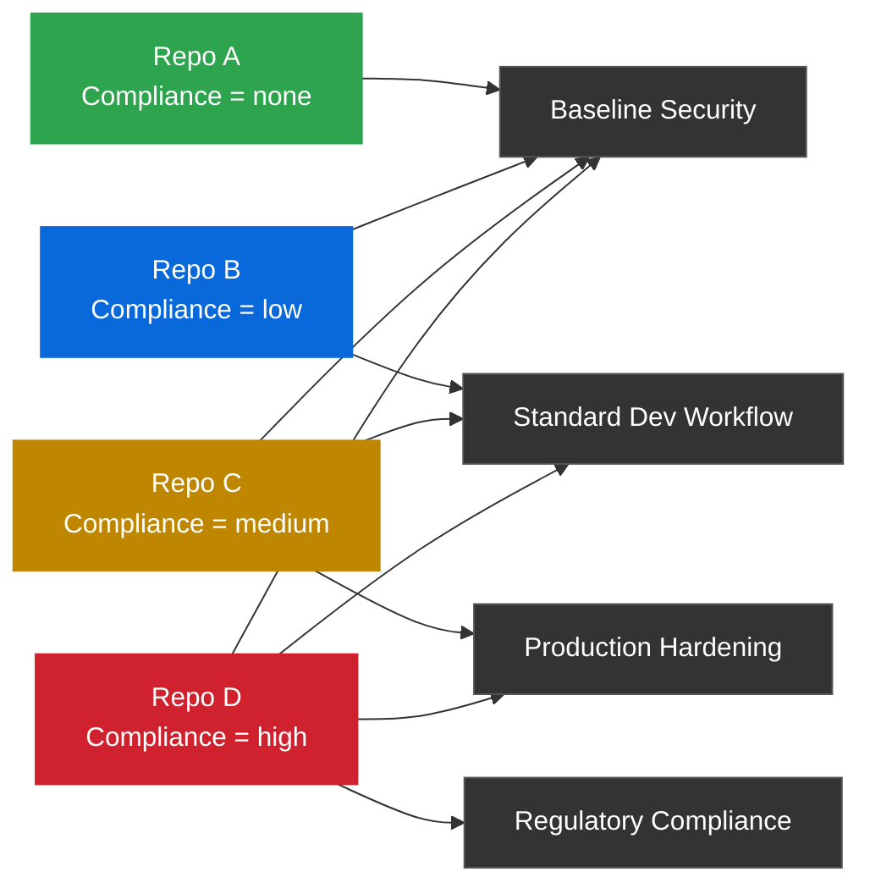

Stop me if you've heard this one: your enterprise has 100,000+ repositories spread across dozens of orgs, tens of thousands of developers, a compliance team breathing down your neck, and a patchwork of branch protection rules that nobody fully understands. Sound familiar?

Here's the thing - GitHub [repository rulesets](https://docs.github.com/en/enterprise-cloud@latest/repositories/configuring-branches-and-merges-in-your-repository/managing-rulesets/about-rulesets) are a massive upgrade over the old branch protection rules. They're more flexible, they layer together, and they can be managed at the org level. But if you're not thoughtful about *how* you structure them, you'll end up right back in the same mess - just with a fancier UI.

The real power move? Combine rulesets with [custom properties](https://docs.github.com/en/enterprise-cloud@latest/organizations/managing-organization-settings/managing-custom-properties-for-repositories-in-your-organization) to build a tiered governance model that scales across your entire enterprise without making your admin team lose their minds.

Let's talk about how to do that.

## Two Schools of Thought

Before we get into the how, let's talk strategy. There are fundamentally two ways to approach policy management with rulesets:

### Option 1: One Ruleset Per Permutation

Create a dedicated ruleset for every unique combination of rules you need. Need secrets protection for internal repos? That's a ruleset. Need PR reviews for production repos? Another ruleset. Need code scanning for PCI repos? Yet another one.

**Pros:**
- Simple to understand. Each ruleset is self-contained.
- Easy to audit. You can read a single ruleset and know exactly what it does.

**Cons:**
- Permutation explosion. As your org grows, you end up with dozens (or hundreds (or thousands)) of nearly identical rulesets.
- Maintenance nightmare. Changing a common rule means updating it in every ruleset that includes it.
- Drift. Over time, those "identical" rulesets stop being identical. Someone updates one and forgets the others.

### Option 2: Composable Rulesets with Custom Properties

Create a small set of modular rulesets, each focused on a specific policy concern (secrets, PR reviews, code scanning, etc.). Then use custom properties to tag repositories with their governance requirements. Rulesets target repos by property value, and the rules *stack automatically*.

**Pros:**
- Scales beautifully. Add a new repo? Set its properties. Done. Whether it's your 100th repo or your 100,000th.
- DRY policy management. Each rule lives in exactly one place.
- Consistent enforcement. No drift between similar repos, even across dozens of orgs.
- API-driven. You can automate property assignment and ruleset deployment at enterprise scale.

**Cons:**
- Requires upfront design. You need to think about your property taxonomy and ruleset architecture before you start building.
- Slightly more abstract. New admins need to understand how layering works.

Let's be real, if you're reading this post, you're probably managing (or about to manage) an enterprise with a boat load of developers and more repos than you can count. Option 1 will break you. **Option 2 is the play.** Let's dig in.

## The Building Blocks: Custom Properties

Custom properties are metadata fields you define at the org level and assign to repositories. Think of them as labels with structure. Unlike topics (which are free-form), custom properties have defined types (text, single select, multi select, boolean) and can be required across all repos.

The key insight: **org-level rulesets can target repositories based on their custom property values.** This is what makes the whole composable model work.

> **Setting up custom properties:** For step-by-step instructions on creating properties and assigning values, see [Managing custom properties for repositories in your organization](https://docs.github.com/en/enterprise-cloud@latest/organizations/managing-organization-settings/managing-custom-properties-for-repositories-in-your-organization).

### Designing Your Property Taxonomy

Here's your action plan for property design:

- **Keep it simple.** Start with the fewest properties you need. You can always add more later.
- **Use single-select for tiered models.** If a value can only be one thing (like a compliance level), enforce that at the property type level.
- **Make critical properties required.** If every repo needs a compliance classification, require it with a default value so nothing slips through.
- **Use descriptive names.** Your properties should make sense to someone who's never seen your governance docs. `Regulatory Compliance` is better than `rc-level`.
- **Document your values.** Use the description field. Future you will thank present you.

## Building a Tiered Governance Model

Let's walk through a real-world example. Say your organization handles a mix of workloads - dev sandboxes, internal tools, production services, and systems that process PII or cardholder data. You need different levels of governance for each.

### Step 1: Define Your Custom Property

Create a single-select custom property at the org level:

| Field | Value |
|---|---|
| **Name** | `Regulatory Compliance` |
| **Type** | Single select |
| **Values** | `none`, `low`, `medium`, `high` |
| **Required** | Yes |
| **Default** | `none` |

Here's what each tier maps to in practice:

| Tier | Use Case | Examples |
|---|---|---|
| **none** | Dev sandboxes, experiments, hackathon projects | Repos where speed matters more than ceremony |
| **low** | Non-production environments, internal tools, staging | Repos that support production but don't serve traffic directly |
| **medium** | Production services that don't handle sensitive data | APIs, front-end apps, infrastructure repos |
| **high** | Systems handling PII, cardholder data, or regulated workloads | Payment processing, healthcare data, auth services |

### Step 2: Build Your Modular Rulesets

Now, instead of creating one mega-ruleset per tier, you build small, focused rulesets that each address a specific concern. Each ruleset targets repos by property value.

Here's the architecture:



Read the chart top to bottom: each tier inherits everything from the tiers below it. A `high` repo gets all four rulesets stacked together. A `none` repo gets only the baseline. The arrows show what each tier *adds* on top of the previous one. Here are the details for each ruleset:

#### Ruleset: Baseline Security (targets `none`, `low`, `medium`, `high`)

This applies to **every repo in the org**. No exceptions.

| Rule | Setting |
|---|---|
| Secrets protection | Enabled (push protection) |
| Restrict deletions | Enabled on default branch |

**Why:** Secrets leaking into git history is a universal risk. Every repo gets this, full stop. Accidentally deleting the default branch on any repo is painful, so we prevent that everywhere too.

#### Ruleset: Standard Development Workflow (targets `low`, `medium`, `high`)

| Rule | Setting |
|---|---|
| Require pull request before merging | 1 reviewer required |
| Block force pushes | Enabled on default branch |
| Require status checks to pass | CI must pass before merge |

**Why:** Once a repo is supporting anything beyond personal experiments, you need basic code review hygiene. One reviewer, no force pushes, CI must be green.

#### Ruleset: Production Hardening (targets `medium`, `high`)

| Rule | Setting |
|---|---|
| Require pull request before merging | 2 reviewers required |
| Require code owner review | Enabled |
| Require code scanning results | Security severity: high and above |
| Dismiss stale reviews on new pushes | Enabled |
| Require approval of most recent push | Enabled |

**Why:** Production repos need tighter controls. Multiple reviewers catch more issues. Code owners ensure the right people sign off. Code scanning catches vulnerabilities before they ship.

#### Ruleset: Regulatory Compliance (targets `high`)

| Rule | Setting |
|---|---|
| Require pull request before merging | 3 reviewers required |
| Require signed commits | Enabled |
| Require code scanning results | Security severity: medium and above |
| Require code quality results | Enabled |
| Metadata restrictions | Commit message must reference ticket (e.g., `JIRA-\d+`) |
| Required workflows | Compliance audit workflow must pass |

**Why:** When you're dealing with PCI, HIPAA, SOC 2, or similar frameworks, you need an airtight audit trail. Signed commits prove authorship. Metadata restrictions tie changes to tracked work items. Required workflows can enforce additional compliance checks that your auditors want to see.

### Step 3: Understand How Stacking Works

Here's where the magic happens. GitHub rulesets use **additive layering**. When multiple rulesets target the same repository and branch, **all rules from all matching rulesets apply, and the most restrictive version of any overlapping rule wins.**

So what does a `high` compliance repo actually experience? Let's trace it:

| Source Ruleset | Rules Applied |
|---|---|
| Baseline Security | Secrets protection, restrict deletions |
| Standard Development Workflow | PR required (1 reviewer), block force pushes, status checks |
| Production Hardening | PR required (2 reviewers), code owner review, code scanning (high), dismiss stale reviews, approval of most recent push |
| Regulatory Compliance | PR required (3 reviewers), signed commits, code scanning (medium), code quality, metadata restrictions, required workflows |

**Effective policy for a `high` repo:**
- Secrets protection enabled
- Restrict deletions on default branch
- Pull requests required with **3 reviewers** (most restrictive wins)
- Block force pushes
- Status checks must pass
- Code owner review required
- Code scanning required at **medium severity and above** (most restrictive wins)
- Code quality results required
- Stale reviews dismissed on new pushes
- Most recent push must be approved by someone other than the pusher
- Signed commits required
- Commit messages must reference a ticket
- Compliance workflow must pass

**The bottom line:** The repo owner sees one coherent set of requirements. They don't need to know that six different rulesets are contributing to that experience. They just know their repo is classified as `high` compliance and the rules reflect that.

## What the Developer Experience Looks Like

This is a critical point that's easy to overlook. Your developers and repo owners don't see rulesets. They see the *sum of what's enforced*.

When a developer on a `high` compliance repo opens a pull request, they see:
- A required reviewers count of 3
- A code scanning check that must pass
- A code quality gate
- A compliance workflow running
- A reminder that their commit message needs a ticket reference

They don't know (or care) that these requirements come from four separate rulesets managed by different teams. And that's exactly the point. **The complexity lives on the admin side, not the developer side.**

For repo owners, the experience is even simpler. When they look at their repo's settings, they see a `Regulatory Compliance` property set to `high`. If they need to understand what that means, you point them to a wiki page or internal doc that maps tiers to requirements. No need for them to parse ruleset configurations.

## Deploying Properties and Rulesets at Scale

The UI is fine for prototyping, but if you're managing 100,000+ repos across dozens of orgs, you need automation. Let's talk about how to deploy this model programmatically.

### Automating Property Definitions

Use the [REST API for custom properties](https://docs.github.com/en/enterprise-cloud@latest/rest/orgs/custom-properties) to define your property schema consistently across every org. The `PATCH /orgs/{org}/properties/schema` endpoint lets you create or update multiple properties in a single call:

```bash
curl -L \
  -X PATCH \
  -H "Accept: application/vnd.github+json" \
  -H "Authorization: Bearer $GH_TOKEN" \
  -H "X-GitHub-Api-Version: 2022-11-28" \
  https://api.github.com/orgs/my-org/properties/schema \
  -d '{
    "properties": [
      {
        "property_name": "Regulatory_Compliance",
        "value_type": "single_select",
        "required": true,
        "default_value": "none",
        "description": "Regulatory compliance tier for governance rulesets",
        "allowed_values": ["none", "low", "medium", "high"]
      }
    ]
  }'
```

Wrap this in a script that iterates over your list of orgs, and you've got consistent property definitions everywhere in minutes.

### Bulk-Assigning Property Values

The `PATCH /orgs/{org}/properties/values` endpoint lets you set property values for up to **30 repositories per request**. At enterprise scale, you'll want to script this against your service catalog or CMDB:

```bash
curl -L \
  -X PATCH \
  -H "Accept: application/vnd.github+json" \
  -H "Authorization: Bearer $GH_TOKEN" \
  -H "X-GitHub-Api-Version: 2022-11-28" \
  https://api.github.com/orgs/my-org/properties/values \
  -d '{
    "repository_names": ["payment-service", "auth-service", "pii-handler"],
    "properties": [
      {
        "property_name": "Regulatory_Compliance",
        "value": "high"
      }
    ]
  }'
```

For a real deployment, you'd pull your repo inventory and classifications from your system of record (ServiceNow, Backstage, a spreadsheet - we don't judge) and batch these API calls in groups of 30. A simple Python or Bash script can tag thousands of repos in a few minutes.

**Pro tip:** Make the `Regulatory Compliance` property **required with a default value of `none`**. That way every new repo automatically gets baseline security rules from day one - no human intervention needed.

### Importing and Exporting Rulesets

Here's a feature that's easy to overlook but critical for multi-org deployments: [ruleset import and export](https://docs.github.com/en/enterprise-cloud@latest/organizations/managing-organization-settings/managing-rulesets-for-repositories-in-your-organization#importing-a-ruleset).

You can export any ruleset as a JSON file from the ruleset's history menu, then import that JSON into another org. This means you can:

- **Build once, deploy everywhere.** Design your rulesets in a test org, validate them, then export and import across all your production orgs.
- **Version control your rulesets.** Export your rulesets to JSON, commit them to a config repo, and track changes over time. Now you have a full audit trail of your governance model.
- **Disaster recovery.** If someone accidentally deletes or misconfigures a ruleset, you can reimport from your last known good config in seconds.
- **Consistency across orgs.** When you update a ruleset, export the new version and import it everywhere. No manual recreation. No drift.

The [REST API for rules](https://docs.github.com/en/enterprise-cloud@latest/rest/orgs/rules) also supports creating and managing rulesets programmatically. For true enterprise-scale automation, combine the API with your CI/CD pipeline: store your ruleset definitions as code, validate changes in a test org, then deploy across all orgs on merge.

> **Note:** The bypass list is excluded from exported JSON files. You'll need to configure bypass permissions separately for each org after import, which is actually a good thing - bypass lists should be org-specific.

Here's what a deploy pipeline might look like:

1. Property definitions and ruleset configs live in a central Git repo
2. A PR triggers a deploy to your test org in Evaluate mode
3. You review Rule Insights to validate behavior
4. On merge to main, automation deploys properties and imports rulesets across all production orgs
5. Rulesets go active after a configurable bake-in period

This is governance-as-code. And it's the only way to keep dozens of orgs consistent without an army of admins.

## Best Practices for Enterprise Scale

After walking through the model, here are the patterns that work well at scale:

### Start with "Evaluate" Mode

Every new ruleset should start in [Evaluate mode](https://docs.github.com/en/enterprise-cloud@latest/repositories/configuring-branches-and-merges-in-your-repository/managing-rulesets/about-rulesets#using-ruleset-enforcement-statuses). This lets you see what *would* be blocked without actually blocking anything. Use [Rule Insights](https://docs.github.com/en/enterprise-cloud@latest/organizations/managing-organization-settings/managing-rulesets-for-repositories-in-your-organization#viewing-insights-for-rulesets) to monitor the impact, then flip to Active once you're confident.

### Use Bypass Lists Sparingly

Rulesets support [bypass permissions](https://docs.github.com/en/enterprise-cloud@latest/organizations/managing-organization-settings/creating-rulesets-for-repositories-in-your-organization) for specific roles, teams, or GitHub Apps. Use these for break-glass scenarios, not for convenience. Every bypass is a hole in your governance model.

Quick checklist for bypass configuration:
- **Do** grant bypass to a dedicated "release engineering" team for emergency hotfixes
- **Do** grant bypass to specific GitHub Apps that need to push directly (e.g., Dependabot, release automation)
- **Don't** grant bypass to "repository admins" by default - that defeats the purpose of org-level rulesets
- **Don't** grant bypass without a corresponding audit trail

### Layer Properties for Complex Scenarios

The `Regulatory Compliance` property handles one dimension. You might need others. For example:

| Property | Type | Values |
|---|---|---|
| `Regulatory Compliance` | Single select | `none`, `low`, `medium`, `high` |
| `Environment Type` | Single select | `sandbox`, `staging`, `production` |
| `Data Classification` | Single select | `public`, `internal`, `confidential`, `restricted` |

You can then create rulesets that target combinations: "All repos where `Environment Type` is `production` AND `Data Classification` is `restricted`." This gives you incredible granularity without creating a ruleset for every permutation.

**Word of caution:** Don't go overboard. Two or three well-chosen properties cover most use cases. Every property you add is one more thing someone has to set and maintain.

### Automate Property Assignment

We covered this in detail in the deployment section above, but it bears repeating: at enterprise scale, you don't want humans manually tagging repos. Use the [REST API for custom properties](https://docs.github.com/en/enterprise-cloud@latest/rest/orgs/custom-properties) to automate property assignment based on your existing metadata. Pull from your CMDB, service catalog, or whatever system of record you already trust. Better yet, integrate property assignment into your repo provisioning workflow so new repos are classified correctly from the moment they're created.

### Document Your Governance Model

Create an internal reference that maps:
- Each property value to its intended use case
- Each ruleset to the rules it enforces
- The effective policy for each tier (the stacked result)

This doc becomes your single source of truth when onboarding new admins, answering developer questions, or responding to audit requests.

### Monitor with Rule Insights

[Rule Insights](https://docs.github.com/en/enterprise-cloud@latest/organizations/managing-organization-settings/managing-rulesets-for-repositories-in-your-organization#viewing-insights-for-rulesets) show you every action that passed, failed, or bypassed a ruleset. Review these regularly. They'll tell you:
- If a ruleset is too restrictive (lots of bypasses)
- If a ruleset isn't catching anything (maybe it's not needed, or repos are miscategorized)
- If developers are hitting unexpected friction (time to improve docs or tooling)

## Pitfalls to Avoid

- **Don't migrate everything at once.** Start with one org. Get it right. Then expand to the next one. At 100k+ repos, a phased rollout isn't optional - it's survival.
- **Don't forget about rule layering behavior.** Remember, the most restrictive version of any overlapping rule wins. Test your stacks before going active.
- **Don't skip the developer communication.** Engineers hate surprises. Tell them what's changing, why, and what they need to do differently. At enterprise scale, this probably means partnering with your internal dev experience team.
- **Don't ignore the `none` tier.** Even your least-regulated repos should have secrets protection. That's non-negotiable.
- **Don't set it and forget it.** Compliance requirements evolve. Review your tier definitions at least quarterly.
- **Don't manually manage rulesets across orgs.** Export, version control, and automate. If you're clicking through the UI to replicate rulesets across 20 orgs, you're doing it wrong.

## Summary and Key Takeaways

Rulesets and custom properties together give you a composable, scalable governance model for GitHub Enterprise Cloud. Instead of managing hundreds of bespoke rulesets across dozens of orgs, you define a small set of modular policies, tag repos with properties, and let GitHub's rule layering do the heavy lifting. Add API automation and ruleset import/export, and you've got a governance-as-code pipeline that works at true enterprise scale.

Here's your action plan:

1. **Audit your current state.** What branch protection rules and rulesets do you have today? What patterns emerge across your orgs?
2. **Design your property taxonomy.** Start with one property (like `Regulatory Compliance`) and define clear tiers.
3. **Build modular rulesets.** One ruleset per policy concern, not per repo or permutation.
4. **Automate deployment.** Use the REST API to push property definitions and values. Export rulesets as JSON and store them in a config repo.
5. **Deploy in Evaluate mode.** Use Rule Insights to validate before enforcing.
6. **Communicate the change.** Give developers a clear reference for what each tier means.
7. **Roll out org by org.** Start with a pilot org, validate, then expand across the enterprise.
8. **Iterate quarterly.** Review your tier definitions, check Rule Insights for friction, and update as compliance requirements evolve.

The goal isn't just compliance - it's compliance that doesn't slow your teams down. Custom properties and layered rulesets let you get there without drowning in administrative overhead.

## Further Reading

- [About rulesets](https://docs.github.com/en/enterprise-cloud@latest/repositories/configuring-branches-and-merges-in-your-repository/managing-rulesets/about-rulesets)
- [Available rules for rulesets](https://docs.github.com/en/enterprise-cloud@latest/repositories/configuring-branches-and-merges-in-your-repository/managing-rulesets/available-rules-for-rulesets)
- [Managing custom properties for repositories in your organization](https://docs.github.com/en/enterprise-cloud@latest/organizations/managing-organization-settings/managing-custom-properties-for-repositories-in-your-organization)
- [Managing rulesets for repositories in your organization](https://docs.github.com/en/enterprise-cloud@latest/organizations/managing-organization-settings/managing-rulesets-for-repositories-in-your-organization)
- [Creating rulesets for repositories in your organization](https://docs.github.com/en/enterprise-cloud@latest/organizations/managing-organization-settings/creating-rulesets-for-repositories-in-your-organization)
- [REST API endpoints for custom properties](https://docs.github.com/en/enterprise-cloud@latest/rest/orgs/custom-properties)
- [REST API endpoints for organization rules](https://docs.github.com/en/enterprise-cloud@latest/rest/orgs/rules)
