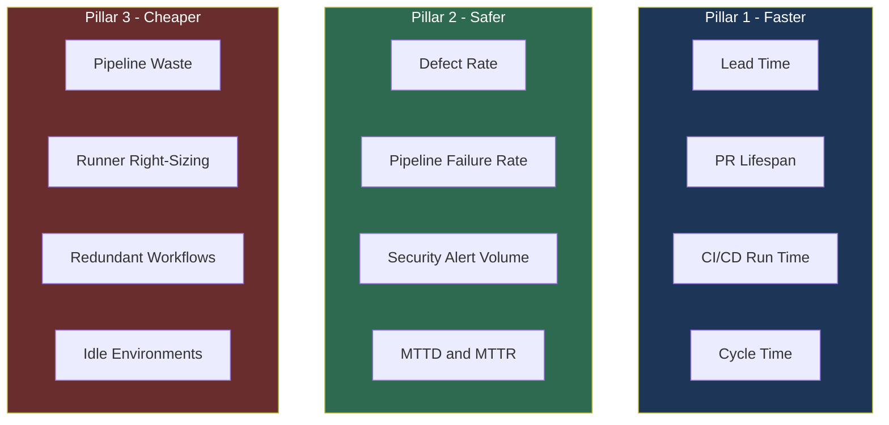
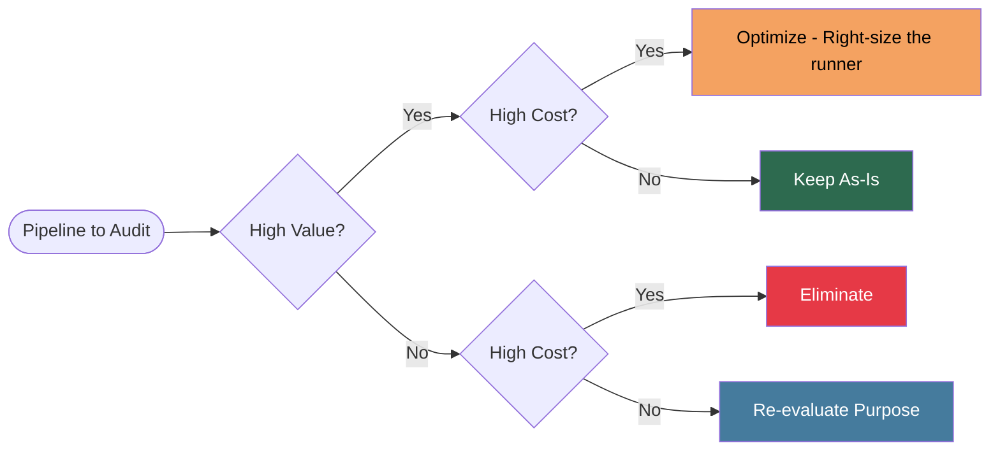
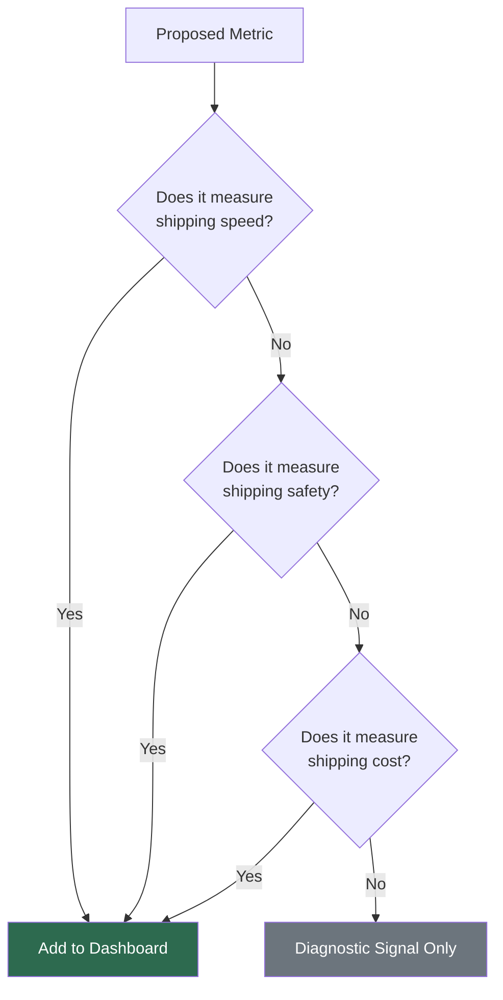

You've probably heard me say "metrics that matter" more than once. If you've been following along, you know I have [strong opinions about what most teams get wrong](), [a collection of autopsies on metrics that actively mislead](), and [a practical framework for what to measure instead](). Today I want to zoom out even further.

Because here's the thing: frameworks are great, but they can get complicated fast. And complicated frameworks are easy to ignore.

So let me give you the version you can write on a sticky note and put on your monitor.

## What Does "Value" Actually Mean?

Every time a new buzzword hits the circuit - "developer productivity," "engineering ROI," "velocity" - someone inevitably asks: "How do we measure it?" And then we spend six months building dashboards that measure things no executive actually cares about.

Let me be blunt. The business doesn't care about your deployment frequency score. They don't care that your DORA metrics are in the "Elite" tier. They care about one thing: **does what you're doing make the business more competitive?**

That's it. That's value. That's ROI. That's productivity. Whichever word is trending this quarter, strip away the jargon and you're left with the same question: **how does what you're doing affect the business?**

Here's the uncomfortable truth: most of what we measure doesn't answer that question at all.

So I want to propose a simpler filter. Before any metric earns a spot on your dashboard, it needs to answer one of three questions:

1. Are we shipping **faster**?
2. Are we shipping **safer**?
3. Are we shipping **cheaper**?

That's the framework. Three pillars. Let's dig in.

---

## Pillar 1: Are We Shipping Faster?

Speed is competitive advantage. Full stop.

When we ask "are we getting faster," what we're really asking is: **are we getting our deliverables into customers' hands faster than our competitors?** Not faster than last sprint. Not faster than some theoretical baseline. Faster than the alternative your customer might choose.

This maps to metrics you've probably seen before:

- **Lead time** - from idea to production
- **PR lifespan** - how long code sits waiting for review or merge
- **Workflow run times** - how long CI/CD actually takes
- **Time to first commit** - how quickly new features start moving
- **Cycle time** - time from active development to shipped

The goal isn't to watch these numbers go up or down in isolation. The goal is to understand where work gets stuck and eliminate those bottlenecks. A PR that sits for three days before review doesn't just slow that feature down - it kills momentum, creates context-switching costs, and signals to engineers that their work doesn't matter.

**Quick reference - fast shipping indicators:**

| Metric | What it signals |
|--------|----------------|
| Lead time < 1 week | Healthy flow from idea to production |
| PR lifespan < 24 hours | Active review culture, small PRs |
| CI run time < 10 minutes | Fast feedback loops |
| Failed pipeline rate trending down | Stable build health |

Speed without safety is just recklessness. Which brings us to pillar two.

---

## Pillar 2: Are We Shipping Safer?

This one sounds obvious, but it trips teams up constantly because "safer" gets conflated with "slower." It doesn't have to.

Shipping safer means: **are we getting fewer defects, vulnerabilities, and surprises into production over time?** That's really it. Not zero defects - that's a fantasy. Fewer defects, trending down, over time.

Here's what you're measuring:

- **Defect rate** - how many bugs make it to production per release
- **Pipeline failure rate** - how often does CI/CD catch problems before they ship
- **Code scanning alert volume** - how many security findings are being introduced vs. resolved
- **Mean time to detect (MTTD)** - how quickly do we find problems after they ship
- **Mean time to recover (MTTR)** - how quickly do we fix them

That last one is worth calling out specifically. No system is perfect. The teams that ship safely aren't the ones who never break things - they're the ones who find and fix things *fast*. Build your monitoring, alerting, and incident response processes around that reality.

The pipeline failure rate is especially underrated. Every time CI catches a bug before it hits production, that's the system working. A healthy failure rate means your automated checks are meaningful. A failure rate near zero either means your code is perfect (sure) or your checks aren't checking anything useful.

**The goal:** ship with confidence, not with crossed fingers.

---

## Pillar 3: Are We Shipping Cheaper?

This is the sneaky one. Teams nail speed and safety and then leave a ton of money on the table because nobody's watching the bill.

Shipping cheaper means: **are we being good stewards of the company's money?**

This isn't about cutting corners. It's about eliminating waste - the kind that accumulates quietly in the background while everyone's focused on features.

Here's what waste looks like in practice:

- **Pipelines that always fail** - you're paying for compute that never delivers value
- **Pipelines that always time out** - same problem, worse UX
- **Jobs running on oversized runners** - sure, a 32-core runner might finish 3 minutes faster, but does that 3 minutes justify 8x the compute cost?
- **Redundant workflows** - multiple pipelines doing the same work because nobody cleaned up after a migration
- **Long-lived test environments** - infrastructure running 24/7 for workflows that only need it for 20 minutes

That runner example is worth sitting with. Let's do the math. If a job takes 10 minutes on a 4-core runner and 7 minutes on a 32-core runner, the 32-core runner is 8x more expensive per minute and only saves you 3 minutes. Unless that job runs thousands of times a day, you're hemorrhaging money for marginal velocity gains.

**Questions to ask about every pipeline:**

- What happens if this fails? (Severity)
- How often does it fail? (Reliability)
- What does it cost per run? (Efficiency)
- Does the runner size match the actual workload? (Fit)
- Is this pipeline still needed? (Relevance)

Efficiency reviews aren't sexy, but they fund the work that is. The money you save from right-sizing infrastructure is money that can go toward tooling, training, or headcount.

---

## Tying It Together

So here's the filter.

 Every proposed metric goes through three questions:

1. Does it tell us if we're shipping **faster**?
2. Does it tell us if we're shipping **safer**?
3. Does it tell us if we're shipping **cheaper**?

If the answer to all three is "no," the metric doesn't belong on your executive dashboard. Maybe it belongs on an engineering team dashboard as a diagnostic signal - but it shouldn't be the thing you're reporting up to leadership as evidence of value.

This framework also has a useful side effect: it forces conversations about what "better" actually means. Faster for whom? Safer by what measure? Cheaper compared to what baseline? Those conversations are exactly the ones you should be having with your stakeholders before you pick up a single measurement tool.

---

## Summary and Key Takeaways

Here's your sticky note version:

**Every metric worth tracking answers one of three questions:**

- **Faster** - are we reducing lead time, PR lifespan, and cycle time?
- **Safer** - are we reducing defects, pipeline failures, and security findings?
- **Cheaper** - are we eliminating waste, right-sizing infrastructure, and cutting unused pipelines?

If a metric doesn't connect to one of those three outcomes, it's not a business metric - it's a vanity metric.

**Your action plan:**

1. Audit your current dashboard. For each metric, ask: faster, safer, or cheaper?
2. Flag anything that doesn't fit. Not delete - flag. Understand why it's there.
3. Identify the top one or two gaps. Where are you flying blind on speed, safety, or cost?
4. Build metrics to fill those gaps - and make sure stakeholders agree they're meaningful.
5. Review quarterly. Metrics decay. What mattered six months ago might not matter today.

The goal was never to have a great dashboard. The goal was to ship great software, reliably, without wasting the company's money. Measure that.
