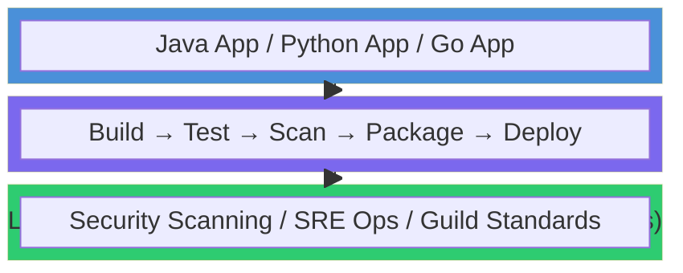
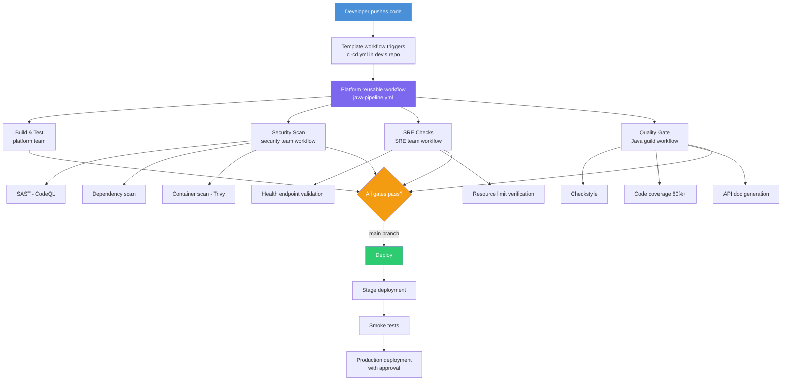

*This is Part 2 of a three-part series on migrating to GitHub Actions at scale. [Part 1: Making the Case for Change](/blog/2026/06/03/migrating-to-github-actions-part-1-making-the-case/) covers the why and the planning. [Part 3: Building the Lego Blocks](/blog/2026/06/03/migrating-to-github-actions-part-3-building-the-lego-blocks/) gets into hands-on implementation.*

---

In [Part 1](/blog/2026/06/03/migrating-to-github-actions-part-1-making-the-case/), we covered the case for migration and rollout planning. This part is the payoff: designing the system your teams will actually use.

This post is intentionally architecture-first. [Part 3](/blog/2026/06/03/migrating-to-github-actions-part-3-building-the-lego-blocks/) contains the implementation details, including deployment environment protections, trigger patterns, OIDC-based auth wiring, and rollback mechanics.

Imagine a Java developer on your team wants to set up CI/CD for their new service. Instead of spending a week writing pipeline YAML from scratch, copying snippets from Slack, and hoping they remembered to add the security scan, they browse a catalog of template workflows, pick "Java Application," add it to their repo, and they're done. Tests run, artifacts build, security scans execute, SRE checks pass - all from that single template.

Behind the scenes, that template calls a reusable workflow maintained by the CI/CD platform team. That reusable workflow calls other reusable workflows maintained by the security team, the SRE team, and the Java guild. Every team owns their piece, updates happen in one place, and changes automatically flow out to every repo that uses the template.

Sounds complicated? It's actually the opposite - structured simplicity built from composable pieces.

## The Layered Architecture

Think of this as a three-layer cake:



Each layer has a clear owner, a clear responsibility, and a clear interface to the layers above and below it.

### Layer 1: Template Workflows (What Developers See)

Template workflows are the front door. They're what developers interact with directly. The goal is to make them so simple and obvious that a developer looks at the options and says, "Oh, I'm building in Java, I'll use the Java one."

These live as [starter workflows](https://docs.github.com/en/actions/sharing-automations/creating-starter-workflows-for-your-organization) in your organization's `.github` repository, or as template repositories that teams can clone.

A developer's experience should look like this:

1. Create a new repository (or go to an existing one)
2. Navigate to Actions tab and click "New workflow"
3. See organization-specific templates: "Java Application," "Python Service," "Go Microservice," "Static Site"
4. Select the appropriate template
5. Commit the workflow file
6. Done. CI/CD is running.

The template workflow itself is intentionally thin. It defines the trigger events, passes in the parameters specific to this application (Java version, build tool, deployment target), and calls a reusable workflow for the heavy lifting:

```yaml
# .github/workflows/ci-cd.yml (in the developer's repo)
name: Java CI/CD

on:
  push:
    branches: [main]
  pull_request:
    branches: [main]

jobs:
  pipeline:
    uses: my-org/platform-workflows/.github/workflows/java-pipeline.yml@9b7f6d5c4a3e2f1d0c9b8a7e6d5c4b3a2f1e0d9c
    with:
      java-version: '21'
      build-tool: 'gradle'
      deploy-target: 'kubernetes'
    secrets: inherit
```

Six meaningful lines of configuration. The developer specifies *what* they're building and *where* it goes. The platform handles *how*.

**Why this matters:** When the security team adds a new required scan, the developer's workflow file doesn't change. When the SRE team updates the deployment strategy, the developer's workflow file doesn't change. When a CVE is found in a build tool and needs an urgent patch, the platform team fixes it once and every repo gets the fix automatically.

### Layer 2: Standardized CI/CD Workflows (What the Platform Team Manages)

The orchestration layer lives here. The platform team maintains a repository of [reusable workflows](https://docs.github.com/en/actions/sharing-automations/reusing-workflows) that implement the full CI/CD pipeline for each language/framework.

These workflows are opinionated. They encode your organization's standards for how Java apps get built, tested, scanned, packaged, and deployed. They're not infinitely flexible - they're intentionally constrained to the patterns your organization supports.

A standardized Java pipeline workflow might orchestrate:


```yaml
# my-org/platform-workflows/.github/workflows/java-pipeline.yml
name: Standardized Java CI/CD Pipeline

on:
  workflow_call:
    inputs:
      java-version:
        type: string
        default: '21'
      build-tool:
        type: string
        default: 'gradle'
      deploy-target:
        type: string
        default: 'kubernetes'

jobs:
  build-and-test:
    runs-on: ubuntu-latest
    steps:
      - uses: actions/checkout@v4
      - uses: actions/setup-java@v4
        with:
          java-version: ${{ inputs.java-version }}
          distribution: 'temurin'
      - name: Build and Test
        run: |
          if [ "${{ inputs.build-tool }}" = "gradle" ]; then
            ./gradlew build test
          else
            mvn clean verify
          fi

  security-scan:
    needs: build-and-test
    uses: my-org/security-workflows/.github/workflows/full-scan.yml@3f4c2b1e9d8a7c6b5e4f3210a9b8c7d6e5f4a3b2
    secrets: inherit

  sre-checks:
    needs: build-and-test
    uses: my-org/sre-workflows/.github/workflows/operational-readiness.yml@7a6b5c4d3e2f1a0b9c8d7e6f5a4b3c2d1e0f9a8b
    with:
      deploy-target: ${{ inputs.deploy-target }}
    secrets: inherit

  java-standards:
    needs: build-and-test
    uses: my-org/java-guild-workflows/.github/workflows/quality-gate.yml@1c2d3e4f5a6b7c8d9e0f1234567890abcdef1234
    with:
      java-version: ${{ inputs.java-version }}
    secrets: inherit

  deploy:
    needs: [security-scan, sre-checks, java-standards]
    if: github.ref == 'refs/heads/main'
    uses: my-org/platform-workflows/.github/workflows/deploy.yml@8e7d6c5b4a392817f6e5d4c3b2a1908f7e6d5c4b
    with:
      target: ${{ inputs.deploy-target }}
    secrets: inherit
```


See what's happening? The platform workflow calls out to specialized workflows owned by different teams. The security team owns `security-workflows`. The SRE team owns `sre-workflows`. The Java guild owns `java-guild-workflows`. The platform team orchestrates the composition.

### Layer 3: Specialized Workflows and Actions (What Domain Teams Own)

This layer encodes organizational expertise into reusable components. Domain teams maintain their own repositories of workflows and actions that implement their standards.

**Security team** owns workflows for:
- SAST scanning (CodeQL, Semgrep)
- Dependency vulnerability scanning (Dependabot, Snyk)
- Container image scanning (Trivy)
- Secret detection
- License compliance checks
- Artifact attestations and SBOM generation

**SRE team** owns workflows for:
- Health check validation
- Deployment verification tests
- Canary analysis
- Rollback triggers
- Observability configuration validation
- Infrastructure-as-code validation

**Language guilds** (Java, Python, Go, etc.) own workflows for:
- Language-specific linting and formatting
- Framework-specific best practices (Spring Boot actuator endpoints, Django security middleware)
- Code coverage thresholds
- Documentation generation
- Dependency update policies

This separation of concerns is powerful. The security team doesn't need to understand Gradle to enforce security scanning on Java projects. They write a security scanning workflow once, and the platform team composes it into every language pipeline. When a new CVE scanner comes out, the security team updates one workflow and every project in the organization benefits.

## The Ownership Model

The layered architecture only works if ownership is crystal clear. The breakdown:

| Layer | Owner | Responsibility | Update Frequency |
|---|---|---|---|
| Template workflows | Platform team | Starter templates, input parameters, documentation | As needed |
| Language pipelines | Platform team | Build/test/deploy orchestration per language | Monthly or as needed |
| Security workflows | Security team | Scanning, compliance checks, attestations | Weekly to monthly |
| SRE workflows | SRE team | Operational readiness, deployment verification | Monthly |
| Guild workflows | Language guilds | Language-specific quality gates | Quarterly |
| Custom actions | Platform team + domain teams | Environment-specific tooling | As needed |

**One rule above all: each team owns their workflows end-to-end.** They write them, they test them, they version them, they support them. The platform team's job is composition and orchestration, not micromanaging what the security team puts in their scan workflow.

## Versioning Strategy

Versioning is what keeps this from being a house of cards. Without it, a change to a security workflow could break builds across the entire organization at 2 AM.

**Use semantic versioning for releases, and pin consumers to immutable commit SHAs:**

- **Major version** (`v1` to `v2`): Breaking changes to inputs, outputs, or behavior. Consuming workflows must update explicitly.
- **Minor version** (`v1.1` to `v1.2`): New features, new optional inputs. Backward compatible.
- **Patch version** (`v1.1.1` to `v1.1.2`): Bug fixes, security patches. Backward compatible.

Tags are release labels and communication tools. The workflow reference in `uses:` should be an immutable SHA to reduce supply-chain risk from tag or branch movement.

**Reference pattern for consuming workflows:**

```yaml
# Recommended: pin to an immutable commit SHA
uses: my-org/security-workflows/.github/workflows/full-scan.yml@3f4c2b1e9d8a7c6b5e4f3210a9b8c7d6e5f4a3b2

# Optional: use tags only in tightly controlled internal repos
# where tag protection and signed, protected releases are enforced
uses: my-org/security-workflows/.github/workflows/full-scan.yml@v1.2.3
```

Most teams should pin to SHA and use an automated update process (Dependabot or Renovate) to open PRs when new workflow releases are available. This gives you controlled upgrades with reviewability, rollback, and provenance.

**Critical: version your workflow repos the same way you'd version any shared library.** Maintain a changelog. Test before releasing. Protect tags, require reviews, and use a proper release process, not random commits to `main`.

## Repository Structure

The repository landscape for a mature Actions platform looks like this:

```
my-org/
├── .github/                          # Org-level defaults
│   └── workflow-templates/           # Starter workflow templates
│       ├── java-app.yml
│       ├── java-app.properties.json
│       ├── python-app.yml
│       ├── python-app.properties.json
│       ├── go-app.yml
│       └── go-app.properties.json
│
├── platform-workflows/               # Platform team's reusable workflows
│   └── .github/workflows/
│       ├── java-pipeline.yml
│       ├── python-pipeline.yml
│       ├── go-pipeline.yml
│       └── deploy.yml
│
├── security-workflows/               # Security team's workflows
│   └── .github/workflows/
│       ├── full-scan.yml
│       ├── sast-scan.yml
│       ├── dependency-scan.yml
│       ├── container-scan.yml
│       └── attestation.yml
│
├── sre-workflows/                    # SRE team's workflows
│   └── .github/workflows/
│       ├── operational-readiness.yml
│       ├── deployment-verification.yml
│       └── canary-analysis.yml
│
├── java-guild-workflows/             # Java guild's workflows
│   └── .github/workflows/
│       └── quality-gate.yml
│
└── custom-actions/                   # Shared custom actions
    ├── setup-internal-tools/
    ├── deploy-to-internal-k8s/
    └── notify-release-channel/
```

Each repository has its own CI (yes, your CI/CD workflows need CI/CD), its own CODEOWNERS, and its own release process.

## How Changes Flow

Walk through a real scenario to see how this architecture handles change:

**Scenario:** The security team needs to add a new container scanning tool (Trivy) alongside the existing scanner.

1. Security team adds Trivy to `security-workflows/.github/workflows/container-scan.yml`
2. Security team tests the change against sample repos
3. Security team releases `v1.3.0` of their workflow repo
4. Renovate/Dependabot opens PRs in consuming workflow repos to update pinned SHAs to the `v1.3.0` commit
5. Platform team validates in test repos, merges, and rolls out in waves
6. Every repo using the standard pipeline gets container scanning with Trivy after controlled promotion

**Teams affected:** Platform + Security. **Repos updated manually:** Zero (automation-driven). **Time from decision to full rollout:** One release + approval window.

Now compare that to the alternative: someone posts in Slack "hey everyone, please add this Trivy step to your pipelines," and six months later half the org still hasn't done it.

## Enforcing Standards Without Being a Bottleneck

There's a tension in platform engineering between enforcing standards and enabling autonomy. Too strict, and teams route around your platform. Too loose, and you don't have standards at all.

The layered workflow architecture resolves this by **making the standard path the easiest path**:

- **Templates make adoption trivial.** It's easier to use the template than to write a workflow from scratch.
- **Reusable workflows encode best practices.** Teams get security scanning, SRE checks, and quality gates without doing anything.
- **Custom actions handle edge cases.** When a team has a legitimate need that doesn't fit the template, they can extend (not replace) the standard pipeline.

For non-negotiable requirements (security scans, compliance checks), you can use [required workflows](https://docs.github.com/en/actions/sharing-automations/sharing-workflows-secrets-and-runners-with-your-organization) and [repository rulesets](/blog/2026/03/10/scaling-github-rulesets-with-custom-properties/) to enforce them at the organization level. This guarantees that even repos that don't use your templates still run the required checks.

The combination of "easy path that includes everything" plus "hard guardrails for non-negotiables" gives you both flexibility and control.

## Common Objections (and Responses)

### "This seems over-engineered for our size"

If you have fewer than 20 repos and one development team, it probably is. Start with a single reusable workflow and a couple of starter templates. You can always add layers later. The architecture scales down as well as it scales up.

### "What if teams need to customize their pipeline?"

They can. Template workflows accept inputs that control behavior (Java version, build tool, deploy target). For deeper customization, teams can add additional jobs or steps in their workflow file alongside the reusable workflow call. The standard pipeline runs regardless; they're adding to it, not replacing it.

### "What happens when a reusable workflow update breaks something?"

SHA pinning prevents updates from propagating automatically. But yes, bugs happen. This is why your workflow repos need their own CI, plus staged rollout and automated update PRs that run integration tests against sample repos before promotion.

### "How do we handle teams that refuse to adopt the templates?"

Required workflows handle the non-negotiables. For the rest, make the templates so good that not using them is obviously more work. If a team still wants to maintain their own artisanal pipeline, that's their prerogative - as long as they meet the required checks. I personally leave the groups that refuse to adopt to the end of the project. I come back around once 95% of the org is on the new tooling, then ask their leadership why they aren't taking advantage of the improvements that the rest of the org is seeing. This changes the perspective of the conversation from "You must do this" to "Help us understand why you can't take advantage of the more efficient tooling." One is a directive, the other is seeking to understand. Some chafe against directives, where most people in tech will happily explain their setup to you.

## The Role of Custom Actions

We've talked about template workflows and reusable workflows, but there's a third building block: [custom Actions](https://docs.github.com/en/actions/sharing-automations/creating-actions). While workflows orchestrate the pipeline, Actions handle discrete, reusable tasks.

Custom actions shine for environment-specific problems:

- **Internal tool setup.** Configuring authentication for your internal artifact registry, installing internal CLIs, or setting up VPN connectivity.
- **Deployment abstractions.** Wrapping your organization's specific deployment tooling (internal Kubernetes operators, custom blue-green deployment scripts) into a clean, parameterized action.
- **Notification and integration.** Posting to your specific Slack channels, creating tickets in your specific ITSM tool, updating your specific dashboard.

The pattern is the same as workflows: **build it once, version it, share it.** [Part 3](/blog/2026/06/03/migrating-to-github-actions-part-3-building-the-lego-blocks/) walks through the implementation details and shows how these actions plug into production-grade deployment flows.

## Runner Architecture

The workflow architecture tells you *what* runs. The runner architecture tells you *where* it runs. These are separate concerns, but they need to be designed together.

For a detailed deep-dive on runner scaling patterns, see [GitHub Actions Runner Scaling Patterns: GitHub-Hosted vs ARC](/blog/2026/04/29/github-actions-runner-scaling-patterns/). The short version:

**TLDR:** Use GitHub-hosted runners by default for most CI because they are the lowest operational burden. Move to larger runners when performance or static networking requirements justify the extra cost, and use self-hosted ARC when you need deeper environment control, stricter compliance boundaries, or networking patterns that exceed hosted runner options. For additional real-world context, see this runner selection discussion: [github-actions/issues/1](https://github.com/dane-joh/github-actions/issues/1). In my experience, there's rarely a legitimate need for self-hosted runners but they do exist. Custom hardware, embedded systems that don't exist in a data center, extremely large scale runners for graphics and AI workloads, etc. Put what you can put on GHR, then use SHR for the exceptions when needed.

| Runner Type | Use When | Scaling Pattern | Downside |
|---|---|---|---|
| **GitHub-hosted** | Stateless CI, broad compatibility, and low ops overhead | Create runners, organize into groups | Limited environment customization; private networking is possible but requires additional setup and platform constraints |
| **Larger runners** | Resource-heavy builds, static IPs (or private Azure v-nets) | Same as GitHub-hosted, larger specs | Higher cost and fewer size/region options than standard hosted runners |
| **Self-hosted (ARC)** | Private network access, custom tooling, compliance | Multiple clusters, same runner scale set name | Highest operational overhead: cluster management, patching, and on-call ownership |

**Runner groups** segment runners by workload type, environment, or team. Use [custom properties and rulesets](/blog/2026/03/10/scaling-github-rulesets-with-custom-properties/) to control which repos can access which runner groups.

**Ephemeral runners** are strongly recommended. Every job gets a clean runner, every time. No state leakage between runs, no "it works on the runner because someone installed something manually three months ago" problems.

## Putting It All Together

To see it end-to-end, follow a single PR through the full system:



The developer sees one workflow. Behind it, four teams' standards are being enforced automatically. Nobody had to copy-paste YAML from a wiki. Nobody forgot the security scan. Nobody skipped the SRE checks because they were in a hurry.

*That* is what good looks like.

## Summary and Key Takeaways

**The architecture in a nutshell:**

- **Layer 1 - Templates:** Simple, language-specific starter workflows that developers adopt in minutes. Thin wrappers that call Layer 2.
- **Layer 2 - Platform Workflows:** Standardized CI/CD pipelines per language/framework. Orchestrate Layer 3 components. Owned by the platform team.
- **Layer 3 - Specialized Workflows:** Security scanning, SRE operations, guild standards. Owned by the teams with domain expertise.
- **Custom Actions:** Reusable building blocks for environment-specific tasks. Complement workflows.

**Key principles:**

- [ ] **Make the right thing the easy thing.** Templates should be easier to use than DIY.
- [ ] **Separate concerns by ownership.** Teams own their layer end-to-end.
- [ ] **Version and pin everything.** Use semantic releases plus SHA pinning to prevent surprise breakage.
- [ ] **Compose, don't duplicate.** Workflows call workflows call workflows. One source of truth per concern.
- [ ] **Enforce non-negotiables with guardrails,** not willpower. Required workflows and rulesets.

**Where things live:**

| What | Where | Owner |
|---|---|---|
| Starter templates | `.github` repo | Platform team |
| Language pipelines | `platform-workflows` repo | Platform team |
| Security checks | `security-workflows` repo | Security team |
| Operational checks | `sre-workflows` repo | SRE team |
| Language standards | `*-guild-workflows` repos | Language guilds |
| Custom actions | `custom-actions` repo | Varies |

*Next up: [Part 3 - Building the Lego Blocks](/blog/2026/06/03/migrating-to-github-actions-part-3-building-the-lego-blocks/) - where we implement the workflows, wire delivery triggers, and add production safety controls.*
