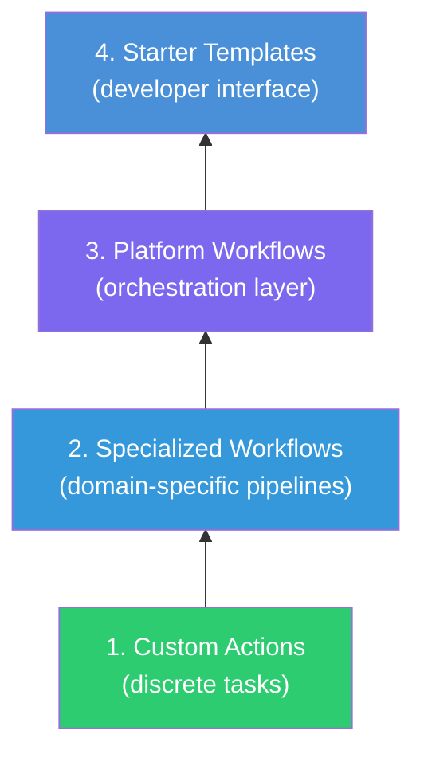

*This is Part 3 of a three-part series on migrating to GitHub Actions at scale. [Part 1: Making the Case for Change](/blog/2026/06/03/migrating-to-github-actions-part-1-making-the-case/) covers the why and the planning. [Part 2: What Good Looks Like](/blog/2026/06/03/migrating-to-github-actions-part-2-what-good-looks-like/) covers the target architecture.*

---

You've got the business case ([Part 1](/blog/2026/06/03/migrating-to-github-actions-part-1-making-the-case/)). You've seen the architecture ([Part 2](/blog/2026/06/03/migrating-to-github-actions-part-2-what-good-looks-like/)). Time to build.

This post is the implementation guide. We're going to walk through building each layer of the composable workflow system, from the bottom up: custom actions first, then specialized reusable workflows, then the platform pipeline workflows, and finally the starter templates that developers actually interact with.

Same idea as Lego. Start with the small pieces, assemble them into bigger structures, and eventually you've got something that looks like a spaceship. Or in our case, an enterprise CI/CD platform.

Please keep in mind that these are examples and may or may not directly work in your environment. Disclaimers out of the way, let's get to work!

## Building from the Bottom Up

We build bottom-up because each layer depends on the layers below it:



Smallest building blocks first.

## Custom Actions: Solving Environment-Specific Problems

Every organization has its own internal tools, registries, deployment targets, and operational quirks. Custom actions standardize how you interact with these environment-specific systems so that individual teams don't each invent their own approach.

### Types of Custom Actions

GitHub supports three types of actions:

| Type | Written In | Best For |
|---|---|---|
| **Composite** | YAML (workflow steps) | Combining existing actions and shell commands into reusable sequences |
| **JavaScript** | Node.js | Complex logic, API integrations, rich input/output handling |
| **Docker** | Dockerfile + any language | Isolated environments, specific tool versions, non-Node runtimes |

For most platform engineering needs, **composite actions** are the sweet spot. They're easy to write, easy to debug, and they compose well with other actions. Reach for JavaScript or Docker actions when you need complex logic or environment isolation.

### Example: Internal Artifact Registry Setup

A real-world example makes this concrete. Your organization uses JFrog Artifactory as its internal artifact registry. Every team needs to authenticate and configure their build tool to use it. Without a custom action, every team writes their own version of this setup, and half of them get the authentication wrong.

**Repository:** `my-org/custom-actions`


```yaml
# setup-artifactory/action.yml
name: 'Setup Artifactory'
description: 'Configures authentication and build tool settings for internal Artifactory registry'

inputs:
  build-tool:
    description: 'Build tool to configure (gradle, maven, npm, pip)'
    required: true
  artifactory-url:
    description: 'Artifactory instance URL'
    required: false
    default: 'https://artifactory.internal.company.com'

runs:
  using: 'composite'
  steps:
    - name: Setup JFrog CLI
      uses: jfrog/setup-jfrog-cli@v4
      env:
        JF_URL: ${{ inputs.artifactory-url }}
        JF_ACCESS_TOKEN: ${{ env.ARTIFACTORY_TOKEN }}

    - name: Configure Gradle
      if: inputs.build-tool == 'gradle'
      shell: bash
      run: |
        mkdir -p ~/.gradle
        cat > ~/.gradle/gradle.properties << 'EOF'
        artifactory_url=${{ inputs.artifactory-url }}
        artifactory_user=${{ env.ARTIFACTORY_USER }}
        artifactory_token=${{ env.ARTIFACTORY_TOKEN }}
        EOF

    - name: Configure Maven
      if: inputs.build-tool == 'maven'
      shell: bash
      run: |
        mkdir -p ~/.m2
        cat > ~/.m2/settings.xml << EOF
        <settings>
          <servers>
            <server>
              <id>internal-releases</id>
              <username>${{ env.ARTIFACTORY_USER }}</username>
              <password>${{ env.ARTIFACTORY_TOKEN }}</password>
            </server>
          </servers>
        </settings>
        EOF

    - name: Configure npm
      if: inputs.build-tool == 'npm'
      shell: bash
      run: |
        npm config set registry ${{ inputs.artifactory-url }}/api/npm/npm-remote/
        npm config set //${{ inputs.artifactory-url }}/api/npm/npm-remote/:_authToken ${{ env.ARTIFACTORY_TOKEN }}

    - name: Configure pip
      if: inputs.build-tool == 'pip'
      shell: bash
      run: |
        mkdir -p ~/.config/pip
        cat > ~/.config/pip/pip.conf << EOF
        [global]
        index-url = https://${{ env.ARTIFACTORY_USER }}:${{ env.ARTIFACTORY_TOKEN }}@${{ inputs.artifactory-url }}/api/pypi/pypi-remote/simple
        EOF
```


Now every pipeline that needs Artifactory uses one line:

```yaml
- uses: my-org/custom-actions/setup-artifactory@v1
  with:
    build-tool: 'gradle'
```

No copy-pasting setup scripts. No wondering if you got the authentication right. No debugging why Maven can't find the internal registry on a Tuesday.

### Example: Internal Kubernetes Deployment

Another common pattern - wrapping your organization's specific deployment process into a clean action:


```yaml
# deploy-to-k8s/action.yml
name: 'Deploy to Internal Kubernetes'
description: 'Deploys an application to internal Kubernetes clusters with standard conventions'

inputs:
  cluster:
    description: 'Target cluster (staging, production-east, production-west)'
    required: true
  namespace:
    description: 'Kubernetes namespace'
    required: true
  image:
    description: 'Container image to deploy (full registry path with tag)'
    required: true
  manifest-path:
    description: 'Path to Kubernetes manifests'
    required: false
    default: 'k8s/'
  dry-run:
    description: 'Perform a dry-run without applying changes'
    required: false
    default: 'false'

outputs:
  deployment-url:
    description: 'URL of the deployed application'
    value: ${{ steps.deploy.outputs.url }}

runs:
  using: 'composite'
  steps:
    - name: Configure kubectl
      shell: bash
      run: |
        # Your org's specific cluster authentication
        # Maybe OIDC, maybe kubeconfig from secrets, maybe a custom CLI
        internal-k8s-auth --cluster ${{ inputs.cluster }}

    - name: Validate manifests
      shell: bash
      run: |
        kubectl apply --dry-run=server -f ${{ inputs.manifest-path }} \
          -n ${{ inputs.namespace }}

    - name: Apply manifests
      id: deploy
      if: inputs.dry-run == 'false'
      shell: bash
      run: |
        # Update image reference in manifests
        kustomize edit set image app=${{ inputs.image }}

        # Apply with server-side apply for clean diffs
        kubectl apply --server-side -f ${{ inputs.manifest-path }} \
          -n ${{ inputs.namespace }}

        # Wait for rollout
        kubectl rollout status deployment/app \
          -n ${{ inputs.namespace }} \
          --timeout=300s

        # Output the service URL
        URL=$(kubectl get ingress app -n ${{ inputs.namespace }} \
          -o jsonpath='{.spec.rules[0].host}')
        echo "url=https://${URL}" >> $GITHUB_OUTPUT

    - name: Post deployment summary
      shell: bash
      run: |
        echo "## Deployment Summary" >> $GITHUB_STEP_SUMMARY
        echo "| Detail | Value |" >> $GITHUB_STEP_SUMMARY
        echo "|--------|-------|" >> $GITHUB_STEP_SUMMARY
        echo "| Cluster | ${{ inputs.cluster }} |" >> $GITHUB_STEP_SUMMARY
        echo "| Namespace | ${{ inputs.namespace }} |" >> $GITHUB_STEP_SUMMARY
        echo "| Image | ${{ inputs.image }} |" >> $GITHUB_STEP_SUMMARY
        echo "| Dry Run | ${{ inputs.dry-run }} |" >> $GITHUB_STEP_SUMMARY
```


### Custom Action Best Practices

A few ground rules for building actions that don't become maintenance nightmares:

- **One action, one responsibility.** `setup-artifactory` sets up Artifactory. It doesn't also run your build.
- **Sensible defaults for everything optional.** If 90% of teams use the same Artifactory URL, make it the default.
- **Validate inputs early.** Fail fast with a clear error message, not halfway through execution with a cryptic stack trace.
- **Use step summaries.** Write to `$GITHUB_STEP_SUMMARY` so developers can see what happened without digging through logs.
- **Version with semantic versioning.** Tag releases properly. Use a CI workflow in the action's own repository to test it.
- **Document inputs and outputs.** The `action.yml` metadata is your API contract.

## Specialized Reusable Workflows: Domain Team Components

With custom actions as our foundation, we build the next layer: reusable workflows owned by domain teams. Each workflow encapsulates one team's area of expertise.

### Security Scanning Workflow

Owned by the security team. Runs all required security checks and produces a pass/fail result.

**Repository:** `my-org/security-workflows`


```yaml
# .github/workflows/full-scan.yml
name: Security Scan Suite

on:
  workflow_call:
    inputs:
      language:
        type: string
        required: false
        default: 'auto'
        description: 'Primary language for SAST configuration'
      container-image:
        type: string
        required: false
        description: 'Container image to scan (if applicable)'
      severity-threshold:
        type: string
        required: false
        default: 'high'
        description: 'Minimum severity to fail the build (critical, high, medium, low)'
    outputs:
      scan-passed:
        description: 'Whether all security scans passed'
        value: ${{ jobs.summary.outputs.passed }}

jobs:
  sast:
    name: Static Analysis
    runs-on: ubuntu-latest
    permissions:
      security-events: write
      contents: read
    steps:
      - uses: actions/checkout@v4

      - name: Initialize CodeQL
        uses: github/codeql-action/init@v3
        with:
          languages: ${{ inputs.language != 'auto' && inputs.language || '' }}

      - name: Perform CodeQL Analysis
        uses: github/codeql-action/analyze@v3

  dependency-scan:
    name: Dependency Vulnerabilities
    runs-on: ubuntu-latest
    steps:
      - uses: actions/checkout@v4

      - name: Run dependency review
        if: github.event_name == 'pull_request'
        uses: actions/dependency-review-action@v4
        with:
          fail-on-severity: ${{ inputs.severity-threshold }}

  container-scan:
    name: Container Image Scan
    runs-on: ubuntu-latest
    if: inputs.container-image != ''
    steps:
      - name: Run Trivy vulnerability scanner
        uses: aquasecurity/trivy-action@master
        with:
          image-ref: ${{ inputs.container-image }}
          format: 'sarif'
          output: 'trivy-results.sarif'
          severity: 'CRITICAL,HIGH'

      - name: Upload Trivy scan results
        uses: github/codeql-action/upload-sarif@v3
        with:
          sarif_file: 'trivy-results.sarif'

  secret-detection:
    name: Secret Detection
    runs-on: ubuntu-latest
    steps:
      - uses: actions/checkout@v4
        with:
          fetch-depth: 0

      - name: Detect secrets
        uses: trufflesecurity/trufflehog@main
        with:
          extra_args: --only-verified

  license-check:
    name: License Compliance
    runs-on: ubuntu-latest
    steps:
      - uses: actions/checkout@v4

      - name: Check licenses
        # Your org's specific license compliance tooling
        run: |
          # Example: check that no GPL-licensed dependencies
          # exist in a project that ships proprietary code
          echo "Running license compliance check..."

  summary:
    name: Security Summary
    needs: [sast, dependency-scan, container-scan, secret-detection, license-check]
    if: always()
    runs-on: ubuntu-latest
    outputs:
      passed: ${{ steps.check.outputs.passed }}
    steps:
      - name: Evaluate results
        id: check
        run: |
          if [[ "${{ contains(needs.*.result, 'failure') }}" == "true" ]]; then
            echo "passed=false" >> $GITHUB_OUTPUT
            echo "## :x: Security Scan Failed" >> $GITHUB_STEP_SUMMARY
            exit 1
          else
            echo "passed=true" >> $GITHUB_OUTPUT
            echo "## :white_check_mark: All Security Scans Passed" >> $GITHUB_STEP_SUMMARY
          fi
```


The security team can add, remove, or update any scanner in this workflow without touching any other team's code. When they decide to add SBOM generation next quarter, it's one PR to this repo.

### SRE Operational Readiness Workflow

Owned by the SRE team. Validates that an application meets operational standards before deployment.

**Repository:** `my-org/sre-workflows`


```yaml
# .github/workflows/operational-readiness.yml
name: Operational Readiness Check

on:
  workflow_call:
    inputs:
      deploy-target:
        type: string
        required: true
        description: 'Deployment target type (kubernetes, ecs, lambda)'
      manifest-path:
        type: string
        required: false
        default: 'k8s/'
      require-health-endpoint:
        type: boolean
        required: false
        default: true

jobs:
  resource-validation:
    name: Resource Configuration
    runs-on: ubuntu-latest
    if: inputs.deploy-target == 'kubernetes'
    steps:
      - uses: actions/checkout@v4

      - name: Validate resource limits
        run: |
          # Ensure all deployments have resource requests and limits
          for file in ${{ inputs.manifest-path }}*.yml; do
            if grep -q "kind: Deployment" "$file"; then
              if ! grep -q "resources:" "$file"; then
                echo "::error file=$file::Deployment missing resource limits"
                exit 1
              fi
            fi
          done
          echo "All deployments have resource limits defined"

      - name: Validate replica count
        run: |
          # Production deployments should have at least 2 replicas
          for file in ${{ inputs.manifest-path }}*.yml; do
            if grep -q "kind: Deployment" "$file"; then
              replicas=$(grep "replicas:" "$file" | awk '{print $2}')
              if [ "$replicas" -lt 2 ]; then
                echo "::warning file=$file::Deployment has fewer than 2 replicas"
              fi
            fi
          done

  health-endpoint:
    name: Health Endpoint Check
    runs-on: ubuntu-latest
    if: inputs.require-health-endpoint
    steps:
      - uses: actions/checkout@v4

      - name: Verify health endpoint configuration
        run: |
          # Check that liveness and readiness probes are defined
          found_probes=false
          for file in ${{ inputs.manifest-path }}*.yml; do
            if grep -q "livenessProbe:" "$file" && grep -q "readinessProbe:" "$file"; then
              found_probes=true
            fi
          done
          if [ "$found_probes" = false ]; then
            echo "::error::No liveness/readiness probes found in deployment manifests"
            exit 1
          fi

  observability:
    name: Observability Configuration
    runs-on: ubuntu-latest
    steps:
      - uses: actions/checkout@v4

      - name: Check for monitoring configuration
        run: |
          # Verify that the app includes standard observability config
          # Check for metrics endpoint, structured logging config, etc.
          if [ -f "monitoring/alerts.yml" ] || [ -f "monitoring/dashboards.json" ]; then
            echo "Monitoring configuration found"
          else
            echo "::warning::No monitoring configuration found in monitoring/ directory"
          fi
```


### Language Guild Quality Gate

Owned by the Java guild. Enforces language-specific standards.

**Repository:** `my-org/java-guild-workflows`


```yaml
# .github/workflows/quality-gate.yml
name: Java Quality Gate

on:
  workflow_call:
    inputs:
      java-version:
        type: string
        required: false
        default: '21'
      coverage-threshold:
        type: number
        required: false
        default: 80
      checkstyle-config:
        type: string
        required: false
        default: 'google'

jobs:
  code-style:
    name: Code Style
    runs-on: ubuntu-latest
    steps:
      - uses: actions/checkout@v4

      - uses: actions/setup-java@v4
        with:
          java-version: ${{ inputs.java-version }}
          distribution: 'temurin'

      - name: Run Checkstyle
        run: |
          if [ -f "gradlew" ]; then
            ./gradlew checkstyleMain checkstyleTest
          elif [ -f "pom.xml" ]; then
            mvn checkstyle:check
          fi

  coverage:
    name: Code Coverage
    runs-on: ubuntu-latest
    steps:
      - uses: actions/checkout@v4

      - uses: actions/setup-java@v4
        with:
          java-version: ${{ inputs.java-version }}
          distribution: 'temurin'

      - name: Run tests with coverage
        run: |
          if [ -f "gradlew" ]; then
            ./gradlew test jacocoTestReport
          elif [ -f "pom.xml" ]; then
            mvn verify
          fi

      - name: Check coverage threshold
        run: |
          # Parse JaCoCo report and verify coverage meets threshold
          COVERAGE=$(grep -o 'Total[^%]*%' build/reports/jacoco/test/html/index.html \
            | head -1 | grep -o '[0-9]*' | head -1 || echo "0")
          echo "Code coverage: ${COVERAGE}%"
          if [ "$COVERAGE" -lt "${{ inputs.coverage-threshold }}" ]; then
            echo "::error::Code coverage ${COVERAGE}% is below threshold ${{ inputs.coverage-threshold }}%"
            exit 1
          fi

  dependency-updates:
    name: Dependency Freshness
    runs-on: ubuntu-latest
    steps:
      - uses: actions/checkout@v4

      - name: Check for outdated dependencies
        run: |
          if [ -f "gradlew" ]; then
            ./gradlew dependencyUpdates --warning-mode all || true
          fi
        # This is informational, not blocking
```


## Platform Workflows: The Orchestration Layer

Now we assemble the pieces. The platform team's reusable workflows compose custom actions and domain team workflows into complete pipelines.

### Java Pipeline (Complete Implementation)

**Repository:** `my-org/platform-workflows`


```yaml
# .github/workflows/java-pipeline.yml
name: Java CI/CD Pipeline

on:
  workflow_call:
    inputs:
      java-version:
        type: string
        required: false
        default: '21'
        description: 'Java version to use'
      build-tool:
        type: string
        required: false
        default: 'gradle'
        description: 'Build tool (gradle or maven)'
      deploy-target:
        type: string
        required: false
        default: 'kubernetes'
        description: 'Deployment target (kubernetes, ecs, none)'
      deploy-environments:
        type: string
        required: false
        default: 'staging'
        description: 'Comma-separated deployment environments (staging,production)'
      coverage-threshold:
        type: number
        required: false
        default: 80
      skip-deploy:
        type: boolean
        required: false
        default: false
        description: 'Skip deployment (CI only)'

jobs:
  build:
    name: Build & Test
    runs-on: ubuntu-latest
    outputs:
      image-tag: ${{ steps.meta.outputs.version }}
      image-digest: ${{ steps.build-image.outputs.digest }}
    steps:
      - uses: actions/checkout@v4

      - uses: actions/setup-java@v4
        with:
          java-version: ${{ inputs.java-version }}
          distribution: 'temurin'
          cache: ${{ inputs.build-tool }}

      # Use our custom action to configure internal registry
      - uses: my-org/custom-actions/setup-artifactory@v1
        with:
          build-tool: ${{ inputs.build-tool }}

      - name: Build
        run: |
          if [ "${{ inputs.build-tool }}" = "gradle" ]; then
            ./gradlew build -x test
          else
            mvn compile -DskipTests
          fi

      - name: Test
        run: |
          if [ "${{ inputs.build-tool }}" = "gradle" ]; then
            ./gradlew test
          else
            mvn test
          fi

      - name: Package
        run: |
          if [ "${{ inputs.build-tool }}" = "gradle" ]; then
            ./gradlew bootJar
          else
            mvn package -DskipTests
          fi

      - name: Docker meta
        id: meta
        uses: docker/metadata-action@v5
        with:
          images: artifactory.internal.company.com/docker/${{ github.repository }}
          tags: |
            type=sha,prefix=
            type=ref,event=branch
            type=semver,pattern={{version}}

      - name: Build and push container image
        id: build-image
        if: inputs.deploy-target != 'none'
        uses: docker/build-push-action@v6
        with:
          context: .
          push: ${{ github.ref == 'refs/heads/main' }}
          tags: ${{ steps.meta.outputs.tags }}
          labels: ${{ steps.meta.outputs.labels }}

      - name: Upload test results
        if: always()
        uses: actions/upload-artifact@v4
        with:
          name: test-results
          path: |
            **/build/reports/tests/
            **/target/surefire-reports/

  # Security scanning (owned by security team)
  security:
    needs: build
    uses: my-org/security-workflows/.github/workflows/full-scan.yml@v1
    with:
      language: 'java'
      container-image: >-
        ${{ needs.build.outputs.image-tag != '' &&
        format('artifactory.internal.company.com/docker/{0}:{1}',
        github.repository, needs.build.outputs.image-tag) || '' }}
    secrets: inherit
    permissions:
      security-events: write
      contents: read

  # SRE operational readiness (owned by SRE team)
  sre:
    needs: build
    uses: my-org/sre-workflows/.github/workflows/operational-readiness.yml@v1
    with:
      deploy-target: ${{ inputs.deploy-target }}
    secrets: inherit

  # Java quality gate (owned by Java guild)
  quality:
    needs: build
    uses: my-org/java-guild-workflows/.github/workflows/quality-gate.yml@v1
    with:
      java-version: ${{ inputs.java-version }}
      coverage-threshold: ${{ inputs.coverage-threshold }}
    secrets: inherit

  # Deploy to staging
  deploy-staging:
    name: Deploy to Staging
    needs: [security, sre, quality]
    if: >-
      github.ref == 'refs/heads/main' &&
      !inputs.skip-deploy &&
      contains(inputs.deploy-environments, 'staging')
    runs-on: ubuntu-latest
    environment:
      name: staging
      url: ${{ steps.deploy.outputs.deployment-url }}
    steps:
      - uses: actions/checkout@v4

      - uses: my-org/custom-actions/deploy-to-k8s@v1
        id: deploy
        with:
          cluster: staging
          namespace: ${{ github.event.repository.name }}
          image: >-
            artifactory.internal.company.com/docker/${{ github.repository }}:${{ needs.build.outputs.image-tag }}

  # Deploy to production (requires approval)
  deploy-production:
    name: Deploy to Production
    needs: [deploy-staging]
    if: >-
      github.ref == 'refs/heads/main' &&
      !inputs.skip-deploy &&
      contains(inputs.deploy-environments, 'production')
    runs-on: ubuntu-latest
    environment:
      name: production
      url: ${{ steps.deploy.outputs.deployment-url }}
    steps:
      - uses: actions/checkout@v4

      - uses: my-org/custom-actions/deploy-to-k8s@v1
        id: deploy
        with:
          cluster: production-east
          namespace: ${{ github.event.repository.name }}
          image: >-
            artifactory.internal.company.com/docker/${{ github.repository }}:${{ needs.build.outputs.image-tag }}

      - uses: my-org/custom-actions/notify-release-channel@v1
        with:
          status: 'deployed'
          environment: 'production'
          version: ${{ needs.build.outputs.image-tag }}
```


### Deployment Workflow (Shared Across Languages)

Some pieces aren't language-specific. Deployment, for example, often follows the same pattern regardless of what language produced the artifact:


```yaml
# .github/workflows/deploy.yml
name: Standard Deployment

on:
  workflow_call:
    inputs:
      target:
        type: string
        required: true
      image:
        type: string
        required: true
      environment:
        type: string
        required: true
      require-approval:
        type: boolean
        required: false
        default: false

jobs:
  deploy:
    runs-on: ubuntu-latest
    environment:
      name: ${{ inputs.environment }}
    steps:
      - uses: actions/checkout@v4

      - uses: my-org/custom-actions/deploy-to-k8s@v1
        id: deploy
        with:
          cluster: ${{ inputs.target }}
          namespace: ${{ github.event.repository.name }}
          image: ${{ inputs.image }}

      - name: Smoke test
        run: |
          # Hit the health endpoint and verify it's responding
          DEPLOY_URL="${{ steps.deploy.outputs.deployment-url }}"
          for i in {1..10}; do
            if curl -sf "${DEPLOY_URL}/health" > /dev/null; then
              echo "Health check passed"
              exit 0
            fi
            echo "Waiting for deployment to be healthy... (attempt $i/10)"
            sleep 10
          done
          echo "::error::Health check failed after 10 attempts"
          exit 1
```


## Production Delivery Mechanics: Environments, Strategies, and Recovery

Part 2 introduced the architecture. This section closes the implementation gap for production delivery mechanics: how deployments get triggered, how environments are protected, how traffic gets shifted, and how rollback works when things fail.

### Trigger Patterns

Most teams should keep CI and CD as separate workflows and trigger CD when CI completes successfully on the default branch:

```yaml
on:
  workflow_run:
    workflows: ["CI"]
    branches: [main]
    types: [completed]
```

Use tag-based release triggers when you need explicit release control:

```yaml
on:
  push:
    tags:
      - "v*"
```

### Environment Protection Rules

Treat environment settings as part of your platform contract, not repo-by-repo preferences.

| Environment | Required Reviewers | Wait Timer | Branch Restriction |
|---|---|---|---|
| Dev | None | None | Feature and main |
| Staging | Optional (platform on-call) | None | Main and release/* |
| Production | Platform/SRE approval | 5-10 min | Main only |

Pair these with environment-scoped secrets so production credentials are only available to jobs targeting `production`.

### Deployment Strategy Selection

Use the strategy that matches risk and rollback requirements:

| Strategy | Best For | Trade-Off |
|---|---|---|
| Rolling | Most internal services | Slower rollback, mixed-version window |
| Blue-Green | Zero-downtime cutovers | Double environment cost |
| Canary | High-risk, high-traffic services | More routing + observability complexity |

For most organizations: start with rolling, use blue-green for critical customer paths, adopt canary where production behavior uncertainty is highest.

### Rollback by Design

Always record the currently deployed version before rollout and automate health-check rollback.

```bash
# Capture previous image before deployment
PREV_IMAGE=$(kubectl get deployment app \
  -o jsonpath='{.spec.template.spec.containers[0].image}')

# Deploy candidate and verify health
kubectl set image deployment/app app=${NEW_IMAGE}
kubectl rollout status deployment/app --timeout=300s
curl -fsS https://service.example.com/health

# Roll back immediately if health check fails
kubectl set image deployment/app app=${PREV_IMAGE}
```

The workflow equivalent should gate production promotion behind smoke tests and execute rollback steps automatically on failed validation.

### OIDC First, Long-Lived Secrets Last

For cloud deployments, prefer OpenID Connect federation over static access keys. It reduces credential sprawl and limits token lifetime to the job duration.

```yaml
permissions:
  id-token: write
  contents: read

steps:
  - name: Configure AWS credentials via OIDC
    uses: aws-actions/configure-aws-credentials@v4
    with:
      role-to-assume: arn:aws:iam::123456789012:role/github-actions-deploy
      aws-region: us-east-1
```

Reserve environment secrets for values that cannot yet be federated.

## Starter Templates: The Developer Interface

The final layer. Starter templates are what developers see when they click "New workflow" in their repository. They live in your organization's `.github` repository.

### Setting Up the Template Repository

**Repository:** `my-org/.github`

The `.github` repo has special meaning in GitHub - it's where organization-level defaults live, including workflow templates.

```
my-org/.github/
├── workflow-templates/
│   ├── java-app.yml
│   ├── java-app.properties.json
│   ├── python-app.yml
│   ├── python-app.properties.json
│   ├── go-app.yml
│   ├── go-app.properties.json
│   ├── node-app.yml
│   └── node-app.properties.json
├── ISSUE_TEMPLATE/
├── PULL_REQUEST_TEMPLATE.md
└── profile/
    └── README.md
```

### Java Application Template

```yaml
# workflow-templates/java-app.yml
name: Java CI/CD

on:
  push:
    branches: [$default-branch]
  pull_request:
    branches: [$default-branch]

# Minimal permissions - reusable workflows request what they need
permissions:
  contents: read

jobs:
  pipeline:
    uses: my-org/platform-workflows/.github/workflows/java-pipeline.yml@v2
    with:
      java-version: '21'
      build-tool: 'gradle'           # Change to 'maven' for Maven projects
      deploy-target: 'kubernetes'    # Change to 'ecs' or 'none' as needed
      deploy-environments: 'staging' # Add ',production' when ready
      coverage-threshold: 80
    secrets: inherit
    permissions:
      security-events: write
      contents: read
```

```json
// workflow-templates/java-app.properties.json
{
  "name": "Java Application",
  "description": "Standard CI/CD pipeline for Java applications. Includes build, test, security scanning, quality gates, and deployment.",
  "iconName": "java",
  "categories": ["Java", "CI/CD"],
  "filePatterns": ["pom.xml", "build.gradle", "build.gradle.kts"]
}
```

The `properties.json` file controls how the template appears in the UI. The `filePatterns` field is particularly useful - GitHub will suggest this template to repos that contain `pom.xml` or `build.gradle` files.

### Python Application Template

```yaml
# workflow-templates/python-app.yml
name: Python CI/CD

on:
  push:
    branches: [$default-branch]
  pull_request:
    branches: [$default-branch]

permissions:
  contents: read

jobs:
  pipeline:
    uses: my-org/platform-workflows/.github/workflows/python-pipeline.yml@v2
    with:
      python-version: '3.12'
      package-manager: 'pip'         # Or 'poetry', 'uv'
      deploy-target: 'kubernetes'
      deploy-environments: 'staging'
    secrets: inherit
    permissions:
      security-events: write
      contents: read
```

```json
// workflow-templates/python-app.properties.json
{
  "name": "Python Application",
  "description": "Standard CI/CD pipeline for Python applications. Includes build, test, security scanning, quality gates, and deployment.",
  "iconName": "python",
  "categories": ["Python", "CI/CD"],
  "filePatterns": ["requirements.txt", "pyproject.toml", "setup.py", "Pipfile"]
}
```

### Go Application Template

```yaml
# workflow-templates/go-app.yml
name: Go CI/CD

on:
  push:
    branches: [$default-branch]
  pull_request:
    branches: [$default-branch]

permissions:
  contents: read

jobs:
  pipeline:
    uses: my-org/platform-workflows/.github/workflows/go-pipeline.yml@v2
    with:
      go-version: '1.23'
      deploy-target: 'kubernetes'
      deploy-environments: 'staging'
    secrets: inherit
    permissions:
      security-events: write
      contents: read
```

## Testing Your Workflow Platform

Your CI/CD platform is software. It needs tests.

### Testing Custom Actions

Every custom action repository should have its own CI that validates the action works:

```yaml
# In my-org/custom-actions/.github/workflows/test-setup-artifactory.yml
name: Test Setup Artifactory Action

on:
  pull_request:
    paths:
      - 'setup-artifactory/**'

jobs:
  test-gradle:
    runs-on: ubuntu-latest
    steps:
      - uses: actions/checkout@v4

      - uses: ./setup-artifactory
        with:
          build-tool: 'gradle'
        env:
          ARTIFACTORY_TOKEN: 'test-token'
          ARTIFACTORY_USER: 'test-user'

      - name: Verify Gradle configuration
        run: |
          if [ ! -f ~/.gradle/gradle.properties ]; then
            echo "::error::gradle.properties was not created"
            exit 1
          fi
          grep -q "artifactory_url" ~/.gradle/gradle.properties

  test-maven:
    runs-on: ubuntu-latest
    steps:
      - uses: actions/checkout@v4

      - uses: ./setup-artifactory
        with:
          build-tool: 'maven'
        env:
          ARTIFACTORY_TOKEN: 'test-token'
          ARTIFACTORY_USER: 'test-user'

      - name: Verify Maven configuration
        run: |
          if [ ! -f ~/.m2/settings.xml ]; then
            echo "::error::settings.xml was not created"
            exit 1
          fi
          grep -q "internal-releases" ~/.m2/settings.xml
```

### Testing Reusable Workflows

Reusable workflow repos should have test workflows that call the reusable workflow against a sample project:

```yaml
# In my-org/platform-workflows/.github/workflows/test-java-pipeline.yml
name: Test Java Pipeline

on:
  pull_request:
    paths:
      - '.github/workflows/java-pipeline.yml'

jobs:
  test-gradle:
    uses: ./.github/workflows/java-pipeline.yml
    with:
      java-version: '21'
      build-tool: 'gradle'
      deploy-target: 'none'
      skip-deploy: true
    secrets: inherit
```

Keep a sample Java project in the workflow repo (or reference a dedicated test fixture repo) so you have something to build.

### Release Process for Workflow Repos

Every workflow repository should follow a release process:

1. Changes go through PR with required reviews
2. CI tests validate the workflow against sample projects
3. After merge, create a release with a semantic version tag
4. Publish release notes and let update automation propose SHA bumps in consumers

```bash
# After merging a change to the workflow repo
git tag v2.3.0
git push origin v2.3.0
```

Use semantic versions for release communication, and pin consuming workflows to immutable commit SHAs. Then use Dependabot or Renovate to raise PRs for controlled updates.

## Wiring It to Your Runner Infrastructure

All of these workflows need somewhere to run. The runner architecture is a separate concern, but it needs to match your workflow design.

For the complete runner scaling guide, see [GitHub Actions Runner Scaling Patterns: GitHub-Hosted vs ARC](/blog/2026/04/29/github-actions-runner-scaling-patterns/). The short version for this context:

**For the workflows we've built:**

| Job Type | Runner Recommendation |
|---|---|
| Build and test | GitHub-hosted or larger runners (for resource-heavy builds) |
| Security scanning | GitHub-hosted (stateless, no special access needed) |
| Deployment | Self-hosted with private network access (or GitHub-hosted with VNet) |

**Runner groups** let you segment access. Your deployment jobs should target runners that have network access to your clusters. Your CI jobs don't need that access and shouldn't have it (principle of least privilege).

Use [runner group assignment with rulesets](/blog/2026/03/10/scaling-github-rulesets-with-custom-properties/) to ensure production deployment runners are only accessible to repos that should be deploying to production.

## Governance and Required Workflows

For checks that must run on every repository (not just repos that opt into your templates), use [required workflows](https://docs.github.com/en/actions/sharing-automations/sharing-workflows-secrets-and-runners-with-your-organization) at the organization level.

Pair required workflows with [repository rulesets and custom properties](/blog/2026/03/10/scaling-github-rulesets-with-custom-properties/) for targeted enforcement:

- **All repositories:** Secret detection, license compliance
- **Repositories with `compliance-level: high`:** Full SAST scan, SBOM generation, artifact attestation
- **Repositories with `deployment-target: production`:** SRE operational readiness checks

This gives you a safety net. Even if a team writes their own custom workflow and skips your templates entirely, the non-negotiable checks still run.

## Where Copilot-Based Migrations Fit

GitHub's [actions-migrations-via-copilot](https://github.com/github/actions-migrations-via-copilot) can accelerate migration from legacy CI/CD systems. It is especially useful for translating existing pipeline intent into an initial GitHub Actions baseline.

Use it for:

- Rapid first-pass conversion from Jenkins/GitLab CI/CircleCI/Azure DevOps pipeline definitions
- Learning recurring patterns in your current pipelines so generated workflows are closer to your internal standards
- Reducing manual YAML rewrite effort during large migration waves

Don't treat it as a final-state generator. Treat it as an accelerator into your target architecture.

Why not advocate pure lift-and-shift as the destination:

- Legacy pipelines usually encode local workarounds, duplicated logic, and inconsistent security controls
- Direct conversion often produces repo-by-repo workflows, not layered reusable workflows with clear ownership
- Converted pipelines still need to be refactored into templates, reusable workflows, required workflows, and runner-group guardrails

Practical pattern:

1. Convert legacy workflows with Copilot migration tooling
2. Validate functional parity in a pilot repo
3. Refactor into your standardized platform workflows and templates
4. Enforce non-negotiables with required workflows and rulesets
5. Pin dependencies to SHAs and automate update PRs

## Migration Execution Checklist

Implementation checklist, in build order:

### Week 1: Foundation

- [ ] Create the `custom-actions` repository with your first 2-3 actions
- [ ] Create domain team workflow repositories (`security-workflows`, `sre-workflows`)
- [ ] Set up CI for each workflow repository
- [ ] Deploy and validate runner infrastructure

### Week 2: Platform Workflows

- [ ] Create `platform-workflows` repo with your first language pipeline
- [ ] Test end-to-end against a sample application
- [ ] Run Copilot migration tooling on 1-2 representative legacy pipelines and map outputs to your standardized workflow model
- [ ] Create starter templates in the `.github` repo
- [ ] Document the workflow catalog for developers

### Weeks 3-4: Pilot

- [ ] Onboard 2-3 pilot teams using the starter templates
- [ ] Collect feedback and iterate on workflow design
- [ ] Validate that all domain team checks work correctly
- [ ] Measure build times and compare to baseline

### Weeks 5+: Scale

- [ ] Add language pipelines for remaining tech stacks
- [ ] Roll out to remaining teams
- [ ] Implement required workflows for non-negotiable checks
- [ ] Decommission old CI/CD platform pipelines as teams migrate

## Summary and Key Takeaways

We've built a complete composable CI/CD platform from the ground up. What we covered:

**The building blocks:**

- **Custom Actions** handle environment-specific tasks (registry setup, deployment, notifications). Build them as composite actions with clear inputs, outputs, and defaults.
- **Specialized Workflows** encode domain team expertise (security scanning, SRE checks, language standards). Domain teams own and maintain their workflows independently.
- **Platform Workflows** orchestrate everything into complete CI/CD pipelines per language. They compose actions and domain workflows into an opinionated, standardized pipeline.
- **Starter Templates** are the developer-facing interface. Simple, obvious, and backed by all the machinery underneath.

**Key implementation principles:**

- [ ] **Build bottom-up.** Custom actions first, then specialized workflows, then platform workflows, then templates.
- [ ] **Test your CI/CD platform like software.** Every workflow and action repo needs its own CI.
- [ ] **Version and pin everything.** Use semantic releases for communication and SHA pinning for consumers.
- [ ] **Use required workflows for non-negotiables.** Templates handle the happy path; required workflows handle the guardrails.
- [ ] **Start small.** One language pipeline, two pilot teams. Expand after you've validated the pattern works.

This architecture looks like more complexity upfront. In practice, it's less complexity distributed more intelligently. Teams own their pieces, changes flow automatically, and developers get a five-minute path to a fully standardized CI/CD pipeline.

Small pieces, clear interfaces, infinite combinations. That's the Lego block model in action.

## Series Wrap-Up

Across this three-part series, we've covered:

- [**Part 1:**](/blog/2026/06/03/migrating-to-github-actions-part-1-making-the-case/) Building the business case, planning the organizational change, conducting the self-assessment, and phasing the migration
- [**Part 2:**](/blog/2026/06/03/migrating-to-github-actions-part-2-what-good-looks-like/) Designing the layered architecture with clear ownership, versioning, and composability
- [**Part 3:**](/blog/2026/06/03/migrating-to-github-actions-part-3-building-the-lego-blocks/) Implementing custom actions, reusable workflows, platform pipelines, and starter templates

If you're starting a CI/CD migration, start with Part 1. Get the organizational alignment right before you write any YAML. Then use Part 2 for ownership and architecture decisions, and Part 3 as the implementation playbook for composable workflows and production delivery safety.

Good luck out there. Your pipelines will thank you.
