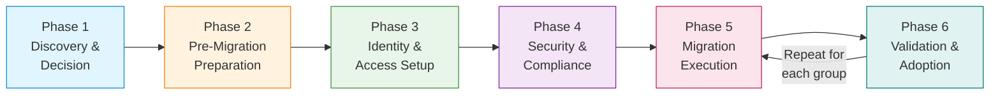
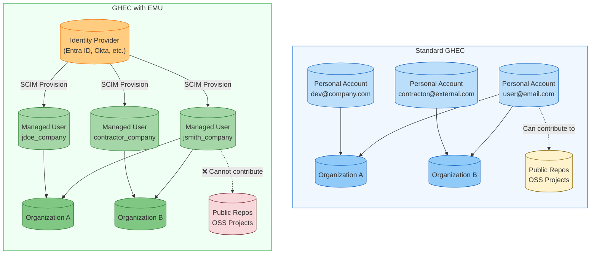
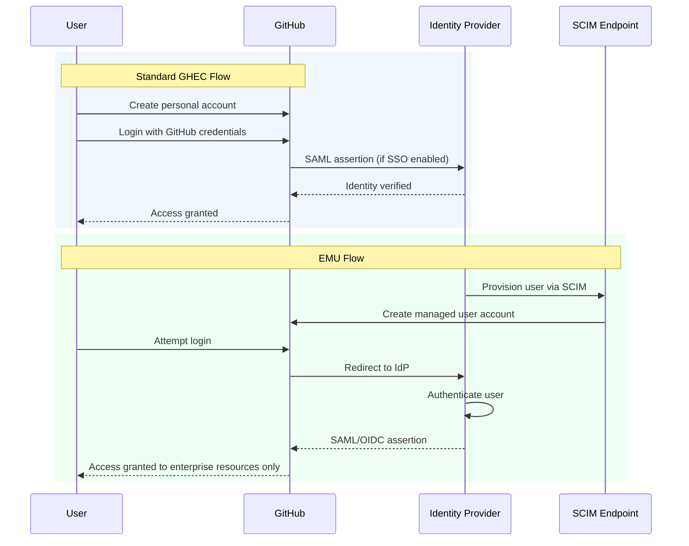

# The Complete Guide to Migrating to GitHub Enterprise Managed Users - Part 1: Discovery & Decision

> **📚 Series: The Complete Guide to Migrating to GitHub Enterprise Managed Users**
> This is **Part 1 of 6** in the EMU migration guide series.
>
> | Part | Topic |
> |------|-------|
> | **[Part 1: Discovery & Decision](https://github.com/orgs/community/discussions/189382)** (You are here) | Define goals, evaluate fit, get buy-in |
> | [Part 2: Pre-Migration Preparation](https://github.com/orgs/community/discussions/189383) | Inventory, cleanup, IdP readiness, user communication |
> | [Part 3: Identity & Access Setup](https://github.com/orgs/community/discussions/189384) | Configure SCIM, provision users, set up teams |
> | [Part 4: Security & Compliance](https://github.com/orgs/community/discussions/189385) | Audit logging, security hardening, CI/CD, integrations |
> | [Part 5: Migration Execution](https://github.com/orgs/community/discussions/189386) | Run GEI, migrate repos, reclaim mannequins |
> | [Part 6: Validation & Adoption](https://github.com/orgs/community/discussions/189387) | Testing, user training, OSS strategy, go-live |

---

Migrating to GitHub Enterprise Cloud with Enterprise Managed Users (EMU) is one of those projects that sounds straightforward until you're knee-deep in identity provider configurations wondering why SCIM provisioning just deleted half your test users and renamed the other half. Trust me, I've been there.

This guide is designed to help you navigate the migration process with your sanity intact. Whether you're coming from standard GitHub Enterprise Cloud (GHEC), GitHub Enterprise Server (GHES), or another SCM platform entirely, we'll cover the requirements, considerations, gotchas, and hard-won lessons that will make your migration successful.

## Migration Phases Overview

A successful EMU migration is a marathon, not a sprint. We've broken this guide into six distinct phases to help you track progress and ensure nothing falls through the cracks:

| Phase | Focus | Key Activities | Timeline |
|-------|-------|----------------|----------|
| **Phase 1** | Discovery & Decision | Define goals, evaluate fit, get buy-in | 2-4 weeks |
| **Phase 2** | Pre-Migration Preparation | Inventory, cleanup, IdP readiness, user communication | 4-8 weeks |
| **Phase 3** | Identity & Access Setup | Configure SCIM, provision users, set up teams | 1-2 weeks |
| **Phase 4** | Security & Compliance | Audit logging, security hardening, CI/CD, integrations | 2-4 weeks |
| **Phase 5** | Migration Execution | Run GEI, migrate repos, reclaim mannequins | *Per group* |
| **Phase 6** | Validation & Adoption | Testing, user training, OSS strategy, go-live | *Per group* |

**Phases 1-4** are sequential and done once. **Phases 5-6 are iterative**. You'll repeat them for each team, department, or group of repositories you migrate. Don't try to move everyone at once. Let me say that again DO NOT TRY TO MIGRATE EVERYTHING AT ONCE. Whew... got that out of my system....

**Total estimated timeline: 12-26 weeks** depending on organization size and complexity.

> **NOTE:** These times can vary WILDLY depending on a multitude of factors. Some organizations have completed 1000 user migrations in 6-8 weeks, others have taken 18+ months. The key is that Phases 5 and 6 form a loop: you migrate a group, validate, get them productive, then move to the next group. Trying to do a "big bang" migration rarely ends well.

Now let's dive into Phase 1.

---

# Phase 1: Discovery & Decision

*Why are we doing this, and is EMU the right choice?*

Before you commit to an EMU migration, you need to ensure it's the right fit for your organization. This phase is about understanding EMU, defining your goals, and getting stakeholder alignment.

## Why Migrate to EMU? Defining Your Goals

Before diving into the technical details, let's be clear about what you're trying to achieve. A successful migration starts with well-defined goals that your stakeholders agree on.

### Common Migration Goals

**Security and Risk Reduction**
- Eliminate the risk of code leaking to public repositories
- Ensure immediate access revocation when employees leave
- Gain visibility into all developer activity through centralized audit logging
- Enforce corporate authentication policies consistently

**Compliance and Governance**
- Meet regulatory requirements for identity management (SOC 2, HIPAA, FedRAMP)
- Satisfy auditor requests for centralized access control evidence
- Implement data residency controls for geographic compliance
- Demonstrate segregation of duties through role-based access

**Operational Efficiency**
- Reduce manual account management overhead through SCIM automation
- Consolidate identity management into your existing IdP infrastructure
- Simplify access reviews and certifications with group-based permissions
- Decrease time-to-productivity for new hires through automated provisioning

**Cost Optimization**
- Better license management through automated deprovisioning
- Reduced support burden from self-service account issues
- Cleaner enterprise structure with centralized administration

### Defining Success Metrics

Document measurable outcomes for your migration. Here are a couple possible examples. These may or may not align with your reasons or goals and that's totally fine. The key is to document the "why" about the process.

| Goal | Metric | Target |
|------|--------|--------|
| Security | Time to revoke access on termination | < 1 hour (automated) |
| Compliance | Audit findings related to access management | Zero |
| Efficiency | Manual account management tasks per month | Reduced by 90% |
| Visibility | Percentage of activity captured in audit logs | 100% |

Having these goals documented helps justify the migration effort, align stakeholders, and measure success after completion.

## What Are Enterprise Managed Users?

Before we dive into the migration process, let's make sure we're on the same page about what EMU actually is and why you might want it.

Enterprise Managed Users is GitHub's solution for organizations that need centralized identity management. Unlike standard GHEC where users create and manage their own personal accounts, EMU gives your organization complete control over the user lifecycle:

- **Your IdP provisions user accounts** on GitHub, with access to your enterprise
- **Users authenticate through your identity provider** using SAML or OIDC
- **You control usernames, profile data, organization membership, and repository access** from your IdP
- **User accounts are automatically created, updated, and deactivated** based on IdP changes

Think of it as the difference between "bring your own device" and "company-issued laptops." Both can work, but they serve different security and compliance requirements.

For the full rundown, see GitHub's official documentation on [About Enterprise Managed Users](https://docs.github.com/en/enterprise-cloud@latest/admin/identity-and-access-management/understanding-iam-for-enterprises/about-enterprise-managed-users).

## When Should You Use EMU?

EMU isn't for everyone, and that's okay. Here's how to figure out if it's right for your organization.

### Reasons TO Use EMU

**1. Compliance and Regulatory Requirements**

If you're in a regulated industry (finance, healthcare, government, defense), EMU provides the control auditors love:
- Complete user lifecycle management from a single source of truth
- Automatic deprovisioning when employees leave (no more orphaned accounts)
- Full audit trail of all identity-related actions
- Enforced authentication through your corporate IdP

**2. Data Loss Prevention (DLP)**

EMU's restrictions are features, not bugs, for security-conscious organizations:
- Users cannot accidentally (or intentionally) push company code to public repositories
- No public gists where sensitive snippets might end up
- All work stays within your enterprise boundary
- Prevents "shadow IT" scenarios where developers use personal accounts for work

**3. True Single Sign-On Experience**

Unlike standard GHEC where SAML links external identities to personal accounts, EMU provides actual SSO:
- Users authenticate once through your IdP
- No separate GitHub passwords to manage
- Conditional Access Policies (with OIDC/Entra ID) for location, device compliance, and risk-based access
- Session management tied directly to your IdP

**4. Centralized Identity Governance**

If your organization already invests heavily in identity management:
- User attributes flow automatically from your IdP
- Group-based access management through IdP groups
- Consistent naming conventions across all systems
- One place to manage access reviews and certifications

**5. Contractor and Vendor Management**

EMU's guest collaborator role is perfect for external parties:
- Grant temporary access without creating permanent accounts
- Automatic removal when contractor engagements end
- Clear separation between full-time employees and external collaborators
- Audit trail for all external access

**6. Data Residency Requirements**

If you need to control where your data is stored, GitHub Enterprise Cloud with data residency (on GHE.com) **requires** EMU. This is essential for organizations with:
- EU data sovereignty requirements
- Government data handling mandates
- Industry-specific geographic restrictions

### Reasons NOT to Use EMU

**1. Heavy Open Source Participation**

If your company actively contributes to open source projects:
- Managed users cannot contribute to repositories outside your enterprise
- No public repository creation means no hosting your own OSS projects on GitHub
- Developers will need separate personal accounts for external contributions
- The cognitive overhead of switching accounts is real and annoying

**2. Developer Recruitment and Community Building**

Contribution graphs matter for some organizations:
- Managed user contributions don't appear on public profiles
- You can't showcase your team's open source work through their EMU accounts
- Developer advocacy and community engagement become more complex

**3. Small Teams or Startups**

The overhead may not be worth it if:
- You have fewer than 50-100 developers
- Your IdP infrastructure isn't mature
- You need flexibility over control
- Quick onboarding trumps governance

**4. Academic or Research Institutions**

Where collaboration is the primary goal:
- Researchers need to collaborate across institutional boundaries
- Open publication of code is often required
- Student accounts come and go frequently
- The "walled garden" model conflicts with academic openness

**5. Consulting or Agency Work**

If your developers work in client repositories:
- Managed users can only access repositories within your enterprise
- Client work often happens in the client's GitHub organization
- The restrictions create friction for client-facing work

### The Decision Framework

Ask yourself these questions:

| Question | If Yes | If No |
|----------|--------|-------|
| Do we have strict compliance requirements? | EMU | Either |
| Do developers need to contribute to external OSS? | Standard GHEC | EMU |
| Is our IdP our source of truth for all access? | EMU | Either |
| Do we need data residency controls? | EMU | Either |
| Do developers work in client repositories? | Standard GHEC | Either |
| Is preventing data exfiltration a top priority? | EMU | Either |

If you answered "EMU" to multiple questions, especially the compliance and data residency ones, EMU is probably your path. If external collaboration is critical to your business, think carefully before committing.

## Comparing GHEC and GHEC-EMU

One of the most common migration scenarios is moving from standard GHEC to GHEC-EMU. Before you start, it's critical to understand what you're gaining and what you're giving up.

### Architectural Differences

### Identity and Authentication Flow Comparison

### Feature Comparison Matrix

| Capability | Standard GHEC | GHEC-EMU |
|------------|--------------|----------|
| User account creation | User self-service | IdP provisioned only |
| Username format | User chosen | `handle_shortcode` format |
| Public repository creation | Yes | No |
| Public gists | Yes | No |
| Contribute to external repos | Yes | No |
| GitHub Pages (public) | Yes | Limited |
| GitHub Copilot Free/Pro | Yes | No (requires Business/Enterprise) |
| Conditional Access Policy | Limited | Full support (with OIDC) |
| User lifecycle management | Manual | Automated via SCIM |
| Identity provider | Optional | Required |

For the complete list of restrictions, see [Abilities and restrictions of managed user accounts](https://docs.github.com/en/enterprise-cloud@latest/admin/identity-and-access-management/understanding-iam-for-enterprises/abilities-and-restrictions-of-managed-user-accounts).

---

> **📚 EMU Migration Guide Series Navigation**
>
> ➡️ **Next: [Part 2 - Pre-Migration Preparation](https://github.com/orgs/community/discussions/189383)**
>
> ---
> *This is Part 1 of a 6-part series on migrating to GitHub Enterprise Managed Users. Found this helpful? Give it a 👍 and share it with your team! Got questions or something I missed? Drop a comment below.*
