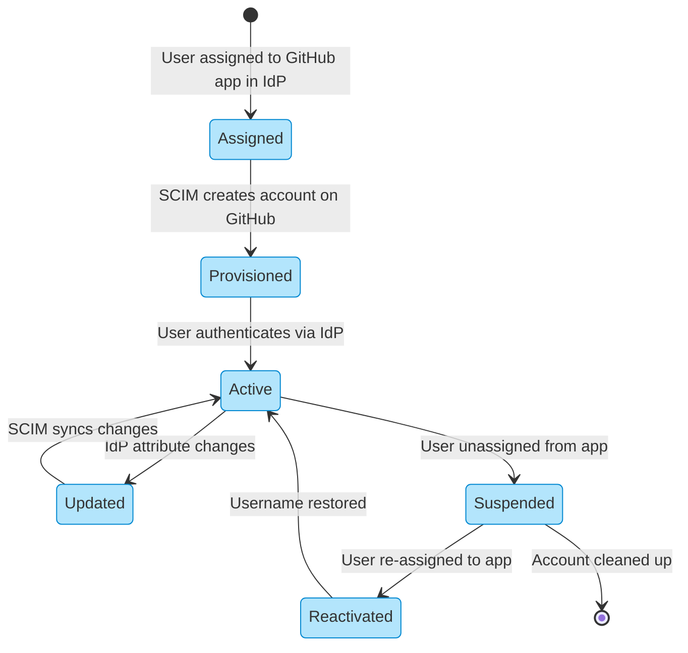
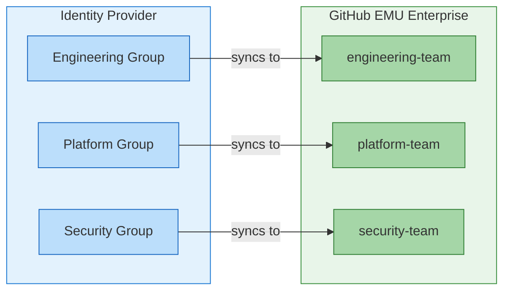

# The Complete Guide to Migrating to GitHub Enterprise Managed Users - Part 3: Identity & Access Setup

> **📚 Series: The Complete Guide to Migrating to GitHub Enterprise Managed Users**
> This is **Part 3 of 6** in the EMU migration guide series.
>
> | Part | Topic |
> |------|-------|
> | [Part 1: Discovery & Decision](https://github.com/orgs/community/discussions/189382) | Define goals, evaluate fit, get buy-in |
> | [Part 2: Pre-Migration Preparation](https://github.com/orgs/community/discussions/189383) | Inventory, cleanup, IdP readiness, user communication |
> | **[Part 3: Identity & Access Setup](https://github.com/orgs/community/discussions/189384)** (You are here) | Configure SCIM, provision users, set up teams |
> | [Part 4: Security & Compliance](https://github.com/orgs/community/discussions/189385) | Audit logging, security hardening, CI/CD, integrations |
> | [Part 5: Migration Execution](https://github.com/orgs/community/discussions/189386) | Run GEI, migrate repos, reclaim mannequins |
> | [Part 6: Validation & Adoption](https://github.com/orgs/community/discussions/189387) | Testing, user training, OSS strategy, go-live |

---

# Phase 3: Identity & Access Setup

*Setting up the new environment before migration.*

Before you can migrate repositories, you need users to assign permissions to. This phase covers configuring your IdP integration, provisioning users via SCIM, and setting up team structures. Get this right first - it makes everything else smoother.

## Identity and User Lifecycle Management

This is where EMU really shines, but also where things can go sideways if not configured properly.

### Username Normalization

GitHub automatically creates usernames by normalizing an identifier from your IdP. The format is:

```
{normalized_handle}_{enterprise_shortcode}
```

For example, if your enterprise shortcode is `acme` and the IdP provides `John.Smith@company.com`, the username might become `john-smith_acme`.

Be aware that:
- Special characters are removed or replaced
- Conflicts may occur if normalized names collide
- Changing a user's email in the IdP will unlink contribution history
- Avoid using any type of randomly generated number or ID as part of the username. It might seem like an easy way to deal with name collisions but if something in the user record updates, SCIM will reprocess the user object and any expressions. TLDR, if you use `rand()` your usernames will change and your users will have a bad time...

See [Username considerations for external authentication](https://docs.github.com/en/enterprise-cloud@latest/admin/identity-and-access-management/managing-iam-for-your-enterprise/username-considerations-for-external-authentication) for normalization rules.

### SCIM Provisioning Lifecycle

With SCIM properly configured, the user lifecycle is fully automated:



### Team and Permission Synchronization

In EMU, team membership is managed through your IdP using group synchronization. This is a fundamental shift from standard GHEC where team membership is managed directly in GitHub.

#### How Team Sync Works



When you connect an IdP group to a GitHub team:
- Users in the IdP group are automatically added to the GitHub team
- Users removed from the IdP group are automatically removed from the GitHub team
- Changes propagate within minutes (typically)
- Manual team membership changes in GitHub are overwritten by the next sync

#### Setting Up Team Sync

**Step 1: Create the GitHub team**

```bash
# Create a new team in your organization
gh api orgs/YOUR_ORG/teams \
  -X POST \
  -f name="platform-team" \
  -f description="Platform engineering team" \
  -f privacy="closed"
```

**Step 2: Connect the IdP group**

In the GitHub UI:
1. Navigate to your organization → Teams → Select team
2. Click "Settings" → "Identity Provider Groups"
3. Search for and select the IdP group to connect
4. Save changes

Or via API:

```bash
# Connect an IdP group to a team
# You'll need the group's IdP identifier
gh api orgs/YOUR_ORG/teams/TEAM_SLUG/team-sync/group-mappings \
  -X PATCH \
  -f "groups[][group_id]=YOUR_IDP_GROUP_ID" \
  -f "groups[][group_name]=Your IdP Group Name" \
  -f "groups[][group_description]=Group description"
```

#### Team Structure Planning

Before migration, map out how your IdP groups will connect to GitHub teams:

| IdP Group | GitHub Team | Repository Access | Permission Level |
|-----------|-------------|-------------------|------------------|
| `eng-backend` | `backend-developers` | `api-services/*` | Write |
| `eng-frontend` | `frontend-developers` | `web-app/*` | Write |
| `eng-platform` | `platform-team` | `infrastructure/*` | Admin |
| `eng-leads` | `tech-leads` | All repos | Maintain |
| `security-team` | `security-reviewers` | All repos | Read + Security alerts |

**Key considerations:**

1. **One-to-one or one-to-many?** Each GitHub team can only be connected to ONE IdP group. But one IdP group can be connected to multiple GitHub teams if needed.

2. **Nested teams**: GitHub supports nested teams, but the IdP group connection only applies to the team it's directly connected to. Child teams don't inherit the group connection.

3. **Naming conventions**: Establish clear naming conventions that work in both systems. Consider prefixes like `gh-` in your IdP to identify GitHub-related groups.

4. **Permission inheritance**: Teams grant repository permissions. Plan your team hierarchy to match your access control needs.

#### Common Pitfalls

**❌ Problem: Manually adding users to synced teams**

Users added manually to a team with IdP sync enabled will be removed on the next sync cycle. All membership must flow through the IdP group.

**❌ Problem: Orphaned teams after migration**

If you migrate teams but don't connect them to IdP groups, they'll have no members (since EMU users can only be in teams via IdP sync).

**❌ Problem: Too many small groups**

Creating a 1:1 mapping between every repository and an IdP group leads to group sprawl in your IdP. Use team hierarchies and broader access patterns where appropriate.

**✅ Solution: Plan your group strategy**

```
IdP Group Strategy:
├── Broad access groups (most users)
│   ├── all-developers (read to most repos)
│   └── all-engineers (write to team repos)
├── Team-specific groups
│   ├── team-api
│   ├── team-web
│   └── team-mobile
└── Privileged access groups
    ├── repo-admins
    └── security-team
```

#### Verifying Team Sync

After setup, verify sync is working:

```bash
# List team members (should match IdP group)
gh api orgs/YOUR_ORG/teams/TEAM_SLUG/members --jq '.[].login'

# Check team sync status
gh api orgs/YOUR_ORG/teams/TEAM_SLUG/team-sync/group-mappings
```

See [Managing team memberships with identity provider groups](https://docs.github.com/en/enterprise-cloud@latest/admin/identity-and-access-management/using-enterprise-managed-users-for-iam/managing-team-memberships-with-identity-provider-groups) for complete documentation.

---

> **📚 EMU Migration Guide Series Navigation**
>
> ⬅️ **Previous: [Part 2 - Pre-Migration Preparation](https://github.com/orgs/community/discussions/189383)**
> ➡️ **Next: [Part 4 - Security & Compliance](https://github.com/orgs/community/discussions/189385)**
>
> ---
> *This is Part 3 of a 6-part series on migrating to GitHub Enterprise Managed Users. Found this helpful? Give it a 👍 and share it with your team! Got questions or something I missed? Drop a comment below.*
