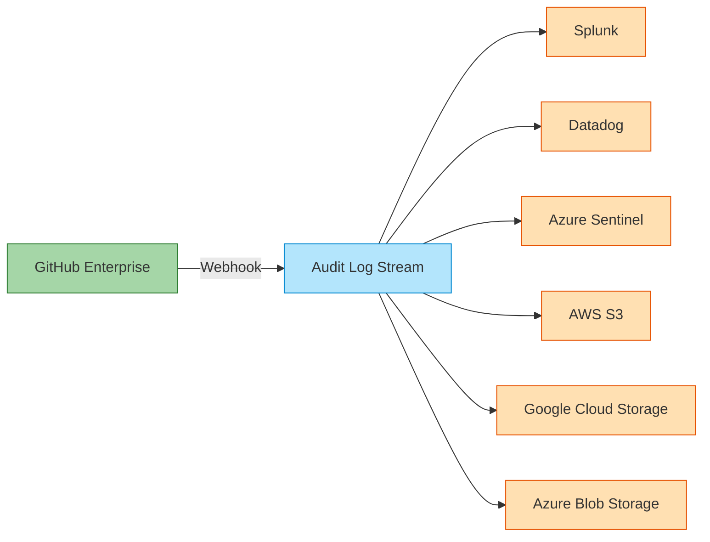
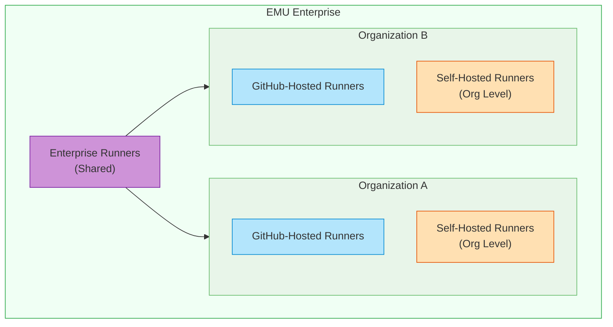
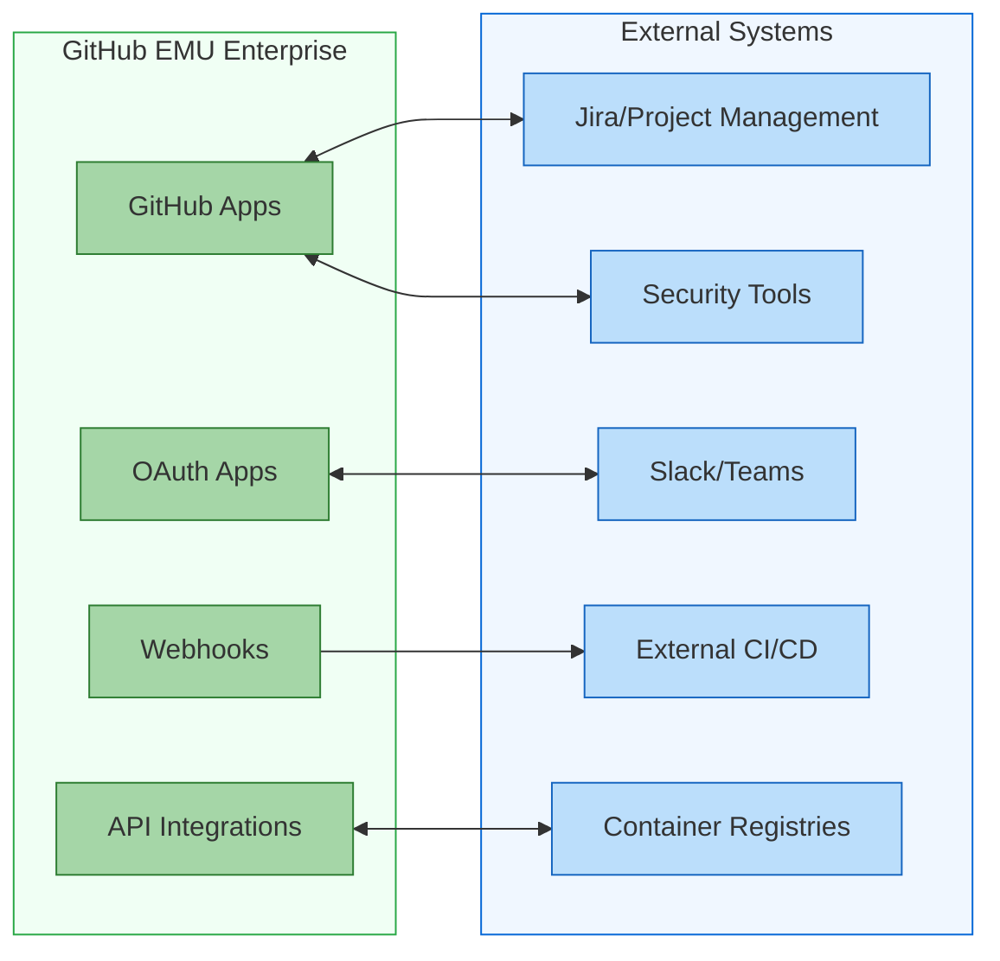
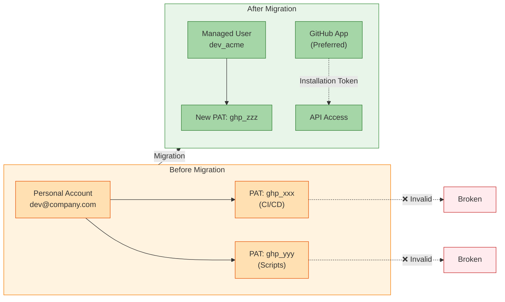

# The Complete Guide to Migrating to GitHub Enterprise Managed Users - Part 4: Security & Compliance

> **📚 Series: The Complete Guide to Migrating to GitHub Enterprise Managed Users**
> This is **Part 4 of 6** in the EMU migration guide series.
>
> | Part | Topic |
> |------|-------|
> | [Part 1: Discovery & Decision](https://github.com/orgs/community/discussions/189382) | Define goals, evaluate fit, get buy-in |
> | [Part 2: Pre-Migration Preparation](https://github.com/orgs/community/discussions/189383) | Inventory, cleanup, IdP readiness, user communication |
> | [Part 3: Identity & Access Setup](https://github.com/orgs/community/discussions/189384) | Configure SCIM, provision users, set up teams |
> | **[Part 4: Security & Compliance](https://github.com/orgs/community/discussions/189385)** (You are here) | Audit logging, security hardening, CI/CD, integrations |
> | [Part 5: Migration Execution](https://github.com/orgs/community/discussions/189386) | Run GEI, migrate repos, reclaim mannequins |
> | [Part 6: Validation & Adoption](https://github.com/orgs/community/discussions/189387) | Testing, user training, OSS strategy, go-live |

---

# Phase 4: Security & Compliance

*Locking down the new environment before migration begins.*

Before you start moving repositories and onboarding users, you need the security guardrails in place. This phase covers audit logging, enterprise policies, CI/CD configuration, and integrations. Get these right so that when code lands in the new environment, it's already protected.

## Audit Logging and Compliance

EMU provides detailed audit logging that's essential for compliance and security monitoring.

### Compliance Framework Alignment

EMU's controls map well to common compliance frameworks. Here's how EMU features support specific requirements:

| Framework | Relevant Controls | How EMU Helps |
|-----------|-------------------|---------------|
| **SOC 2** | Access Control (CC6.1), User Authentication (CC6.6) | Centralized IdP authentication, automated deprovisioning, audit trails |
| **HIPAA** | Access Controls (164.312(a)), Audit Controls (164.312(b)) | Role-based access via IdP groups, detailed audit logging |
| **FedRAMP** | IA-2 (Identification), AC-2 (Account Management) | SSO enforcement, automated account lifecycle, session management |
| **PCI-DSS** | Requirement 7 (Restrict Access), Requirement 8 (Identify Users) | Unique user IDs, MFA via IdP, access logging |
| **GDPR** | Article 32 (Security of Processing) | Data residency options, access controls, right to erasure via IdP |
| **ISO 27001** | A.9 (Access Control) | Identity management, user provisioning, access reviews |

> NOTE: This doesn't mean that you are automatically compliant. These are areas where EMU **helps** get you to a compliant state.

**Key compliance benefits:**
- **Single source of truth**: All access decisions flow from your IdP, simplifying audit evidence collection
- **Automated offboarding**: Deprovisioned users lose access immediately, no manual cleanup required
- **Immutable audit trail**: GitHub's audit log provides tamper-evident records of all actions
- **Segregation of duties**: Role-based access through IdP groups ensures proper separation

### What's Captured

The audit log captures:
- User authentication events
- Repository access and modifications
- Organization and team changes
- SAML SSO and SCIM identity information
- Source IP addresses (when enabled)
- Token-based access identification

Events are retained for 180 days, with Git events retained for 7 days.

### Streaming Audit Logs

For long-term retention and SIEM integration, configure audit log streaming:



See [Streaming the audit log for your enterprise](https://docs.github.com/en/enterprise-cloud@latest/admin/monitoring-activity-in-your-enterprise/reviewing-audit-logs-for-your-enterprise/streaming-the-audit-log-for-your-enterprise) for configuration details.

### Audit Log API

For programmatic access, use the Audit Log API:

```bash
# Get recent audit events
gh api \
  -H "Accept: application/vnd.github+json" \
  /enterprises/{enterprise}/audit-log
```

> NOTE: It's recommended to stream the audit log somewhere else for data processing versus calling the API as the API has certain rate limits that might not be able to keep up in a busy environment.

See [Using the audit log API for your enterprise](https://docs.github.com/en/enterprise-cloud@latest/admin/monitoring-activity-in-your-enterprise/reviewing-audit-logs-for-your-enterprise/using-the-audit-log-api-for-your-enterprise).

## Security Hardening Best Practices

Once you've migrated, implementing proper security controls is essential.

### Enterprise Policies

Set enterprise-wide policies to enforce security standards:

- **Repository visibility**: Restrict to private and internal only
- **Repository creation**: Control who can create repositories
- **Forking**: Limit forking to within the enterprise
- **Actions permissions**: Restrict to verified or enterprise-approved actions
- **Code security**: Enable secret scanning and code scanning by default

See [Enforcing policies for your enterprise](https://docs.github.com/en/enterprise-cloud@latest/admin/enforcing-policies/enforcing-policies-for-your-enterprise).

### Conditional Access Policies (OIDC)

If you use OIDC with Entra ID, you can enforce certian Conditional Access Policies. OIDC cannot enforce device health/compliance conditions. 

See [About support for your IdP's Conditional Access Policy](https://docs.github.com/en/enterprise-cloud@latest/admin/identity-and-access-management/using-enterprise-managed-users-for-iam/about-support-for-your-idps-conditional-access-policy).

### Secret Scanning and Push Protection

If you have GitHub Advanced Security, enable Secrets Scanning and Push Protection the enterprise level:

```
Enterprise Settings → Code security and analysis → Enable for all repositories
```

This catches secrets before they're committed and alerts on any that slip through.

### IP Allow Lists

Restrict access to your enterprise from known IP ranges:

```
Enterprise Settings → Authentication security → IP allow list
```

> NOTE: One caveat here, make sure you talk to your edge networking folks to understand your Internet egress. It's tempting to try to restrict access to a very small number of IPs to make the Allow List management easier, however, this has the possible negative effect of triggering GitHub's DDOS protections and rate limits. 

## CI/CD Implications and GitHub Actions

Your CI/CD pipelines will need attention during the migration. GitHub Actions works with EMU, but there are important differences and considerations.

### GitHub Actions Changes

**What stays the same:**
- Workflow syntax and YAML structure
- GitHub-hosted runner availability (for organization-owned repos)
- Most marketplace actions work normally
- Reusable workflows within the enterprise

**What changes:**
- **Personal repository runners**: Managed users cannot use GitHub-hosted runners for personal repositories (they can only own private repos anyway)
- **Cross-enterprise workflows**: Cannot reference actions or workflows from outside your enterprise unless they are in public repos.
- **GITHUB_TOKEN scope**: Token permissions are scoped to enterprise resources only

### Runner Strategy

For EMU enterprises, plan your runner infrastructure carefully:



**Self-hosted runner considerations:**
- Register runners at the enterprise level for shared infrastructure
- Use runner groups to control which organizations can use which runners. This has the added benefit of separating the usage from the actual infrastructure. Developers set workflows to run on a runner group and don't worry about it. Ops teams can change out hardware under the hood without the Devs needing to update their workflows.
- Implement auto scaling options like [Actions Runner Controller](https://docs.github.com/en/actions/reference/runners/self-hosted-runners)
- Ensure runners can authenticate to your IdP if workflows need corporate resources

### Secrets and Variables Management

Secrets management changes slightly with EMU:

1. **Organization secrets**: Work the same, scoped to org repositories
2. **Repository secrets**: Work the same
3. **Environment secrets**: Work the same, with environment protection rules
4. **Personal access tokens (PATs)**: Managed users can create PATs, but they're scoped to enterprise resources only

**Best practices:**
```yaml
# Use OIDC for cloud provider authentication instead of long-lived secrets
jobs:
  deploy:
    permissions:
      id-token: write
      contents: read
    steps:
      - uses: aws-actions/configure-aws-credentials@v4
        with:
          role-to-assume: arn:aws:iam::123456789:role/github-actions
          aws-region: us-east-1
```

See [About security hardening with OpenID Connect](https://docs.github.com/en/actions/deployment/security-hardening-your-deployments/about-security-hardening-with-openid-connect).

### Actions Permissions and Policies

Configure enterprise-wide Actions policies:

```
Enterprise Settings → Policies → Actions
```

Recommended settings for secure EMU environments:
- **Allow select actions**: Restrict to GitHub-authored, verified marketplace, and specific trusted actions
- **Require approval for fork PRs**: Prevent malicious workflow execution from forks
- **Default workflow permissions**: Set to read-only, require explicit write permissions
- **Allow GitHub Actions to create PRs**: Disable unless specifically needed

### Migrating Existing Workflows

When migrating workflows from standard GHEC:

1. **Audit action sources**: Ensure all referenced actions are available in your EMU enterprise
2. **Update authentication**: Replace personal PATs with GitHub App tokens or OIDC
3. **Review external calls**: Workflows calling external APIs may need updated credentials
4. **Test thoroughly**: Run workflows in the new environment before switching production

```bash
# Find all actions used in your workflows
find . -name "*.yml" -path ".github/workflows/*" -exec grep -h "uses:" {} \; | \
  sort | uniq -c | sort -rn
```

## Planning for Integrations

Integrations are often the most complex part of an EMU migration. You'll need to audit, test, and potentially reconfigure every integration.

### Types of Integrations to Consider



### GitHub Apps vs OAuth Apps

**GitHub Apps** (preferred for EMU):
- Can be installed at organization or repository level
- Use short-lived tokens with specific permissions
- Work well with managed user restrictions
- Can be restricted to specific repositories

**OAuth Apps** (use with caution):
- Authenticate as users, which limits functionality for managed users
- May have issues with EMU's visibility restrictions
- Consider migrating to GitHub Apps where possible

### Integration Audit Checklist

Before migration, document each integration:

| Integration | Type | Current Auth | EMU Compatible | Migration Steps |
|-------------|------|--------------|----------------|------------------|
| Jira | GitHub App | App Installation | ✅ Yes | Reinstall in new enterprise |
| Jenkins | Webhook + PAT | Personal Token | ⚠️ Update | Use GitHub App token |
| Slack | OAuth App | User OAuth | ⚠️ Test | Verify with managed user |
| SonarQube | GitHub App | App Installation | ✅ Yes | Reinstall, update config |
| Custom Tool | API | Service Account | ❌ Rework | Create machine user or GitHub App |

### Common Integration Patterns

**Pattern 1: GitHub App Installation**
```yaml
# Preferred approach - install app at org level
# App authenticates with installation token
# Works well with EMU
```

**Pattern 2: Machine User (for legacy integrations)**
If you have integrations that require a "user" account:
- Provision a dedicated managed user via your IdP
- Assign minimal required permissions
- Use this account's PAT for the integration
- Monitor usage via audit logs

**Pattern 3: Webhook to External System**
```bash
# Webhooks work the same in EMU
# Re-register webhooks after migration
# Update webhook secrets
curl -X POST \
  -H "Authorization: token $GITHUB_TOKEN" \
  -H "Accept: application/vnd.github+json" \
  https://api.github.com/orgs/ORG/hooks \
  -d '{"name":"web","config":{"url":"https://example.com/webhook"}}'
```

### Third-Party Tool Compatibility

Contact vendors to verify EMU compatibility for:
- **IDE plugins**: VS Code, JetBrains, etc.
- **Security scanning**: Snyk, Checkmarx, Veracode
- **Project management**: Jira, Azure Boards, Linear
- **Communication**: Slack, Microsoft Teams
- **Monitoring**: Datadog, New Relic

Most modern tools support GitHub Apps and work fine with EMU. Issues typically arise with older tools that rely on user-level OAuth.

## Token Migration Strategy

Personal Access Tokens (PATs) are one of the most overlooked aspects of EMU migrations. Every token tied to a personal account in your old environment becomes invalid. This section provides a comprehensive approach to identifying, planning, and migrating tokens.

### Understanding the Token Problem

In standard GHEC, PATs are tied to personal accounts. When you migrate to EMU:

- **Old tokens stop working**: They're tied to accounts that no longer have access
- **New tokens must be created**: By managed users in the EMU enterprise
- **Automation breaks**: CI/CD pipelines, scripts, and integrations fail
- **Service accounts need rethinking**: The "shared service account" pattern doesn't work the same way



### Step 1: Inventory Existing Tokens

Before you can migrate tokens, you need to know what exists. Unfortunately, there's no API to list all PATs across an organization (by design—it's a security feature). You'll need a multi-pronged approach:

**Audit Log Analysis**

Search your audit logs for token usage patterns:

```bash
# Export audit log entries for token-related events
gh api orgs/YOUR_ORG/audit-log \
  --paginate \
  -X GET \
  -f phrase='action:oauth_access.create OR action:personal_access_token.create' \
  --jq '.[] | {actor: .actor, action: .action, created_at: .created_at}' \
  > token_audit.json

# Look for API authentication patterns
gh api orgs/YOUR_ORG/audit-log \
  --paginate \
  -X GET \
  -f phrase='action:repo.download_zip' \
  --jq '.[] | {actor: .actor, actor_ip: .actor_ip, created_at: .created_at}' \
  > api_usage.json
```

**Survey Your Teams**

Create a token inventory form for teams to report:

| Token Purpose | Owner | Scope | Where Used | Expiration | Migration Plan |
|---------------|-------|-------|------------|------------|----------------|
| Jenkins CI | @devops-team | repo, workflow | Jenkins server | Never | Convert to GitHub App |
| Deploy scripts | @platform | repo, packages | deploy.sh | 2025-06-01 | New managed user PAT |
| Slack integration | @integrations | repo:status | Slack app config | Never | Use GitHub App for Slack |
| Personal automation | @jsmith | repo, gist | Local scripts | Never | User creates new PAT |

**Check CI/CD Configurations**

Scan your repositories for hardcoded or referenced tokens:

```bash
# Search for PAT references in workflow files
gh api search/code \
  -X GET \
  -f q='org:YOUR_ORG filename:.yml path:.github/workflows GITHUB_TOKEN OR ghp_ OR github_pat_' \
  --jq '.items[] | {repo: .repository.full_name, path: .path}'

# Check for secrets references
gh api search/code \
  -X GET \
  -f q='org:YOUR_ORG secrets. filename:.yml' \
  --jq '.items[] | {repo: .repository.full_name, path: .path}'
```

### Step 2: Classify Tokens by Migration Path

Not all tokens should be migrated the same way. Classify each token:

| Classification | Description | Migration Path |
|----------------|-------------|----------------|
| **Convert to GitHub App** | Automation, CI/CD, integrations | Create/install GitHub App |
| **Machine User PAT** | Service accounts, shared automation | Provision dedicated managed user |
| **Individual User PAT** | Personal scripts, IDE auth | User creates new PAT post-migration |
| **Eliminate** | Unused, duplicate, or obsolete | Don't migrate |

### Step 3: Create GitHub Apps for Automation

For most automation use cases, GitHub Apps are the preferred solution. They offer:

- **Fine-grained permissions**: Request only what you need
- **Short-lived tokens**: Installation tokens expire in 1 hour
- **Audit trail**: All actions attributed to the app
- **No user dependency**: App continues working regardless of user changes

**Creating a GitHub App for CI/CD**

```bash
# Create a GitHub App via the UI or API
# Navigate to: Enterprise Settings → GitHub Apps → New GitHub App

# Required permissions for typical CI/CD:
# - Contents: Read and write (clone, push)
# - Pull requests: Read and write (create PRs, add comments)
# - Workflows: Read and write (trigger workflows)
# - Checks: Read and write (report status)
# - Metadata: Read (required for all apps)
```

**Generating Installation Tokens**

```bash
#!/bin/bash
# generate-installation-token.sh
# Generates a short-lived installation token for a GitHub App

APP_ID="YOUR_APP_ID"
INSTALLATION_ID="YOUR_INSTALLATION_ID"
PRIVATE_KEY_PATH="path/to/private-key.pem"

# Generate JWT
now=$(date +%s)
iat=$((now - 60))
exp=$((now + 600))

header=$(echo -n '{"alg":"RS256","typ":"JWT"}' | base64 | tr -d '=' | tr '/+' '_-' | tr -d '\n')
payload=$(echo -n "{\"iat\":${iat},\"exp\":${exp},\"iss\":\"${APP_ID}\"}" | base64 | tr -d '=' | tr '/+' '_-' | tr -d '\n')

signature=$(echo -n "${header}.${payload}" | openssl dgst -sha256 -sign "${PRIVATE_KEY_PATH}" | base64 | tr -d '=' | tr '/+' '_-' | tr -d '\n')

jwt="${header}.${payload}.${signature}"

# Get installation token
curl -s -X POST \
  -H "Authorization: Bearer ${jwt}" \
  -H "Accept: application/vnd.github+json" \
  "https://api.github.com/app/installations/${INSTALLATION_ID}/access_tokens" \
  | jq -r '.token'
```

**Using Installation Tokens in GitHub Actions**

```yaml
# .github/workflows/deploy.yml
name: Deploy with GitHub App

on:
  push:
    branches: [main]

jobs:
  deploy:
    runs-on: ubuntu-latest
    steps:
      - name: Generate GitHub App Token
        id: app-token
        uses: actions/create-github-app-token@v1
        with:
          app-id: ${{ vars.APP_ID }}
          private-key: ${{ secrets.APP_PRIVATE_KEY }}
          owner: ${{ github.repository_owner }}
      
      - name: Checkout with App Token
        uses: actions/checkout@v4
        with:
          token: ${{ steps.app-token.outputs.token }}
      
      - name: Push changes
        run: |
          git config user.name "my-automation-app[bot]"
          git config user.email "123456+my-automation-app[bot]@users.noreply.github.com"
          # ... make changes ...
          git push
        env:
          GITHUB_TOKEN: ${{ steps.app-token.outputs.token }}
```

### Step 4: Set Up Machine Users for Legacy Integrations

Some integrations simply can't use GitHub Apps—they require a PAT. For these cases, create dedicated "machine users" (managed user accounts specifically for automation):

**Provisioning a Machine User**

1. **Create an identity in your IdP** specifically for the service
   - Use a descriptive name: `svc-github-jenkins`, `bot-deploy-automation`
   - Use a group mailbox or distribution list for the email
   - Assign to the GitHub EMU application in your IdP

2. **SCIM provisions the account** on GitHub
   - Username will be something like `svc-github-jenkins_acme`
   - Account is managed like any other user

3. **Create a PAT for the machine user**
   - Log in as the machine user (you'll need IdP credentials)
   - Generate a fine-grained PAT with minimal required permissions
   - Set an appropriate expiration (and calendar a reminder to rotate!)

4. **Store the token securely**
   - Use a secrets manager (Vault, Azure Key Vault, AWS Secrets Manager)
   - Never commit tokens to repositories
   - Implement token rotation procedures

**Machine User Best Practices**

| Practice | Why |
|----------|-----|
| One machine user per integration | Isolation, easier auditing, simpler revocation |
| Minimal permissions | Principle of least privilege |
| Descriptive naming | `svc-*` or `bot-*` prefix for clarity |
| Token expiration | 90 days max, with rotation process |
| Documented ownership | Someone must be responsible for each machine user |
| Regular access reviews | Include in quarterly access certification |

### Step 5: Fine-Grained vs Classic PATs

EMU supports both token types, but fine-grained PATs are strongly recommended:

| Feature | Classic PAT | Fine-Grained PAT |
|---------|-------------|------------------|
| Permission granularity | Broad scopes | Per-repository, specific permissions |
| Expiration | Optional | Required (max 1 year) |
| Approval workflow | No | Optional (org can require) |
| Resource access | All accessible repos | Explicitly selected repos |
| Audit visibility | Limited | Detailed |

**Enabling Fine-Grained PAT Controls**

```bash
# Require approval for fine-grained PATs (recommended)
gh api orgs/YOUR_ORG \
  -X PATCH \
  -f personal_access_token_requests_enabled=true

# Restrict classic PAT access (optional but recommended)
# This can be done via Enterprise Settings → Policies → Personal access tokens
```

**Creating a Fine-Grained PAT**

```bash
# Via UI: Settings → Developer settings → Personal access tokens → Fine-grained tokens

# Recommended settings:
# - Expiration: 90 days or less
# - Repository access: Only select repositories
# - Permissions: Minimum required for the use case
```

### Step 6: Update Consumers

With new tokens created, update all consumers:

**CI/CD Pipelines**

```yaml
# Before: Using personal PAT stored in org secrets
env:
  GITHUB_TOKEN: ${{ secrets.DEPLOY_PAT }}

# After: Using GitHub App installation token
- uses: actions/create-github-app-token@v1
  id: app-token
  with:
    app-id: ${{ vars.DEPLOY_APP_ID }}
    private-key: ${{ secrets.DEPLOY_APP_KEY }}
```

**External Systems**

| System | Update Location | Notes |
|--------|-----------------|-------|
| Jenkins | Credentials store | Update GitHub server config |
| ArgoCD | Repository secrets | Update all repo credentials |
| Terraform | Provider config or env vars | May need state migration |
| Scripts | Environment variables | Update deployment docs |

**Local Development**

Communicate to developers:
1. Old PATs will stop working on migration day
2. Create new PATs from their managed user accounts
3. Update Git credential helpers: `git credential reject`
4. Re-authenticate IDE plugins

### Step 7: Validate and Revoke

After migration, validate that new tokens work and old tokens are revoked:

```bash
# Test new token
curl -H "Authorization: token NEW_TOKEN" \
  https://api.github.com/user

# Verify access to expected resources
curl -H "Authorization: token NEW_TOKEN" \
  https://api.github.com/repos/YOUR_ORG/test-repo

# Old tokens should fail with 401
curl -H "Authorization: token OLD_TOKEN" \
  https://api.github.com/user
# Expected: {"message":"Bad credentials"...}
```

### Token Migration Checklist

| Task | Owner | Status |
|------|-------|--------|
| Complete token inventory | | ☐ |
| Classify all tokens by migration path | | ☐ |
| Create GitHub Apps for automation | | ☐ |
| Install GitHub Apps in EMU enterprise | | ☐ |
| Provision machine users in IdP | | ☐ |
| Create PATs for machine users | | ☐ |
| Store new tokens in secrets manager | | ☐ |
| Update CI/CD pipelines | | ☐ |
| Update external system configurations | | ☐ |
| Communicate to developers about PAT recreation | | ☐ |
| Test all integrations with new tokens | | ☐ |
| Document token rotation procedures | | ☐ |
| Schedule token expiration reminders | | ☐ |
| Verify old tokens no longer work | | ☐ |

## GitHub App Migration

GitHub Apps installed in your old environment don't automatically transfer to EMU. You'll need to reinstall them in your new enterprise. This section covers the full migration process.

### Types of GitHub Apps

Understanding the different types helps plan your migration:

| Type | Description | Migration Approach |
|------|-------------|-------------------|
| **Marketplace Apps** | Third-party apps from GitHub Marketplace | Reinstall from Marketplace |
| **Organization Apps** | Apps created by your organization | Recreate or transfer ownership |
| **Private Apps** | Internal apps not published | Recreate in new enterprise |

### Step 1: Inventory Installed Apps

List all GitHub Apps across your organizations:

```bash
# List installed apps for an organization
gh api orgs/YOUR_ORG/installations \
  --jq '.installations[] | {
    app_slug: .app_slug,
    app_id: .app_id,
    id: .id,
    repository_selection: .repository_selection,
    permissions: .permissions
  }' > installed_apps.json

# For each app, document:
# - App name and purpose
# - Current permissions
# - Repository access (all or selected)
# - Who owns/manages the app
# - EMU compatibility status
```

**Create an App Inventory Spreadsheet**

| App Name | Type | Purpose | Permissions | Repo Access | Owner | EMU Compatible | Migration Status |
|----------|------|---------|-------------|-------------|-------|----------------|------------------|
| Jira | Marketplace | Issue tracking | issues:write, pull_requests:read | All | @devops | ✅ Yes | ☐ Pending |
| Dependabot | GitHub | Security updates | contents:write, pull_requests:write | All | GitHub | ✅ Yes | ☐ Pending |
| Custom Deploy Bot | Internal | Deployment automation | contents:write, deployments:write | Selected | @platform | Needs testing | ☐ Pending |
| Legacy Webhook App | Internal | Notifications | metadata:read | All | Unknown | ❓ Unknown | ☐ Investigate |

### Step 2: Check EMU Compatibility

Not all apps work with EMU. Check with vendors or test in a sandbox:

**Common Compatibility Issues**

- **User-level OAuth**: Apps that authenticate as users may have limited functionality
- **Public repository features**: Apps that interact with public repos won't work
- **Cross-enterprise access**: Apps can't access resources outside your enterprise
- **User profile access**: Limited access to managed user profile information

**Vendor Compatibility Check Template**

When contacting vendors, ask:

1. Does your app support GitHub Enterprise Cloud with EMU?
2. Are there any feature limitations with managed users?
3. Do we need a different installation process for EMU?
4. Are there configuration changes required?
5. What permissions are required, and are they EMU-compatible?

### Step 3: Migrate Marketplace Apps

For apps from the GitHub Marketplace:

1. **Verify EMU support** on the Marketplace listing or vendor documentation
2. **Install in new enterprise**: Enterprise Settings → GitHub Apps → Install from Marketplace
3. **Configure app settings**: Apply same configuration as original installation
4. **Grant repository access**: Select repositories or grant organization-wide access
5. **Test functionality**: Verify the app works as expected

```bash
# After installation, verify the app is installed
gh api orgs/YOUR_ORG/installations \
  --jq '.installations[] | select(.app_slug == "APP_NAME")'
```

### Step 4: Recreate Internal/Private Apps

For apps your organization created:

**Option A: Create New App in EMU Enterprise**

If you have the source code and can recreate the app:

1. **Export current app configuration**
   ```bash
   # Document current app settings
   gh api apps/YOUR_APP_SLUG \
     --jq '{
       name: .name,
       description: .description,
       permissions: .permissions,
       events: .events
     }' > app_config.json
   ```

2. **Create new app in EMU enterprise**
   - Navigate to Enterprise Settings → GitHub Apps → New GitHub App
   - Apply saved configuration
   - Generate new private key
   - Note new App ID and Installation ID

3. **Update app code with new credentials**
   ```bash
   # Update environment variables or config
   export GITHUB_APP_ID="new_app_id"
   export GITHUB_APP_INSTALLATION_ID="new_installation_id"
   # Replace private key file
   ```

4. **Install in organizations**
   ```bash
   # Install app in your EMU organizations
   # Via UI: Organization Settings → GitHub Apps → Install
   ```

5. **Test thoroughly**
   - Verify webhook delivery
   - Test all API operations
   - Confirm permissions are sufficient

**Option B: Transfer App Ownership (If Supported)**

In some cases, you can transfer app ownership:

1. Current owner must initiate transfer
2. New owner (EMU enterprise admin) accepts
3. Update installation settings post-transfer
4. Regenerate private keys for security

> **Note:** App transfer is complex and may not preserve all settings. Recreating is often cleaner.

### Step 5: Handle Webhooks

Apps often rely on webhooks. These need reconfiguration:

```bash
# List current webhooks
gh api orgs/YOUR_ORG/hooks \
  --jq '.[] | {
    id: .id,
    name: .name,
    active: .active,
    url: .config.url,
    events: .events
  }'

# After migration, recreate webhooks with new secrets
gh api orgs/NEW_ORG/hooks \
  -X POST \
  -f name='web' \
  -f active=true \
  -f events[]='push' \
  -f events[]='pull_request' \
  -f config[url]='https://your-webhook-endpoint.com/github' \
  -f config[content_type]='json' \
  -f config[secret]='NEW_WEBHOOK_SECRET'
```

**Webhook Migration Checklist**

| Webhook URL | Events | Current Secret Location | New Secret Created | Tested |
|-------------|--------|------------------------|-------------------|--------|
| https://jenkins.internal/github | push, pr | Jenkins credentials | ☐ | ☐ |
| https://slack.com/webhook/xxx | push, issues | Slack app config | ☐ | ☐ |

### Step 6: Update App Authentication

After recreating apps, update all places that authenticate:

**GitHub Actions Workflows**

```yaml
# Update App ID and private key references
- uses: actions/create-github-app-token@v1
  with:
    app-id: ${{ vars.NEW_APP_ID }}  # Updated
    private-key: ${{ secrets.NEW_APP_PRIVATE_KEY }}  # New key
```

**External Services**

| Service | Config Location | Values to Update |
|---------|-----------------|------------------|
| Jenkins | Manage Jenkins → Credentials | App ID, private key, installation ID |
| ArgoCD | argocd-cm ConfigMap | GitHub App credentials |
| Backstage | app-config.yaml | integrations.github section |
| Custom services | Environment variables | All GitHub App credentials |

### Step 7: Validate App Functionality

Create a test plan for each migrated app:

```markdown
## App Migration Test Plan: [App Name]

### Pre-Migration Baseline
- [ ] Document current app behavior
- [ ] Capture sample webhook payloads
- [ ] Note API response formats

### Post-Migration Tests
- [ ] App installation visible in org settings
- [ ] Webhook delivery succeeds (check app settings → Advanced)
- [ ] API authentication works
- [ ] All expected permissions granted
- [ ] Repository access correct (all vs. selected)
- [ ] Event subscriptions triggering correctly

### Functional Tests
- [ ] [Test specific feature 1]
- [ ] [Test specific feature 2]
- [ ] [Test error handling]

### Rollback Plan
- [ ] Document how to revert if issues found
- [ ] Identify critical path dependencies
```

### GitHub App Migration Checklist

| Task | Owner | Status |
|------|-------|--------|
| Inventory all installed GitHub Apps | | ☐ |
| Document app purposes and owners | | ☐ |
| Verify EMU compatibility for each app | | ☐ |
| Contact vendors for incompatible apps | | ☐ |
| Reinstall Marketplace apps | | ☐ |
| Recreate internal apps | | ☐ |
| Generate new private keys | | ☐ |
| Update webhook configurations | | ☐ |
| Rotate webhook secrets | | ☐ |
| Update CI/CD with new app credentials | | ☐ |
| Update external services | | ☐ |
| Test all app functionality | | ☐ |
| Decommission old app installations | | ☐ |
| Document new app IDs and installation IDs | | ☐ |

## Artifact Management and GitHub Packages

GitHub Packages works with EMU, but there are important considerations for your artifact management strategy.

### Supported Package Types

GitHub Packages in EMU supports:
- **Container Registry** (ghcr.io): Docker and OCI images
- **npm**: JavaScript packages
- **Maven**: Java packages
- **NuGet**: .NET packages
- **RubyGems**: Ruby packages

### Authentication Changes

Managed users authenticate to GitHub Packages the same way, but with enterprise-scoped tokens:

```bash
# Docker login with PAT
echo $GITHUB_TOKEN | docker login ghcr.io -u USERNAME_shortcode --password-stdin

# npm configuration
npm login --registry=https://npm.pkg.github.com --scope=@your-org

# Maven settings.xml
<server>
  <id>github</id>
  <username>USERNAME_shortcode</username>
  <password>${GITHUB_TOKEN}</password>
</server>
```

### Package Visibility and Access

In EMU enterprises:
- **No public packages**: All packages are private or internal (visible within enterprise)
- **Organization-scoped**: Packages belong to organizations, not personal accounts
- **Permission inheritance**: Package access follows repository permissions

### Migration Considerations

When migrating existing packages:

1. **Inventory existing packages**: List all packages across registries
2. **Plan namespace changes**: Package URLs will change with new org structure
3. **Update CI/CD pipelines**: Modify publish/pull configurations
4. **Communicate to consumers**: Internal teams need new registry URLs
5. **Consider caching**: Set up artifact caching for build performance

```yaml
# Example: Updated workflow for EMU package publishing
name: Publish Package
on:
  release:
    types: [published]

jobs:
  publish:
    runs-on: ubuntu-latest
    permissions:
      contents: read
      packages: write
    steps:
      - uses: actions/checkout@v4
      - name: Login to GitHub Container Registry
        uses: docker/login-action@v3
        with:
          registry: ghcr.io
          username: ${{ github.actor }}
          password: ${{ secrets.GITHUB_TOKEN }}
      - name: Build and push
        uses: docker/build-push-action@v5
        with:
          push: true
          tags: ghcr.io/${{ github.repository }}:${{ github.ref_name }}
```

### External Registry Integration

If you use external registries (Artifactory, Nexus, ECR, ACR), they'll continue to work:
- Configure authentication in GitHub Actions secrets
- Use OIDC where possible for cloud provider registries
- Update any references to GitHub Packages URLs

## Code Security and GitHub Advanced Security

EMU enterprises can take full advantage of GitHub Advanced Security (GHAS) features. Here's how to maximize your security posture.

### GitHub Advanced Security Features

**Code Scanning**
- Runs CodeQL analysis on your codebase
- Identifies security vulnerabilities and coding errors
- Integrates with PR workflow for shift-left security
- Supports custom queries for organization-specific patterns

```yaml
# Enable code scanning in your workflow
name: "CodeQL"
on:
  push:
    branches: [main]
  pull_request:
    branches: [main]
  schedule:
    - cron: '0 6 * * 1'  # Weekly scan

jobs:
  analyze:
    runs-on: ubuntu-latest
    permissions:
      security-events: write
      contents: read
    steps:
      - uses: actions/checkout@v4
      - uses: github/codeql-action/init@v3
        with:
          languages: javascript, python
      - uses: github/codeql-action/analyze@v3
```

**Secret Scanning**
- Detects secrets accidentally committed to repositories
- Supports 200+ secret patterns from partners
- Custom patterns for organization-specific secrets
- Push protection blocks secrets before they're committed

**Dependabot**
- Automated dependency updates
- Security vulnerability alerts
- Version updates to keep dependencies current
- Works within EMU's enterprise boundary

```yaml
# .github/dependabot.yml
version: 2
updates:
  - package-ecosystem: "npm"
    directory: "/"
    schedule:
      interval: "weekly"
    open-pull-requests-limit: 10
  - package-ecosystem: "docker"
    directory: "/"
    schedule:
      interval: "weekly"
```

### Enterprise Security Configuration

Configure security features at scale:

```
Enterprise Settings → Code security and analysis
```

**Recommended settings:**
- ✅ Enable Dependabot alerts for all repositories
- ✅ Enable Dependabot security updates for all repositories
- ✅ Enable secret scanning for all repositories
- ✅ Enable push protection for all repositories
- ✅ Enable code scanning default setup for all repositories

### Security Overview Dashboard

EMU enterprises get access to the Security Overview dashboard:
- Enterprise-wide view of security alerts
- Risk assessment across all organizations
- Coverage metrics for security features
- Alert trends over time

See [About the security overview](https://docs.github.com/en/code-security/security-overview/about-the-security-overview).

### Private Vulnerability Reporting

Enable private vulnerability reporting to allow security researchers to report issues confidentially:

```
Repository Settings → Security → Private vulnerability reporting
```

This creates a secure channel for vulnerability disclosure without public exposure.

### Security Policies

Create a `SECURITY.md` file in your `.github` repository to establish organization-wide security policies:

```markdown
# Security Policy

## Reporting a Vulnerability

Please report security vulnerabilities through our private vulnerability reporting feature
or by emailing security@company.com.

## Supported Versions

| Version | Supported          |
| ------- | ------------------ |
| 2.x     | :white_check_mark: |
| 1.x     | :x:                |
```

---

> **📚 EMU Migration Guide Series Navigation**
>
> ⬅️ **Previous: [Part 3 - Identity & Access Setup](https://github.com/orgs/community/discussions/189384)**
> ➡️ **Next: [Part 5 - Migration Execution](https://github.com/orgs/community/discussions/189386)**
>
> ---
> *This is Part 4 of a 6-part series on migrating to GitHub Enterprise Managed Users. Found this helpful? Give it a 👍 and share it with your team! Got questions or something I missed? Drop a comment below.*
