# The Complete Guide to Migrating to GitHub Enterprise Managed Users - Part 5: Migration Execution

> **📚 Series: The Complete Guide to Migrating to GitHub Enterprise Managed Users**
> This is **Part 5 of 6** in the EMU migration guide series.
>
> | Part | Topic |
> |------|-------|
> | [Part 1: Discovery & Decision](https://github.com/orgs/community/discussions/189382) | Define goals, evaluate fit, get buy-in |
> | [Part 2: Pre-Migration Preparation](https://github.com/orgs/community/discussions/189383) | Inventory, cleanup, IdP readiness, user communication |
> | [Part 3: Identity & Access Setup](https://github.com/orgs/community/discussions/189384) | Configure SCIM, provision users, set up teams |
> | [Part 4: Security & Compliance](https://github.com/orgs/community/discussions/189385) | Audit logging, security hardening, CI/CD, integrations |
> | **[Part 5: Migration Execution](https://github.com/orgs/community/discussions/189386)** (You are here) | Run GEI, migrate repos, reclaim mannequins |
> | [Part 6: Validation & Adoption](https://github.com/orgs/community/discussions/189387) | Testing, user training, OSS strategy, go-live |

---

# Phase 5: Migration Execution

*Moving repositories, group by group.*

With security policies in place and users provisioned, it's time to start migrating. This phase is iterative - you'll repeat it for each team or group of repositories. Start with a pilot group, learn from the experience, then expand.

## The Migration Loop

```mermaid
flowchart TB
    subgraph Loop["Repeat for Each Group"]
        SELECT["Select next group\n(team/dept/repos)"] --> MIGRATE["Run GEI migration"]
        MIGRATE --> MANNEQUIN["Reclaim mannequins"]
        MANNEQUIN --> VALIDATE["Validate & test"]
        VALIDATE --> TRAIN["Train users"]
        TRAIN --> CUTOVER["Cutover group"]
        CUTOVER --> MONITOR["Monitor & support"]
        MONITOR --> DECISION{"More groups?"}
        DECISION -->|Yes| SELECT
        DECISION -->|No| DONE["Migration complete"]
    end
    
    style Loop fill:#f9f9f9,stroke:#333,color:#333
    style DONE fill:#c8e6c9,stroke:#388e3c,color:#333
    style SELECT fill:#b3e5fc,stroke:#0288d1,color:#333
    style MIGRATE fill:#b3e5fc,stroke:#0288d1,color:#333
    style MANNEQUIN fill:#b3e5fc,stroke:#0288d1,color:#333
    style VALIDATE fill:#b3e5fc,stroke:#0288d1,color:#333
    style TRAIN fill:#b3e5fc,stroke:#0288d1,color:#333
    style CUTOVER fill:#b3e5fc,stroke:#0288d1,color:#333
    style MONITOR fill:#b3e5fc,stroke:#0288d1,color:#333
    style DECISION fill:#fff9c4,stroke:#f9a825,color:#333
```



## GitHub Migration Tools

GitHub provides several tools for migration depending on your source platform.

### GitHub Enterprise Importer (GEI)

[GitHub Enterprise Importer](https://docs.github.com/en/migrations/using-github-enterprise-importer/understanding-github-enterprise-importer/about-github-enterprise-importer) is the primary tool for high-fidelity migrations. It supports:

- **Azure DevOps Cloud** to GHEC
- **Bitbucket Server/Data Center 5.14+** to GHEC
- **GitHub.com** to GHEC
- **GitHub Enterprise Server 3.4.1+** to GHEC

Key features:
- Repository-by-repository or organization-by-organization migration
- Preserves Git history and GitHub metadata (issues, PRs, etc.)
- Supports dry-run migrations for testing
- Clear error logging that doesn't block on non-critical issues
- Users retain ownership of their history

Install and use GEI via the GitHub CLI:

```bash
# Install the GEI extension
gh extension install github/gh-gei

# For GHEC to GHEC migration
gh gei migrate-repo \
  --github-source-org SOURCE_ORG \
  --source-repo REPO_NAME \
  --github-target-org TARGET_ORG \
  --target-repo REPO_NAME

# For organization migration
gh gei migrate-org \
  --github-source-org SOURCE_ORG \
  --github-target-org TARGET_ORG \
  --github-target-enterprise TARGET_ENTERPRISE
```

### Handling Mannequins

When you migrate with GEI, user activity gets linked to placeholder identities called "mannequins." After migration, you'll need to reclaim these mannequins and attribute them to real managed user accounts.

See [Reclaiming mannequins for GitHub Enterprise Importer](https://docs.github.com/en/migrations/using-github-enterprise-importer/completing-your-migration-with-github-enterprise-importer/reclaiming-mannequins-for-github-enterprise-importer) for the process.

### Dry Runs and Rollback Planning

**Always do a dry run first.** GEI supports dry-run migrations that validate everything without actually moving data:

```bash
# Dry run a repository migration
gh gei migrate-repo \
  --github-source-org SOURCE_ORG \
  --source-repo REPO_NAME \
  --github-target-org TARGET_ORG \
  --target-repo REPO_NAME \
  --dry-run
```

**Rollback considerations:**

EMU migrations don't have a simple "undo" button. Plan accordingly:

1. **Keep the source active**: Don't decommission your source environment until the migrated group is fully validated and productive. Run both in parallel during the transition.

2. **Set a cutover date, not a point of no return**: Users can work in the old environment until you're confident the new one is ready. Communication is key.

3. **Repository rollback**: If a specific repo migration fails, you can re-run GEI. The source repo is never modified during migration.

4. **User rollback**: If SCIM causes issues, you can adjust IdP group assignments. Removing a user from the GitHub app assignment suspends (not deletes) their account.

5. **Document your baseline**: Before starting each group's migration, document the current state so you know what "working" looks like.

**The real safety net is iteration**: By migrating group by group, a problem only affects one team, not your entire organization.

---

> **📚 EMU Migration Guide Series Navigation**
>
> ⬅️ **Previous: [Part 4 - Security & Compliance](https://github.com/orgs/community/discussions/189385)**
> ➡️ **Next: [Part 6 - Validation & Adoption](https://github.com/orgs/community/discussions/189387)**
>
> ---
> *This is Part 5 of a 6-part series on migrating to GitHub Enterprise Managed Users. Found this helpful? Give it a 👍 and share it with your team! Got questions or something I missed? Drop a comment below.*
