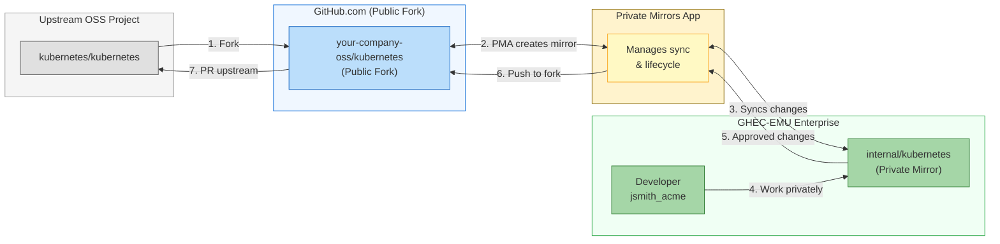

# The Complete Guide to Migrating to GitHub Enterprise Managed Users - Part 6: Validation & Adoption

> **📚 Series: The Complete Guide to Migrating to GitHub Enterprise Managed Users**
> This is **Part 6 of 6** in the EMU migration guide series.
>
> | Part | Topic |
> |------|-------|
> | [Part 1: Discovery & Decision](https://github.com/orgs/community/discussions/189382) | Define goals, evaluate fit, get buy-in |
> | [Part 2: Pre-Migration Preparation](https://github.com/orgs/community/discussions/189383) | Inventory, cleanup, IdP readiness, user communication |
> | [Part 3: Identity & Access Setup](https://github.com/orgs/community/discussions/189384) | Configure SCIM, provision users, set up teams |
> | [Part 4: Security & Compliance](https://github.com/orgs/community/discussions/189385) | Audit logging, security hardening, CI/CD, integrations |
> | [Part 5: Migration Execution](https://github.com/orgs/community/discussions/189386) | Run GEI, migrate repos, reclaim mannequins |
> | **[Part 6: Validation & Adoption](https://github.com/orgs/community/discussions/189387)** (You are here) | Testing, user training, OSS strategy, go-live |

---

# Phase 6: Validation & Adoption

*Testing, training, and bringing each group live.*

For each group you migrate, you need to validate the migration was successful, train the users, and support them through the transition. This phase runs in tandem with Phase 5 - migrate a group, validate, repeat.

## GHEC to GHEC-EMU Migration: Tips and Tricks

If you're specifically migrating from standard GHEC to EMU, here are some hard-won lessons:

### 1. You Need a New Enterprise Account

**This is critical:** You cannot convert an existing GHEC enterprise to EMU. You must create a new EMU enterprise and migrate to it. Contact [GitHub Sales](https://enterprise.github.com/contact) to initiate this process.

### 2. Plan for the "Two Account" Problem

Your developers who contribute to open source will need to maintain two accounts:
- Their managed user account for work
- A personal account for external contributions

Create clear guidelines for when to use each account. Consider using different browsers or browser profiles to avoid confusion.

### 3. Handle GitHub Apps and Integrations

Many GitHub Apps won't work the same way with managed user accounts:
- Apps installed on personal accounts won't transfer
- Some marketplace apps may not support EMU
- Internal apps may need reconfiguration

Audit your integrations before migration and contact vendors for EMU compatibility.

### 4. Preserve Contribution History

To maintain contribution graphs and history:
1. Ensure email addresses in your IdP match the emails used for Git commits
2. Use the mannequin reclaim process to attribute migrated history
3. Consider having users verify their email addresses match their IdP identity

### 5. Test with a Pilot Group

Never do a big-bang migration:
1. Start with a small, technical team that can provide feedback
2. Migrate a few repositories to test the full workflow
3. Iterate on your process before expanding
4. Document issues and solutions as you go

### 6. Timing Considerations

- **Avoid end of quarter/year**: Your finance team will thank you
- **Plan for timezone coverage**: Have support available across regions
- **Buffer time**: Add 50% to your estimates for unexpected issues
- **Communication windows**: Account for company-wide announcements

## Handling Open Source Contributions with EMU

Let's address the elephant in the room: EMU users cannot contribute to repositories outside your enterprise. No public repos, no PRs to external projects, no starring your favorite libraries. For organizations with active open source participation, this requires a deliberate strategy.

### The Reality of EMU's Restrictions

Managed user accounts have these hard limitations:
- **Cannot** create public repositories
- **Cannot** create gists (public or private outside enterprise)
- **Cannot** fork repositories from outside the enterprise
- **Cannot** push to, comment on, or interact with external repositories
- **Cannot** star, watch, or follow anything outside the enterprise
- **Are invisible** to users outside your enterprise

This isn't a bug or something that can be configured away. It's fundamental to EMU's security model.

### Strategy 1: The Dual Account Approach

The most common solution is maintaining two separate accounts:

```
Work Account (EMU):           Personal Account:
jsmith_acme                   jsmith
├── Company repos             ├── Personal projects  
├── Internal tools            ├── OSS contributions
└── Proprietary code          └── Community engagement
```

**Implementation Tips:**

1. **Use different browsers or profiles**
   - Chrome Profile 1: Work (EMU account)
   - Chrome Profile 2: Personal (GitHub.com account)
   - This prevents accidental commits to the wrong account

2. **Configure Git identity per directory**
   ```bash
   # ~/.gitconfig
   [user]
       name = Your Name
       email = personal@email.com
   
   [includeIf "gitdir:~/work/"]
       path = ~/.gitconfig-work
   
   # ~/.gitconfig-work
   [user]
       email = your.name@company.com
   ```

3. **Use SSH key separation**
   ```bash
   # ~/.ssh/config
   Host github.com
       HostName github.com
       User git
       IdentityFile ~/.ssh/id_personal
   
   Host github-work
       HostName github.com
       User git
       IdentityFile ~/.ssh/id_work
   ```

4. **Document the process** for your team so everyone follows the same pattern

### Strategy 2: Private Mirrors App (Recommended for OSS Contributions)

The [Private Mirrors App (PMA)](https://github.com/github-community-projects/private-mirrors) is a GitHub App designed to solve the EMU open source contribution problem. It's a community project with EMU support built in that provides a clean workflow for contributing to upstream projects while keeping your work private until it's ready.

**How it works:**



**Key benefits of PMA:**
- **No commit rewriting**: Keeps commit history, author attributions, and commit signing intact
- **No external datastore**: Your code stays on GitHub, not a third-party server
- **Native GitHub integration**: Works with existing GitHub workflows and permissions
- **EMU compatible**: Explicitly supports Enterprise Managed Users
- **Approval workflows**: Ensure code passes internal review before going public
- **Reduces risk**: Work stays private until explicitly approved for upstream contribution

**Setting up PMA:**

1. Self-host the app (Docker or any Next.js hosting provider)
2. Configure environment variables for your public and private organizations:
   ```bash
   PUBLIC_ORG=your-company-oss      # Where public forks live
   PRIVATE_ORG=your-emu-org         # Your EMU enterprise org
   ALLOWED_HANDLES=user1,user2      # Who can create mirrors
   ```
3. Install the GitHub App on both organizations
4. Developers can then create private mirrors of any upstream project

For detailed setup instructions, see the [PMA documentation](https://github.com/github-community-projects/private-mirrors/blob/main/docs/developing.md) and watch the [demo video](https://www.youtube.com/watch?v=pVhB0epW5ro).

**Real-world example**: Capital One presented their experience using PMA at GitHub Universe 2024 in their talk [Contributing with Confidence](https://www.youtube.com/watch?v=boWJs4lASfY), demonstrating how they enabled secure open source contributions at enterprise scale.

### Strategy 3: Manual Innersource Model

If PMA doesn't fit your needs, you can implement a similar workflow manually:

1. **Fork externally with a service account** or designated personal account
2. **Mirror the fork** into your EMU enterprise as an internal repository
3. **Make changes internally** through normal PR workflows
4. **Push upstream** from the external fork using the personal/service account

This approach requires more manual coordination but avoids additional tooling.

### Strategy 4: Dedicated OSS Team or Account

For companies with significant open source presence:

1. **Create a separate, non-EMU organization** specifically for open source work
2. **Staff it with developers** who have personal accounts (not managed users)
3. **Establish clear governance** for what code can move between EMU and OSS orgs
4. **Use automation** to sync approved changes between environments

This approach works well for companies that:
- Maintain their own open source projects
- Have dedicated developer relations or OSS program offices
- Need public visibility for their contributions

### Communicating the Change to Developers

When rolling out EMU to a team used to contributing to OSS, be upfront:

1. **Acknowledge the friction** - Don't pretend it's not a change
2. **Explain the why** - Help them understand the security benefits
3. **Provide the playbook** - Document exactly how to handle dual accounts
4. **Offer support** - Set up office hours for questions during transition
5. **Gather feedback** - Some workflows may need adjustment

Sample communication:

> "Our move to Enterprise Managed Users means your work GitHub account will be separate from your personal contributions. This protects our code and meets our compliance requirements. Here's our guide to managing both accounts effectively..."

### What About Contribution Graphs?

A common concern: "My contribution graph shows my work!"

With EMU:
- Work contributions appear on your managed user profile
- That profile is only visible within your enterprise
- External contributions go on your personal account
- Your public profile won't show work contributions

For developers who care about their public presence, this means maintaining activity on their personal account for OSS work. For hiring purposes, many companies now understand this separation and don't penalize candidates whose "green squares" are lower due to enterprise restrictions.

## Go-Live Validation Checklist

After migration, verify everything is working:

- [ ] All users can authenticate via IdP
- [ ] SCIM provisioning creates/updates/deactivates users correctly
- [ ] Team sync is working with IdP groups
- [ ] Repository permissions are correct
- [ ] GitHub Actions workflows are functioning
- [ ] Integrations and webhooks are operational
- [ ] Audit log streaming is configured
- [ ] Security policies are enforced
- [ ] Documentation is updated
- [ ] Support channels are established

## Decommissioning the Old Environment

Once all groups have migrated and validated, you can start decommissioning the source:

1. **Set a sunset date**: Give a clear deadline for when the old environment will be read-only, then deleted
2. **Archive, don't delete immediately**: Archive source repos for 30-90 days before permanent deletion
3. **Revoke integrations**: Remove OAuth apps, webhooks, and GitHub Apps from the source
4. **Update DNS/bookmarks**: Redirect any internal links to the new enterprise
5. **Notify stragglers**: Some users will miss every communication. Send final notices.
6. **Document lessons learned**: Capture what worked, what didn't, and what you'd do differently

---

# Resources and Further Reading

### Official GitHub Documentation
- [Choosing an enterprise type for GitHub Enterprise Cloud](https://docs.github.com/en/enterprise-cloud@latest/admin/identity-and-access-management/understanding-iam-for-enterprises/choosing-an-enterprise-type-for-github-enterprise-cloud)
- [Getting started with Enterprise Managed Users](https://docs.github.com/en/enterprise-cloud@latest/admin/identity-and-access-management/understanding-iam-for-enterprises/getting-started-with-enterprise-managed-users)
- [Planning your migration to GitHub](https://docs.github.com/en/migrations/overview/planning-your-migration-to-github)
- [About GitHub Enterprise Importer](https://docs.github.com/en/migrations/using-github-enterprise-importer/understanding-github-enterprise-importer/about-github-enterprise-importer)
- [Enterprise administrator guides](https://docs.github.com/en/enterprise-cloud@latest/admin/guides)

### Migration Tools
- [GitHub Enterprise Importer CLI](https://github.com/github/gh-gei)
- [gh-repo-stats](https://github.com/mona-actions/gh-repo-stats/) - Repository inventory tool
- [git-sizer](https://github.com/github/git-sizer) - Repository size analysis
- [Private Mirrors App](https://github.com/github-community-projects/private-mirrors) - Enable OSS contributions from EMU enterprises

### Identity Provider Documentation
- [Entra ID: Configure GitHub EMU for automatic provisioning](https://learn.microsoft.com/entra/identity/saas-apps/github-enterprise-managed-user-provisioning-tutorial)
- [Okta: GitHub EMU integration](https://help.okta.com/en-us/content/topics/apps/apps-github-emu.htm)

### Support Resources
- [GitHub Support Portal](https://support.github.com/)
- [GitHub Community Discussions](https://github.com/orgs/community/discussions)
- [GitHub Expert Services](https://github.com/services/)

## TL;DR - Key Takeaways

1. **EMU is a different beast** - It's not just "GHEC with better identity management." Understand the restrictions before committing.

2. **You need a new enterprise** - Existing GHEC enterprises cannot be converted. Plan for a migration, not an upgrade.

3. **IdP is the source of truth** - Your identity provider controls everything. Make sure it's properly configured before starting.

4. **Test thoroughly** - Do dry runs, pilot with small groups, and document everything.

5. **Communicate early and often** - User experience will change significantly. Prepare your teams.

6. **Plan for the long tail** - The migration itself is just the beginning. Budget time for cleanup, optimization, and support.

7. **Get help if needed** - GitHub Expert Services exists for a reason. Complex migrations benefit from experienced guidance.

---

Have questions about your EMU migration? Found something I missed? Reach out or leave a comment below. I'm always happy to help fellow engineers navigate enterprise GitHub.

---

> **📚 EMU Migration Guide Series Navigation**
>
> ⬅️ **Previous: [Part 5 - Migration Execution](https://github.com/orgs/community/discussions/189386)**
>
> ---
> *This is Part 6 of 6 - the final installment of the EMU migration guide series. Thanks for reading! If this series was helpful, please share it with others planning their EMU migration. Got questions or something I missed? Drop a comment below.*
